- [Basics](#basics)
  - [Inter-router comm.](#inter-router-comm)
  - [OSPF Hello packets](#ospf-hello-packets)
  - [Neighbors](#neighbors)
  - [Designated Router and Backup Designated Router](#designated-router-and-backup-designated-router)
- [Config](#config)
  - [OSPF Network Statement](#ospf-network-statement)
  - [Interface-specific Statement](#interface-specific-statement)
  - [Router ID](#router-id)
  - [Passive interfaces](#passive-interfaces)
  - [Requirements for Neighbor Adjacency](#requirements-for-neighbor-adjacency)
  - [Sample config](#sample-config)
    - [verify interfaces](#verify-interfaces)
    - [verify neighbors](#verify-neighbors)
    - [verify OSPF routes](#verify-ospf-routes)
    - [check LSDB](#check-lsdb)
- [Default Roue Advertisement](#default-roue-advertisement)
- [Optimization](#optimization)
  - [Link Costs](#link-costs)
  - [Failure detection](#failure-detection)
  - [DR/BDR Placement](#drbdr-placement)
  - [OSPF network types](#ospf-network-types)
- [Advanced OSPF](#advanced-ospf)
  - [Area](#area)
  - [LSA](#lsa)
    - [6 types](#6-types)
    - [LSA sequence](#lsa-sequence)
    - [LSA age](#lsa-age)
    - [Type 1: Router Link](#type-1-router-link)
    - [Type 2: Network Link](#type-2-network-link)
    - [Type 3: Summary Link](#type-3-summary-link)
      - [rules to create type 3 LSA](#rules-to-create-type-3-lsa)
      - [metric calculation](#metric-calculation)
  - [Discontiguous networks](#discontiguous-networks)
  - [Path selection](#path-selection)
  - [Route summarization](#route-summarization)
    - [config](#config-1)
  - [Route filtering](#route-filtering)
- [OSPFv3](#ospfv3)
  - [Basics](#basics-1)
    - [LSA changes](#lsa-changes)
    - [OSPFv3 inter-router comm.](#ospfv3-inter-router-comm)
  - [Config](#config-2)
    - [example](#example)
  - [summary routes](#summary-routes)
  - [IPv4 support in OSPFv3](#ipv4-support-in-ospfv3)

# Basics

* all OSPF routers maintain an identical copy of the LSDB of the same area
* all OSPF routers itself as the root or top of the SPF tree, and the shortest path tree (SPT) contains all destination networks within the OSPF domain
* area 0: backbone
* Non-backbone areas advertise routes into the backbone, and the backbone then advertises routes into other non-backbone areas.
* A router can run multiple OSPF processes.
  * Each process maintains its own unique database.
  * OSPF processes are isolated
  * OSPF process number is local significant

## Inter-router comm.

* protocol: 89
* multicast: 
  * AllSPFRouters: **224.0.0.5** or MAC address 01:00:5E:00:00:05. All routers running OSPF should be able to receive these packets.
  * AllDRouters: **224.0.0.6** or MAC address 01:00:5E:00:00:06. Only designated routers (DRs) uses this address
* 5 packet types

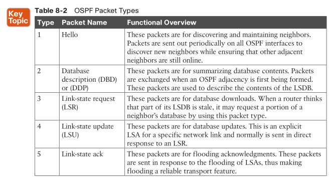

## OSPF Hello packets

* neighboring


* router ID: uniquely identify OSPF router or process
* hello interval: 10s for ethernet
* dead interval: 4x hello

## Neighbors

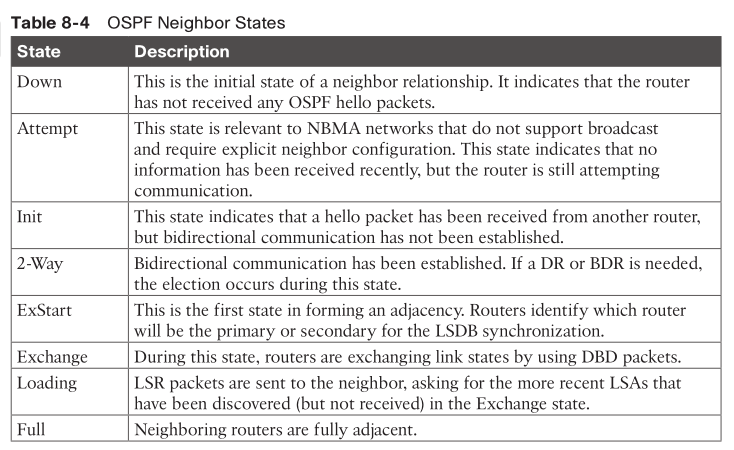

## Designated Router and Backup Designated Router

* for multi-access network, e.g.: Ethernet / LAN, Frame Relay
  * basically, routers are full meshed here
  * $n(n-1)/2$ OSPF adjacencies / LSDB flooded
* everyone peers with DR and backup DR only
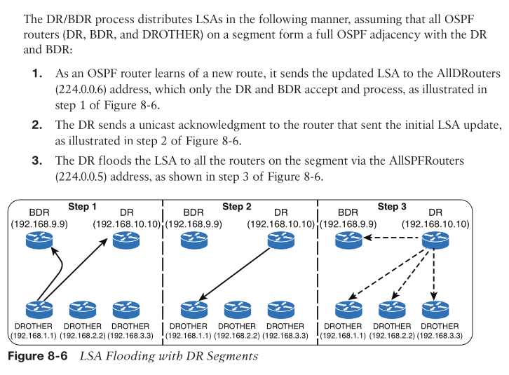

# Config

* `router ospf <process-id>` defines and initializes the OSPF process.
* OSPF is enabled on an interface using two methods:

## OSPF Network Statement

* identifies 
  * the interfaces that the OSPF process will use and 
  * the area that those interfaces participate in.
* via IP addresses/subnets to match interfaces
* not advertise networks into OSPF, networks got advertised only interface is configured with OSPF

```
! explicit IP address matching
router ospf 1
network 10.0.0.10 0.0.0.0 area 0
network 10.0.10.10 0.0.0.0 area 0
network 192.0.0.10 0.0.0.0 area 0
network 192.10.0.10 0.0.0.0 area 0

! all interfaces
router ospf 1
network 0.0.0.0 255.255.255.255 area 0
```

## Interface-specific Statement

* take precedence over the network statement
* Enabling an interface with OSPF is the quickest way to advertise a network segment to other OSPF routers.
* `ip ospf <process-id> area <area-id> [secondaries none]`

```
interface GigabitEthernet 0/0
ip address 10.0.0.1 255.255.255.0
ip ospf 1 area 0
```

## Router ID

* by default, highest loopback IP
* static router ID config: `router-id <router-id>`

## Passive interfaces

* A passive interface does not send out OSPF hellos and does not process any received OSPF packets
* to avoid possible false routes
* `passive-interface <interface-id>` under the OSPF process

## Requirements for Neighbor Adjacency

* RIDs must be unique
* The interfaces must share a common subnet.
  * OSPF uses the interface’s primary IP address when sending out OSPF hellos. The network mask (netmask) in the hello packet is used to extract the network ID of the hello packet. 
  * Network masks on the interfaces must match, except for OSPF point-to-point network type interfaces or virtual links.
* The maximum transmission units (MTUs) on the interfaces must match. 
  * The OSPF protocol does not support fragmentation, so the MTUs on the interfaces should match.
* The area ID must match for the segment.
* The DR enablement must match for the segment.
* OSPF hello and dead timers must match for the segment.
* Authentication type and credentials (if any) must match for the segment.
* Area type flags must match for the segment (for example, Stub, NSSA).

## Sample config

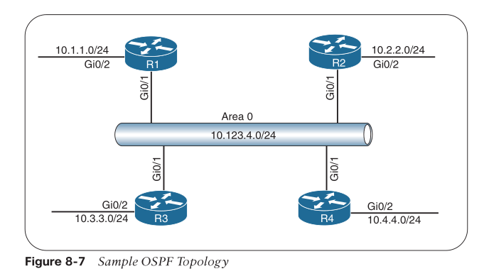

* On R1 and R2, OSPF is enabled on all interfaces with one command
* R3 uses specific network-based statements
* R4 uses interface-specific commands. 
* R1 and R2 set the Gi0/2 interface as passive
* R3 and R4 make all interfaces passive by default but make Gi0/1 active.
* R1
```
! OSPF is enabled with a single command, and the passive interface is
! set individually
R1# configure terminal
Enter configuration commands, one per line. End with CNTL/Z.
R1(config)# interface Loopback0
R1(config-if)# ip address 192.168.1.1 255.255.255.255
R1(config-if)# interface GigabitEthernet0/1
R1(config-if)# ip address 10.123.4.1 255.255.255.0
R1(config-if)# interface GigabitEthernet0/2
R1(config-if)# ip address 10.1.1.1 255.255.255.0
R1(config-if)#
R1(config-if)# router ospf 1
R1(config-router)# router-id 192.168.1.1
R1(config-router)# passive-interface GigabitEthernet0/2
R1(config-router)# network 0.0.0.0 255.255.255.255 area 0
```
* R3
```
! OSPF is enabled with a network command per interface, and the passive interface
! is enabled globally while the Gi0/1 interface is reset to active state
R3(config)# interface Loopback0
R3(config-if)# ip address 192.168.3.3 255.255.255.255
R3(config-if)# interface GigabitEthernet0/1
R3(config-if)# ip address 10.123.4.3 255.255.255.0
R3(config-if)# interface GigabitEthernet0/2
R3(config-if)# ip address 10.3.3.3 255.255.255.0
R3(config-if)#
R3(config-if)# router ospf 1
R3(config-router)# router-id 192.168.3.3
R3(config-router)# passive-interface default
R3(config-router)# no passive-interface GigabitEthernet0/1
R3(config-router)# network 10.3.3.3 0.0.0.0 area 0
R3(config-router)# network 10.123.4.3 0.0.0.0 area 0
R3(config-router)# network 192.168.3.3 0.0.0.0 area 0
```
* R4
```
! OSPF is enabled with a single command under each interface, and the
! passive interface is enabled globally while the Gi0/1 interface is made active.
R4(config-router)# interface Loopback0
R4(config-if)# ip address 192.168.4.4 255.255.255.255
R4(config-if)# ip ospf 1 area 0
R4(config-if)# interface GigabitEthernet0/1
R4(config-if)# ip address 10.123.4.4 255.255.255.0
R4(config-if)# ip ospf 1 area 0
R4(config-if)# interface GigabitEthernet0/2
R4(config-if)# ip address 10.4.4.4 255.255.255.0
R4(config-if)# ip ospf 1 area 0
R4(config-if)#
R4(config-if)# router ospf 1
R4(config-router)# router-id 192.168.4.4
R4(config-router)# passive-interface default
R4(config-router)# no passive-interface GigabitEthernet0/1
```

### verify interfaces


* _Nbrs F_: the number of neighbor OSPF routers for a segment that are fully adjacent 
* _Nbrs C_: The number of neighbor OSPF routers for a segment that have been detected and are in a 2-Way state

### verify neighbors


* _PRI_: The priority for the neighbor’s interface, which is used for DR/BDR elections.

### verify OSPF routes

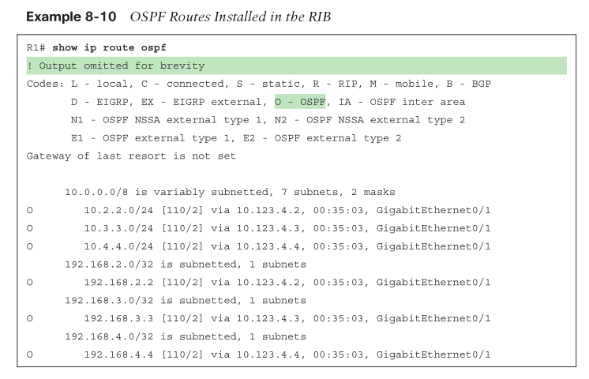

* _[110/2]_, the first number is the administrative distance (AD), which is 110 by default for OSPF, and 
* the second number is the metric of the path used for that network.

### check LSDB

`show ip ospf database router`
`show ip ospf database router | I Advertising|Network|Mask`

# Default Roue Advertisement

* advertising the default route into the OSPF domain
  * e.g.: router connecting to ISP do this
* `default-information originate [always] [metric <metric-value>] [metric-type <type-value>]` underneath the OSPF process.
  * _always_ advertises a default route regardless of whether a default route exists in the RIB or not.

```
ip route 0.0.0.0 0.0.0.0 100.64.1.2
!
router ospf 1
    network 10.0.0.0 0.255.255.255 area 0
    default-information originate
```

# Optimization

## Link Costs

* $Cost = \frac{Reference BW}{Interface BW}$
* reference BW: 100Mbps
* link > 100M will always has cost=1
* `auto-cost reference-bandwidth <bandwidth-in-mbps>` changes the reference bandwidth
  * but need change all OSPF routers to make consistent

> NX-OS uses a default reference cost of 40,000 Mbps. To align with other routers and incorporate higher-speed interfaces, setting the reference bandwidth to 40,000 Mbps could standardize the reference bandwidth across multiple platforms.
* max cost=65535=$2^{16}-1$


## Failure detection

* hello timer: `ip ospf hello-interval 1–65535`
  * under interface config submodule
  * changes dead timer as well
* dead timer: `ip ospf dead-interval 1–65535`
* `show ip ospf interface | i Timer|line`
> Hello and dead interval timers must match for OSPF neighbors to become adjacent.

## DR/BDR Placement

* computation heavier than others
  * Placing the DR and BDR roles on routers with adequate resources is recommended.
* The DR/BDR election occurs during OSPF adjacency—specifically during the last phase of 2-Way neighbor state and just before the ExStart state.
* Any router with an **OSPF priority** of 1 to 255 on its OSPF interface attempts to become the DR
  * **highest** priority wins, if tie, highest RID wins
  * By default, all OSPF interfaces use a priority of 1.
  * The routers place their RID and OSPF priorities in their OSPF hellos for that segment.
  * non DR acks elected DR by putting DR's RID in the DR field in Hello packet
  * same logic for BDR election
* change priority: `ip ospf priority 0–255`
    > OSPF does not preempt the DR or BDR roles, and the OSPF process might need to be restarted on the current DR/BDR for the changes to take effect.
    > to restart ospf process: `clear ip ospf process`
* _wait timer_: The wait timer starts when OSPF first starts on an interface. After the wait timer has expired, a router participates in the DR election. 

## OSPF network types

* affect timers

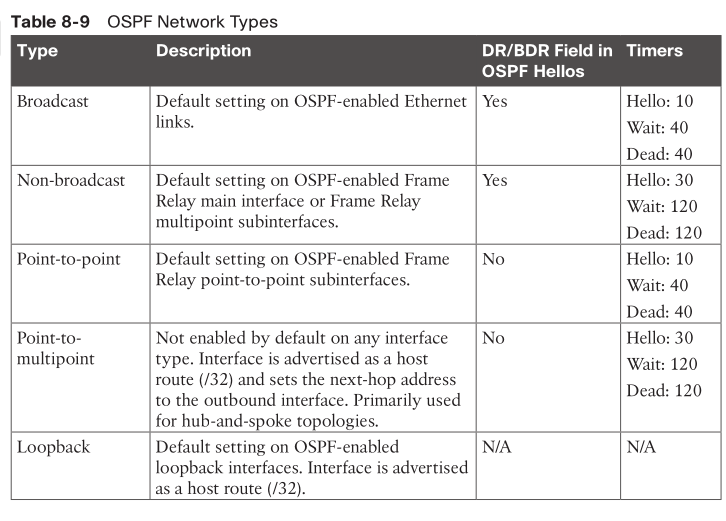

* Non-broadcast multi-access (NBMA): e.g.: frame relay
* P2P: no DR election
  * `ip ospf network point-to-point` can be set on ethernet when there are only two routers on subnet, under interface submodule
* loopback: OSPF always advertised lo with a /32 prefix length

# Advanced OSPF

* example topology


## Area

* group of router interfaces
* an interface can only belong to one area
* all routers within same area have identical LSDB
  * LSDB per area
> In essence, an OSPF area **hides the topology** from another area but enables the **networks to be visible** in other areas within the OSPF domain.
* _Area 0_: backbone
  * all areas to inject routing information into the backbone, and 
  * Area 0 advertises the routes into other areas
* _Area border routers (ABRs)_ must participate in Area 0
* __Area ID__: 32 bits, can be denoted like an IP
* `sh ip route`
  * intra-area routes: denoted by `O`
  * inter-area routes: denoted by `O IA`
* _external routes_: routes from another OSPF process or routing protocol

## LSA

* refer [JNCIS notes](https://github.com/xleonzhao/JNCIS/blob/master/OSPF.md) for OSPF packets format

### 6 types
* __Type 1, router LSA__: Advertises the LSAs that originate within an area
* __Type 2, network LSA__: Advertises a multi-access network segment attached to a DR
* __Type 3, summary LSA__: Advertises network prefixes that originated from a different area
* __Type 4, ASBR summary LSA__: Advertises a summary LSA for a specific ASBR
* __Type 5, AS external LSA__: Advertises LSAs for routes that have been redistributed
* __Type 7, NSSA external LSA__: Advertises redistributed routes in NSSAs

### LSA sequence

* 32bits
* versioning
* compared with LSA in LSDB

### LSA age

* incrementing
* originating router advertise a new LSA if age >= 1800s
* LSA age >= 3600s will be purged from LSDB

### Type 1: Router Link

* area scope
* info. about every interface and its attached networks
  * Every OSPF-enabled interface is listed for that RID
    * along with info including type, neighbor RID or DR, link metric, etc.
  * creating $G=(V,E)$
* `show ip ospf database router`
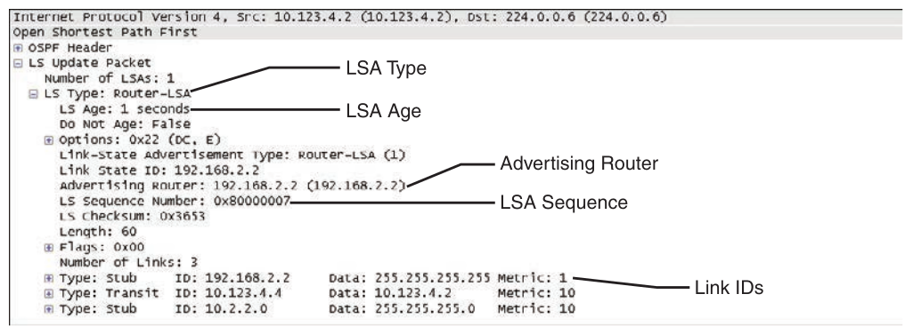
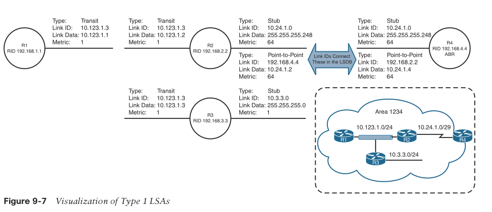
* _Link ID_: DR if LAN, peer IP if P2P, prefix if attached LAN, lo0 addr if stub
* _Link Data_: Self if LAN, IF IP if P2P, prefix len if attached LAN, lo0 mask if stub

### Type 2: Network Link

* for multi-access network segment that uses a DR
* DR originates this LSA to list all OSPF routers attached to the same LAN segment.
* `show ip ospf database network`

### Type 3: Summary Link

* networks from other areas
* ABR regen it when advertise it across area boundary and make itself as advertising router
> It says that a network (identified by _Link State ID_) can be reached via _Advertising Router_ by the cost of _metric_.
* `show ip ospf database summary`

#### rules to create type 3 LSA

* $M,N \ne 0$
* area 0 type 1,3 -> area N type 3
* area M type 1 -> area 0/N type 3
* area M type 3 -> area M LSDB, no type 3
  * someone from area 0 generated this type 3, so area 0 already has it

#### metric calculation

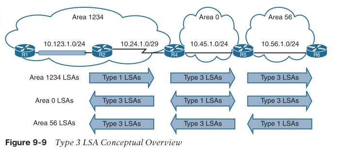
* R4 receives R2’s type 1 LSA and creates a new type 3 LSA by using the metric 65: the cost of 1 for R2’s LAN interface and 64 for the serial link between R2 and R4.
* R4 advertises the type 3 LSA with the metric 65 into Area 0.
* R5 receives the type 3 LSA and creates a new type 3 LSA for Area 56, using the metric 66: the cost of 1 for the link between R4 and R5 plus the original type 3 LSA metric 65.
* R6 receives the type 3 LSA. Part of R6’s calculation is the metric to reach the ABR (R5), which is 1 plus the metric in the type 3 LSA (66). R6 therefore calculates the metric 67 to reach 10.123.1.0/24.
* when multipaths exist, only best path metric is used in type 3 LSA

## Discontiguous networks

* no type 3 learned from area M (M>0) will not be regened
* virtual link is operational complicated
* just keep area 0 continuous

## Path selection

* intra-area > inter-area > external
  * so that not always shortest total path metric
* best route(s) -> OSPF RIB -> global RIB
* ECMP: max 4 routes
  * `maximum-paths <maximum-paths>` under the OSPF process to change it

## Route summarization

* multiple areas -> sort of summarization as well b/c multiple type 1 goes to one type 3
* address summarization -> can hide area N network changes from area 0
  * summarized routes carries the **lowest metric** from component routes - RFC1583

> Summarization works only on type 1 LSAs and is normally configured (or designed) so that summarization occurs as routes enter the backbone from non-backbone areas.

### config

* OSPF process configuration command 
* `area <area-id> range <network> <subnet-mask> [advertise | not-advertise] [cost metric]`
* The ABR performing inter-area summarization installs a **discard route** to summarized route
  * preventing loop, see [previous example](./06-routing-basics.md#static-route-to-null)

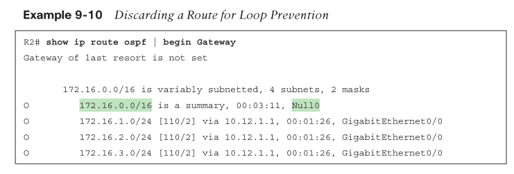

## Route filtering

* to manipulate traffic flows, reduce memory utilization, or improve security
* not easy due to everyone having identical map requirement
  * ABR do it
  
* filter by prefix
```
! to filter out a particular type 1
R2# configure terminal
Enter configuration commands, one per line. End with CNTL/Z.
R2(config)# router ospf 1
R2(config-router)# area 12 range 172.16.2.0 255.255.255.0 not-advertise
```
* filter by area


```
R2#
ip prefix-list PREFIX-FILTER seq 5 deny 172.16.1.0/24
ip prefix-list PREFIX-FILTER seq 10 permit 0.0.0.0/0 le 32
!
router ospf 1
  router-id 192.168.2.2
  network 10.12.1.0 0.0.0.255 area 12
  network 10.23.1.0 0.0.0.255 area 0
  area 0 filter-list prefix PREFIX-FILTER in

R3#
ip prefix-list PREFIX-FILTER seq 5 deny 172.16.2.0/24
ip prefix-list PREFIX-FILTER seq 10 permit 0.0.0.0/0 le 32
!
router ospf 1
  router-id 192.168.3.3
  network 10.23.1.0 0.0.0.255 area 0
  network 10.34.1.0 0.0.0.255 area 34
  area 0 filter-list prefix PREFIX-FILTER out
```

# OSPFv3

## Basics

* support IPv6
* runs directly on IPv6 w/ link-local addr
  * number of fields in the packet header has been reduced.
* authentication via IPSec
* new LSA types
* OSPFv3 uses the term _link_ instead of network because the SPT calculations are per link instead of per subnet.
* router ID must always be manually assigned
* neighbor must be manually specified using link-local addr
* multiple instances: OSPFv3 packets carries an Instance ID field

> IPv6 allows for multiple subnets to be assigned to a single interface, 
> and OSPFv3 allows for neighbor adjacency to form even if the two routers do not share a common subnet.
> RFC 5340 provides in-depth coverage of all the differences between OSPFv2 and OSPFv3.

### LSA changes

* type 1 changed
  * advertising only interface type and cost
  * separation of topology (nodes, links) from prefixes attached to nodes
    * Dijkstra only run on topology changes
* prefix info. is advertised via new LSAs
  * intra-area prefix LSA
  * Link LSA
* type 2 -> renamed to inter-area prefix LSA
* type 4 ASBR summary LSA -> inter-area router LSA

### OSPFv3 inter-router comm.

* still protocol 89
* still 5 packet types
* neighboring uses link-local
* flooding uses multicast link-local
  * FF02::05: OSPFv3 AllSPFRouters
  * FF02::06: OSPFv3 AllDRouters
  
## Config

* prerequisite: `ipv6 unicast-routing`
* RID is set to 0.0.0.0 and does not allow adjacencies to form
* OSPFv3 does not use the network statement for initializing interfaces.
* command similar to those used in OSPFv2; they essentially replace `ip ospf` with `ospfv3 ipv6`.
* Passive interface: same as v2

### example


```
R1#
interface Loopback0
  ipv6 address 2001:DB8::1/128
  ospfv3 1 ipv6 area 0
!
interface GigabitEthernet0/1
  ipv6 address FE80::1 link-local
  ipv6 address 2001:DB8:0:1::1/64
  ospfv3 1 ipv6 area 0
!
interface GigabitEthernet0/2
  ipv6 address FE80::1 link-local
  ipv6 address 2001:DB8:0:12::1/64
  ospfv3 1 ipv6 area 0
!
router ospfv3 1
  router-id 192.168.1.1
```

* verify interface

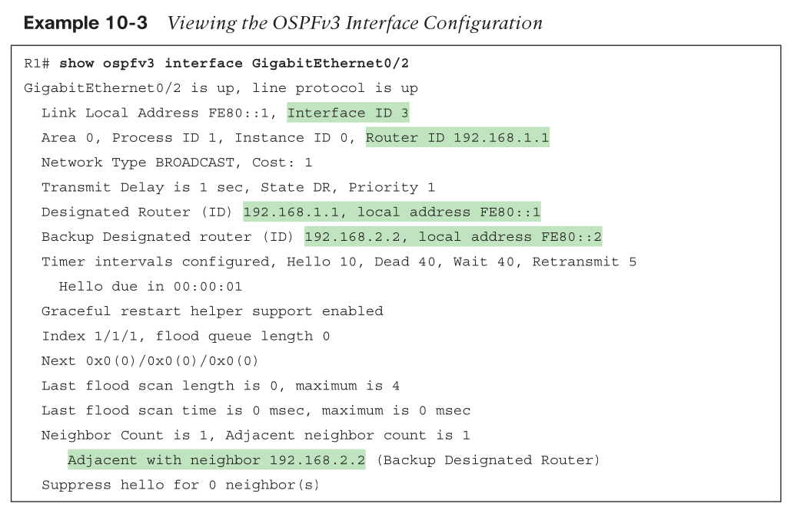

* verify neighbor


* verify routes


## summary routes

```
R3# configure terminal
Enter configuration commands, one per line. End with CNTL/Z.
R3(config)# router ospfv3 1
R3(config-router)# address-family ipv6 unicast
R3(config-router-af)# area 0 range 2001:db8:0:0::/65
```

## IPv4 support in OSPFv3

> RFC 5838 specifies that OSPFv3 should support multiple address families by setting the instance ID value from the IPv6 reserved range to the IPv4 reserved range (64 to 95) in the link LSAs.

* Step 1.Ensure that the IPv4 interface has an IPv6 address (global or link local) con- figured. 
  * Remember that configuring a global address also places a link-local address; alternatively, a link-local address can statically be configured.
* Step 2.Enable the OSPFv3 process for IPv4 on the interface with the command `ospfv3 process-id ipv4 area area-id`.

```
R3(config)# interface Loopback 0
R3(config-if)# ospfv3 1 ipv4 area 0
R3(config-if)# interface GigabitEthernet0/2
R3(config-if)# ospfv3 1 ipv4 area 0Chapter 10: OSPFv3 241
R3(config-if)# interface GigabitEthernet0/4
R3(config-if)# ospfv3 1 ipv4 area 34
```

* verify interface: `show ospfv3 interface brief`
* verify neighbor: `show ospfv3 neighbor`
* verify routes: `show ip route ospfv3 | begin Gateway`

