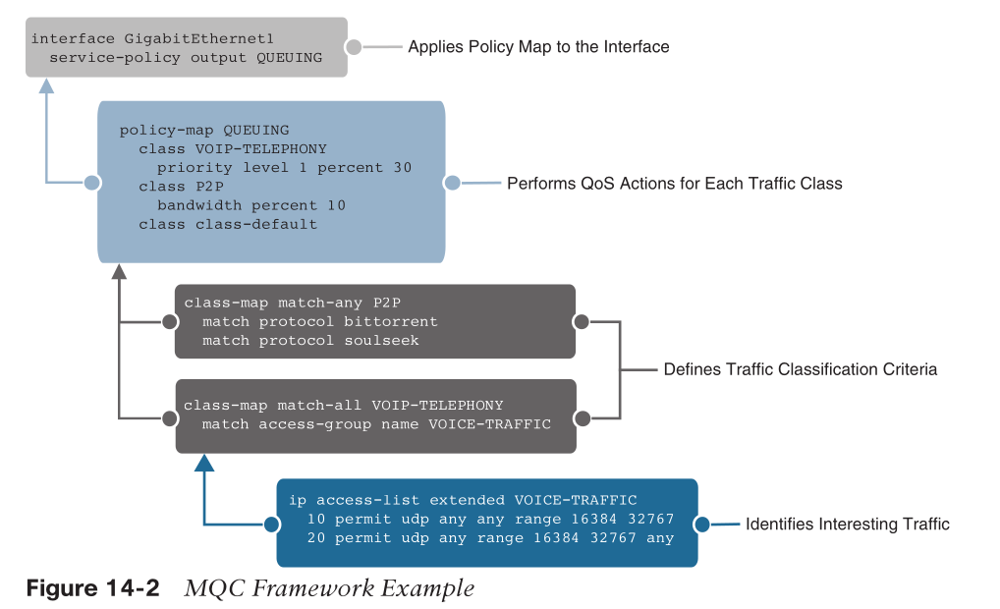
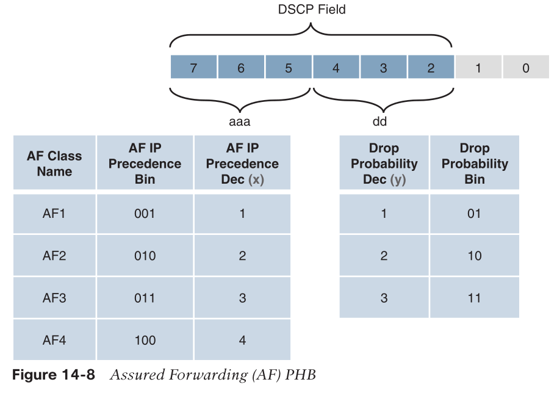
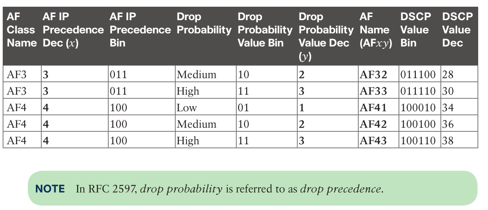
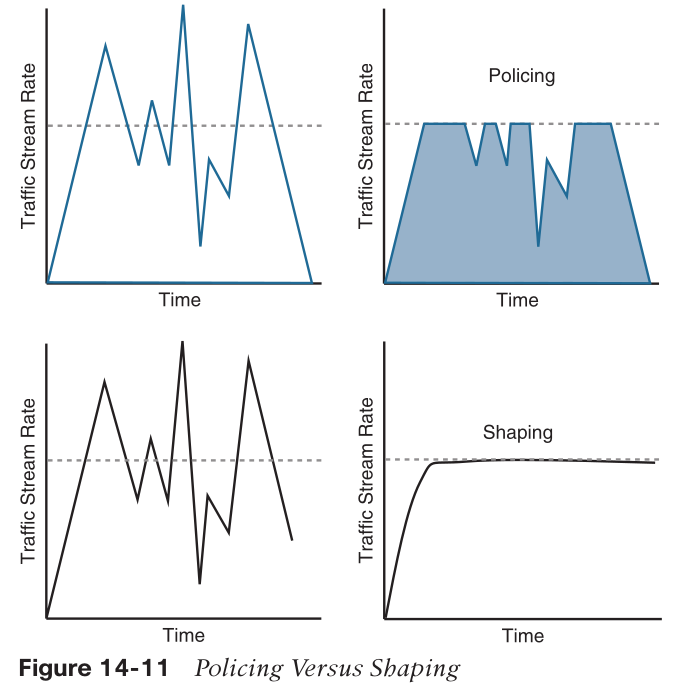
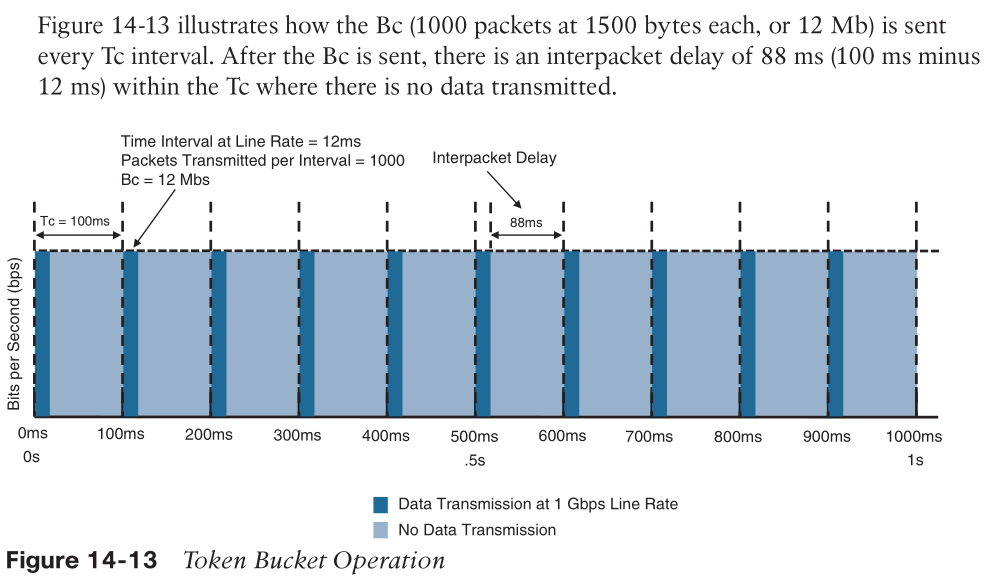
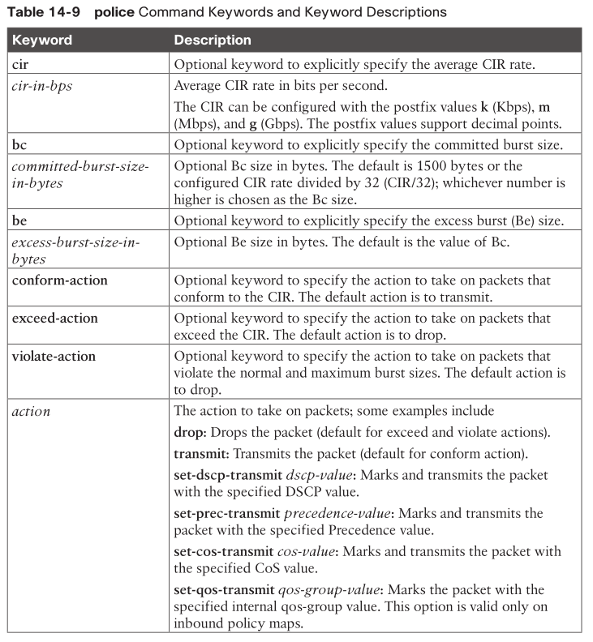
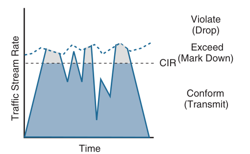
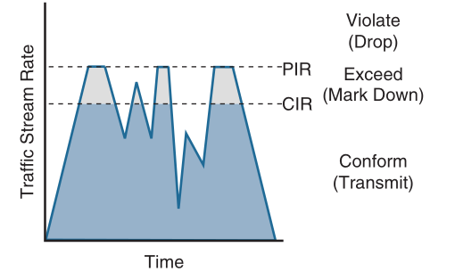
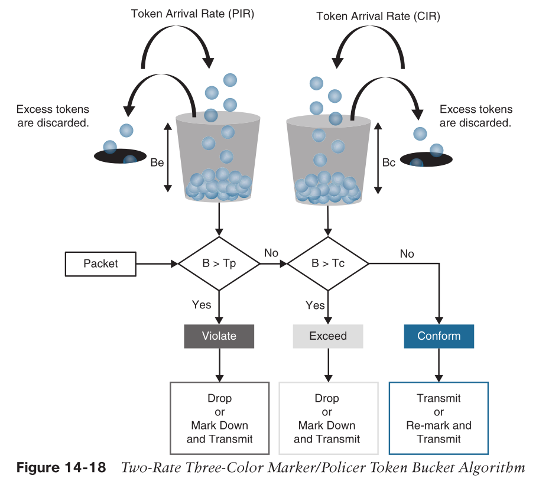
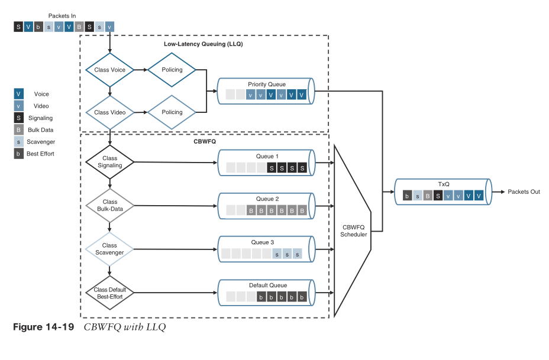

# Basics

* data packets are not equal
* leading trouble-makers
  * Lack of bandwidth
  * Latency and jitter
    * latency = one-way end-to-end delay
    * jitter = delay variance
  * Packet loss

## Latency

* ITU recommendation
  * < 400ms: usual application 
  * < 150ms: real-time traffic
    * cisco showed < 200ms is ok for video
* Causes
  * Propagation delay (fixed)
  * Serialization delay (fixed)
  * Processing delay (fixed)
    * take the packet from an input interface and place the packet onto the output queue of the output interface
  * Delay variation (variable)

### Propagation Delay

* lightspeed in fiber
  * impacted by refractive index 
  * the larger the refractive index value, the slower light travels.
  * refractive index = 1.5, lightspeed = 200,000,000 m/s (= 300,000,000 / 1.5)

###  Serialization delay (fixed)
* place all the bits of a packet onto a link
* e.g.: 1500-byte packet over a 1 Gbps
$(1500 bytes × 8) / 1 Gbps = 12,000 / 1,000,000,000 = 0.12us$

### Delay variation / Jitter

* difference in the latency between packets in a single flow
* factors
  * queuing delay
  * dejitter buffers
    * buffers at applications
      * ~30ms in length
        * If a packet is not received within the 30 ms window allowed for by the dejitter buffer, the packet is dropped by application
  * variable packet sizes
* LLQ: low-latency queuing

## Packet Loss

* solutions
  * Increase link speed.
  * Implement QoS congestion-avoidance and congestion-management mechanisms.
  * Implement traffic **policing to drop** low-priority packets and allow high-priority traffic through.
  * Implement traffic **shaping to delay** packets instead of dropping them because traffic may burst and exceed the capacity of an interface buffer. 
    * not recommended for real-time traffic because it relies on queuing that can cause jitter.
    > * Standard traffic shaping is unable to handle data bursts that occur on a microsecond time interval (that is, micro-bursts). 
    > * Microsecond or low-burst shaping is required for cases where micro-bursts need to be smoothed out by a shaper.

# QoS Models

* best effort
* Integrated Services (IntServ)
  * applications signal the network to make a bandwidth reservation
* Differentiated Services (DiffServ)
  * network identifies classes that require special QoS treatment

## Integrated Services (IntServ)

* use RSVP
  * call admission control (CAC) to guarantee reserved bw
  * if reserved not used, it's wasted


* sender sends RSVP PATH message towards receiver
  * sender’s source address
  * receiver’s destination address
  * bandwidth they wish to reserve
* everyone along the path need maintain RSVP states
  * not scalable if large number of flows
* receiver sends RSVP RESV message towards sender
* everyone along the path reserves the requested bw

## Differentiated Services (DiffServ)

* no need of signaling protocol
* classify and mark traffic in network
* most popular and widely deployed

# Modular QoS CLI (MQC)

* class maps
  * classify the traffic
  * `class-map [match-any | match-all] <class-map-name>`
    * one or more `match` statements
      * match conditions are defined by [ACL or extended ACL](./acl.md)
  * implicitly configured default class called `class-default`
  * can nest and pointing to a child policy
* policy maps
  * actions
  * `policy-map <policy-map-name>`
    * one or more class maps
  * Class-based weighted fair queuing (CBWFQ)
  * Class-based policing
  * Class-based shaping
  * Class-based marking
* service policies
  * apply to the interface
  * `service-policy {input | output} <policy-map-name>`

> The class map and policy map names are case sensitive. Making the name all upper-case characters is a best practice and makes it easier to read in the configuration.




# QoS Mechanisms

## Classification and Marking

### classifying

* as close to the source as possible
* avail for layer 1 to 7
  * Internal: QoS groups (locally significant to a router)
  * Layer 1: Physical interface, subinterface, or port
  * Layer 2: MAC address and 802.1Q/p class of service (CoS) bits
  * Layer 2.5: MPLS experimental (EXP) bits
  * Layer 3: Differentiated Services Code Points (DSCP), IP Precedence (IPP), and
  source/destination IP address
  * Layer 4: TCP or UDP ports
  * Layer 7: Next-Generation Network-Based Application Recognition (NBAR2)
    * DPI, recognizing ~1500 applications
    * monthly updates
    * two independent modes:
      * protocol discovery
      * MQC mode: DPI, dns snooping etc
    


Example

```
ip access-list extended VOICE-TRAFFIC
    10 permit udp any any range 16384 32767
    20 permit udp any range 16384 32767 any
ip access-list extended CALL-CONTROL
    10 permit tcp any any eq 1719
    20 permit tcp any eq 1719 any
class-map match-all VOIP-TELEPHONY
    match dscp ef
    match access-group name VOICE-TRAFFIC
class-map match-any CONTROL
    match dscp cs3 af31 af32 af33
    match access-group name CALL-CONTROL
class-map match-any HTTP-VIDEO
    match protocol http mime "video/*"
class-map match-any P2P
    match protocol bittorrent
    match protocol soulseek
class-map match-all RTP-AUDIO
    match protocol rtp audio
class-map match-all HTTP-WEB-IMAGES
    match protocol http url "*.jpeg|*.jpg"
```

### marking

* Internal: QoS groups
* Layer 2: 802.1Q/p class of service (CoS) bits
* Layer 2.5: MPLS experimental (EXP) bits
* Layer 3: Differentiated Services Code Points (DSCP) and IP Precedence (IPP)

#### layer 2 marking: CoS

* inside 802.1q header
* TCI field: PCP (3b), DEI (1b), VlanID (12b)
  * CoS = PCP (Priority Code Point), 802.1p


* __drawback:__ frames lose their CoS markings when traversing a non-802.1Q link or a Layer 3 network
* Drop Eligible Indicator (DEI) field (1 bit)
  * to indicate frames that are eligible to be dropped during times of congestion
    * 0: not drop eligible, default
    * 1: drop eligible.
  * can be used independently or in conjunction with PCP

#### layer 3 marking: DSCP


* IPP: RFC791, original IP protocol
  * 3 bits
* DiffServ: RFC2474, TOS redefined
  * 6 bits for class
  * 2 bits for ECN: Explicit Congestion Notification
* Scavenger class
  * lower than best effort
  * DSCP: 001000 (CS1)

##### DSCP Per-Hop Behaviors (PHB)

* PHB: expediting, delaying, or dropping
  * edge router do most of the work
  * core router only do PHB based on DSCP
    * A DiffServ **Behavior Aggregates (BAs)** aggregates multiple applications (e.g., SSH/Telnet/SNMP/other mgmt apps) with the same DiffServ value
* four PHBs:
  * Class Selector (CS) PHB: 
    * The first 3 bits (b7-b5) of the DSCP field are used as CS bits / IPP
    * b4-b2: 000 
    * higher IPP, better
    * The CS bits make DSCP backward compatible with IP Precedence
  * Default Forwarding (DF) PHB: Used for best-effort service.
    * DSCP: 000000XX
  * Assured Forwarding (AF) PHB: Used for guaranteed bandwidth service.
  * Expedited Forwarding (EF) PHB: Used for low-delay service.

###### Assured Forwarding (AF) PHB

* DSCP: `aaadd0`
  * `aaa` is the binary value of the AF class (bits 5, 6, and 7), 
  * `dd` (bits 2, 3, and 4) is the drop probability
    * bit 2 is unused and always set to 0
* AF name: `AFxy`
  * `x`: AF IP Precedence value (in decimal)
  * `y`: Drop Probability value (in decimal)
  * `AF41` is a combination of IP Precedence 4 and Drop Probability 1.



* convert AF name to DSCP: $8x+2y$




> The AF class number does not represent precedence; for example, AF4 does not get any preferential treatment over AF1. Each class should be treated independently and placed into different queues

* AF spec only is the guide / requirement to the real implementation
* short-term congestion:
  * each class in a separate queue
    * using a class-based weighted fair queuing (CBWFQ)
* long-term congestion within each class
  * congestion-avoidance algorithm
    * weighted random early detection (WRED) based on DSCP
    * e.g.: as the queue length increases, WRED might start dropping email packets (low priority) earlier to maintain space for video packets (high priority).
      * Once the queue is almost full, WRED drops more packets for both types but still drops fewer video packets.

###### Expedited Forwarding (EF) PHB

* to build a low-loss, low-latency, low-jitter, assured bandwidth, end-to-end service
  * guarantees bandwidth by ensuring a minimum departure rate
  * lowest possible delay by implementing low-latency queuing. 
  * prevents starvation of other non-EF classes by policing EF traffic when congestion occurs.
* DSCP: 101110
  * b7-b5=101, aka IPP=5, highest user-defined value for real-time apps, backward compatibility

### about QoS group

> QoS groups are used to mark packets as they are received and processed internally within the router and are automatically removed when packets egress the router. They are used only in special cases in which traffic descriptors marked or received on an ingress interface would not be visible for packet classification on egress interfaces due to encapsulation or de-encapsulation.

### trust boundary

* PC can mark their packets with DSCP, will switch trust it?
* IP telephony endpoint may do it
  * a PC may be behind IP phone

### example

```
policy-map INBOUND-MARKING-POLICY
    class VOIP-TELEPHONY
        set dscp ef
    class VIDEO
        set dscp af31
    class CONFERENCING
        set dscp af41
        set cos 4
    class class-default
        set dscp default
        set cos 0
```

### Wireless QoS

* wireless LAN controller (WLC)


## Policing and Shaping

* policer: drop
* shaper: delay



### placement

* policer
  * inbound policer at edge
  * outbound at edge or core-facing
* shaper
  * ISP-facing interface
    * ISP may police traffic or have max-rate SLA

### Markdown

* to a lower priority
* congestion avoidance algorithms should be configured throughout the network

> for example, excess traffic marked with AFx1 should be marked down to AFx2 (or AFx3 if using two-rate policing). After marking down the traffic, congestion-avoidance mechanisms, such as DSCP-based weighted random early detection (WRED), should be configured throughout the network to drop AFx3 more aggressively than AFx2 and drop AFx2 more aggressively than AFx1.

### Token Bucket Algorithms

* used by policer and shaper
* terms
  * Committed Information Rate (_CIR_): The policed traffic rate (**bps**), defined in the traffic contract.
  * Committed Burst Size (_Bc_): The maximum size of the CIR token bucket, and the maximum amount of traffic that can be sent within a Tc. 
    * $Bc = CIR * (Tc / 1000)$
    * _Bc_ >= largest possible IP packet size
  * Token bucket: A bucket that accumulates tokens 
    * cost 1 token to send 1 bit
    * maximum number of tokens: _Bc_ when using a single token bucket
    * tokens are added into the bucket at a fixed rate (the _CIR_)
  * Committed Time Interval (_Tc_): The time interval, in milliseconds (ms), over which the committed burst (Bc) is sent. 
    * $Tc = (Bc / CIR ) × 1000$
    * 8ms < _Tc_ < 125ms
      * with fast link speed, tokens will be burned out quickier than refilled
      * if _Tc_ too large, packets have to wait longer til bucket got refilled 

> $Bc$ is the capacity of the token bucket.
> $CIR$ is the rate at which tokens are added.
> $Tc$ is the time it takes to fill the bucket to its capacity.

* If there are not enough tokens in the token bucket to send the packet, the traffic conditioning mechanism can take one of the following actions:
  * Buffer the packets while waiting for enough tokens to accumulate in the token bucket (traffic shaping)
  * Drop the packets (traffic policing)
  * Mark down the packets (traffic markdown)



* Time interval at line rate = (Bc [bits] / Interface speed [bps]) × 1000
  * Bc = 12Mb
  * IF speed = 1Gbps
  * CIR = 120Mbps
  * packet size = 1500B = 12Kb
* within a _Bc_/_Tc_, only 1000 packets can be sent til all tokens burned 
  * assuming a continuous stream of 1500B/packet

### Policer Config

```
police [cir] <cir-in-bps> [bc] <committed-burst-size-in-bytes>
[be] <excess-burst-size-in-bytes> [conform-action <action>] 
[exceed-action <action>] [violate-action <action>]
```



### Policer Types

#### Single-rate two-color marker/policer

```
policy-map OUTBOUND-POLICY
    class VOIP-TELEPHONY
        police 50000000 conform-action transmit exceed-action drop
    class VIDEO
        police 25000000 conform-action transmit exceed-action set-dscp-transmit af21
interface GigabitEthernet1
    service-policy output OUTBOUND-POLICY
```

* Bc by default is CIR/32
  * effectively, Bc is 1/32 CIR
  * Tc will be 1/32s, aka, 32x Tc in 1s

```
router# show policy-map OUTBOUND-POLICY
Policy Map OUTBOUND-POLICY
    Class VOIP-TELEPHONY
        police cir 50000000 bc 1562500
            conform-action transmit
            exceed-action drop
    Class VIDEO
        police cir 25000000 bc 781250
            conform-action transmit
            exceed-action set-dscp-transmit af21
```

#### Single-rate three-color marker/policer (srTCM)

* RFC2697
* two buckets, three traffic states/colors
  * conform/green
  * exceed/yellow
  * voilate/red
* tokens not used in the first bucket overflows to second bucket
  * defined by _excess burst (BE)_


> The exceeding and violating traffic rates vary because they rely on random tokens spilling over from the Bc bucket into the Be.

```
policy-map OUTBOUND-POLICY
    class VOIP-TELEPHONY
        police 50000000 conform-action set-dscp-transmit af31 exceed-action
        set-dscp-transmit af32 violate-action drop
interface GigabitEthernet1
    service-policy output OUTBOUND-POLICY

router# show policy-map OUTBOUND-POLICY
Policy Map OUTBOUND-POLICY
    Class VOIP-TELEPHONY
        police cir 50000000 bc 1562500 be 1562500
            conform-action set-dscp-transmit af31
            exceed-action set-dscp-transmit af32
            violate-action drop
```

#### Two-rate three-color marker/policer (trTCM)

* RFC2698
* Peak Information Rate (PIR): The maximum rate of traffic allowed
  * PIR should be equal to or greater than the CIR.



* how it works



```
policy-map OUTBOUND-POLICY
    class VOIP-TELEPHONY
        police cir 50000000 pir 100000000 conform-action transmit exceed-action set-dscp-transmit af31 violate-action drop

router# show policy-map OUTBOUND-POLICY
Policy Map OUTBOUND-POLICY
    Class VOIP-TELEPHONY
        police cir 50000000 bc 1562500 pir 100000000 be 3125000
            conform-action transmit
            exceed-action set-dscp-transmit af31
            violate-action drop
```

* by default, _Be_ is 1/32 of _PIR_

## Congestion Management and Avoidance

### Congestion Management

* queuing and scheduling
* from router's view, congestion = queue full
  * transmit ring (Tx-ring/TxQ)
* causes
  * input speed > output speed
  * many-to-one comm.
* legacy queuing
  * FIFO
  * round robin
  * weighted round robin (WRR)
    * prioritize multiple queues
  * custom queue (CQ)
    * 16 queues, each has its own bw for a particular traffic
    * unused bw can be used by other queues
    * but long delays and FIFO problems
  * priority queue (PQ)
    * 4 queues (high, medium, normal, low)
    * may starve low priority queues
  * weighted fair queue (WFQ)
    * automatically divide bw by number of flows
    * flows are priorities by IPP
* current queuing
  * Class-based weighted fair queuing (CBWFQ)
    * up to 256 queues
    * each serve a traffic class
      * QoS marking
      * protocols
      * ACL
      * etc.
    * each queue has
      * minimal bw guaranteed
      * queue limit: max # of packets in q
    * good for non-real-time traffic
  * Low-latency queuing (LQQ)
    * CBWFQ + PQ
    * unused bw from higher pri. q can be used by lower pri. q
    * PQ is policed to prevent starvation



### Congestion Avoidance

* monitoring and proactive actions
  * actions are taken before queue actually full
    * predefined threshold
  * default action: tail drop
    * drop regardless of traffic class
    * not suitable for TCP: TCP global synchronization syndrome
      * multiple TCP sessions share same link
  * better action: random early drop (RED)
* Weighted RED 
  * WRED honors IPP / DSCP
    * IPP 3 would be dropped more aggressively than IPP 5
    * DSCP, AFx3 would be dropped more aggressively than AFx2
  * can also set ECN bits

### CBWFQ config

#### queuing actions

* priority
  * LLQ priority
  * it is recommended to configure an explicit policer rate-limit the priority traffic to prevent starvation
    * policer only works during congestion
  * `priority [level {1 | 2}] [percent] [<police-rate-in-kbps/percentage>[burst-in-bytes]]`
    * `percent` enables LLQ strict priority queuing with a conditional policing rate calculated as a percentage of the interface bandwidth, or the shaping rate in a hierarchical policy.
* bandwidth
  * min bw guarantee
  * `bandwidth <bandwidth-kbps> | percent <percentage>`
    * _percent_ w.r.t. absolute interface bw
  * `bandwidth remaining percent <percentage> | remaining ratio <ratio>`
    * _remaining percent_ w.r.t. relative available bw
* shape
  * max bw before shaping
  * `fair-queue`: enable flow-based queuing to manage multiple flows contending for a single queue.
  * `shape {average | peak} <mean-rate-in-bps> [[<committed-burst-size>] [<excess-burst-size>]]`
    * `Average` shaping is used to forward packets at the configured mean rate and allows bursting up to the _Bc_ at every _Tc_, and up to _Be_ when extra tokens are available. This is the most-used shaping method.
    * `Peak` shaping is used to forward packets at the mean rate multiplied by $(1 + Be/Bc)$ at every _Tc_. This method is not commonly used.
    * It is recommended to use the _Bc_ and _Be_ default values.

#### queue management

* `queue-limit <queue-limit-size> {cos <cos-value> | dscp <dscp-value> | <precedence-value>} percent <percentage-of-packets>`
  * change default tail drop behavior
* random-detect [dscp-based|precedence-based|cos-based]
  * enables WRED

#### example: Queuing Policy with Conditionally Policed Multilevel Priority Queues

```
! The VOIP and VIDEO classes are conditionally policed.
! This means that the LLQ queues can use more than their configured
! policing rate if there is enough bandwidth available to use
policy-map QUEUING
    class VOIP
        priority level 1 percent 30
    class VIDEO
        priority level 2 percent 30
    class CRITICAL
        bandwidth percent 10
    class SCAVENGER
        bandwidth percent 5
    class TRANSACTIONAL
        bandwidth percent 15
    class class-default
        bandwidth percent 10
        fair-queue
        random-detect dscp-based
        queue-limit 64
interface GigabitEthernet1
    service-policy output QUEUING
```

* under congestion
  * the VOIP and VIDEO classes would each get a guaranteed minimum bandwidth of 300 Mbps (30% each), or, can only use 300Mbps max
  * the CRITICAL and class-default classes would each get 100 Mbps (10% each)
  * the TRANSACTIONAL class would get 150 Mbps (15%)
  * the SCAVENGER class would get 50 Mbps (5%).

#### example: Queuing Policy with Unconstrained Multilevel Priority Queues

```
! The VOIP and VIDEO classes do not have a policer (unconstrained).
! They can take up all of the available bandwidth, leaving
! no bandwidth remaining for the rest of the classes in the policy
policy-map QUEUING
    class VOIP
        priority level 1
    class VIDEO
        priority level 2
    class CRITICAL
        bandwidth remaining percent 40
! Each of the following classes can use up to 20 percent
! of the remaining bandwidth left by the strict priority queues
    class SCAVENGER
        bandwidth remaining percent 20
    class TRANSACTIONAL
        bandwidth remaining percent 20
    class class-default
        bandwidth remaining percent 20
        fair-queue
        random-detect dscp-based
        queue-limit 64
interface GigabitEthernet1
    service-policy output QUEUING
```

* assume the VOIP and VIDEO classes are using 800 Mbps out of 1 Gbps interface bw.
  * That would leave 200 Mbps available for the remaining classes. 
  * The CRITICAL class would get 80 Mbps (40% of 200 Mbps)
  * the rest of the classes would get 40 Mbps each (20% of 200 Mbps).

#### example: Hierarchical Class-Based Shaping with Nested Queuing Example

```
! Policy map SHAPING is the parent policy
policy-map SHAPING
    class class-default
        shape average 100000000
! Policy map QUEUING is the child policy
        service-policy QUEUING
! The parent policy SHAPING is the one applied to the interface
interface GigabitEthernet1
    service-policy output SHAPING
```

* The SHAPING parent policy shapes all traffic to 100 Mbps (e.g., to meet ISP's LSA) 
* In this case, the QUEUING policy uses the mean rate of the traffic shaping policy, which is 100 Mbps
