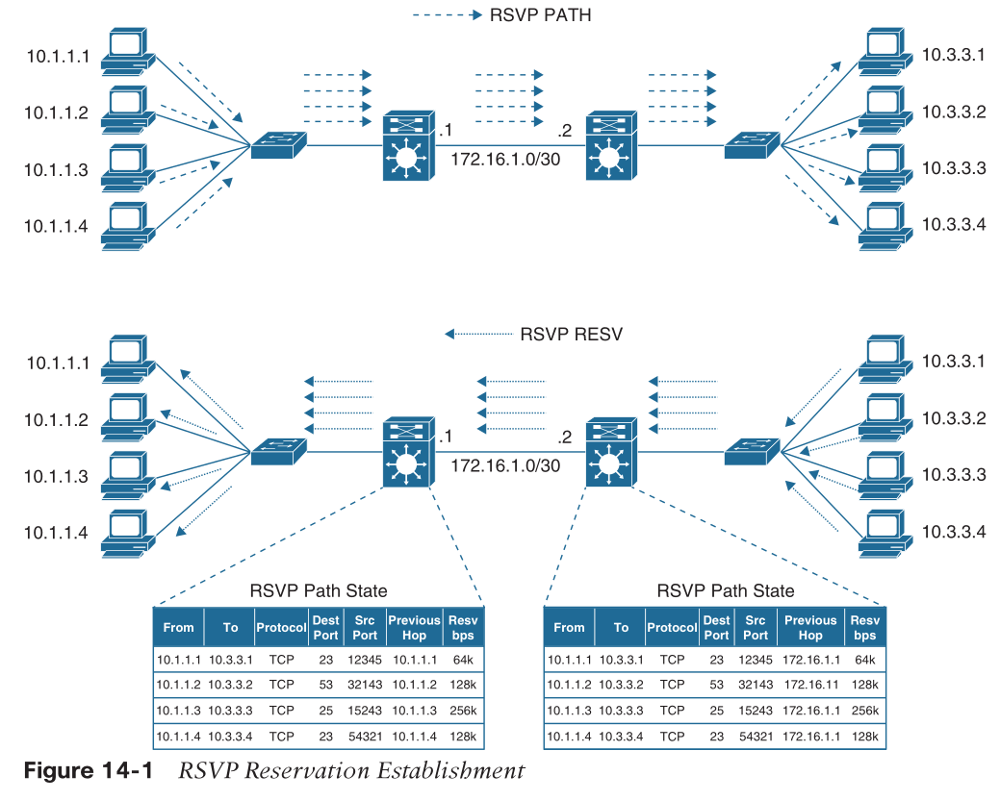
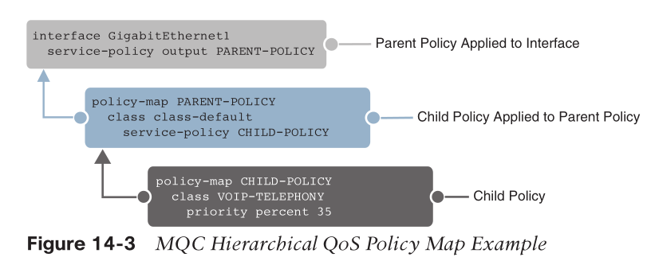
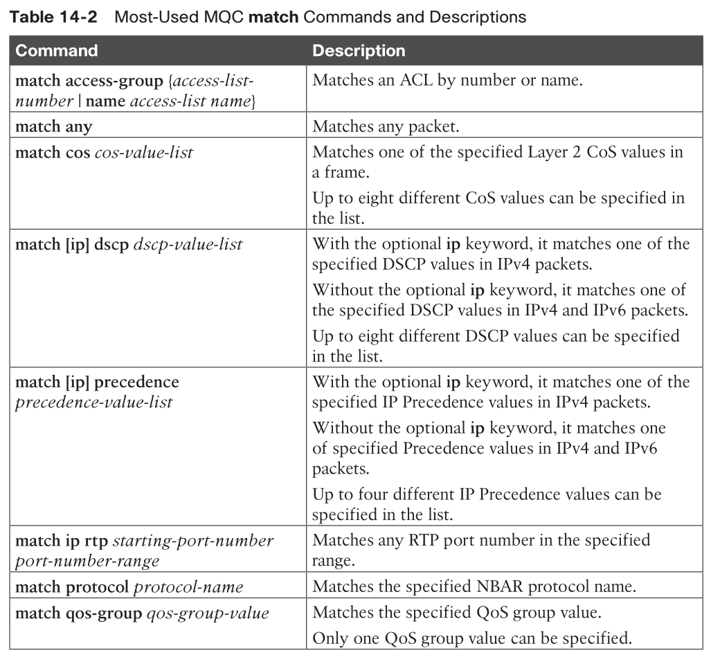
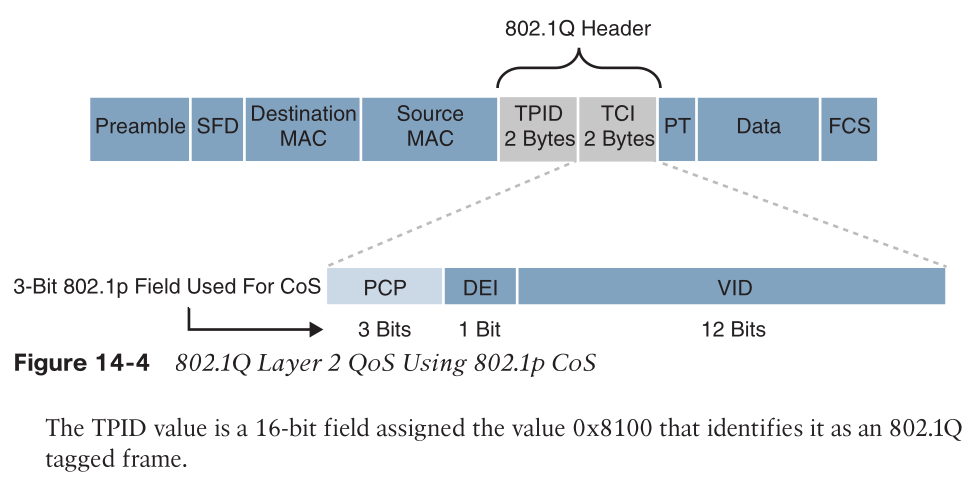
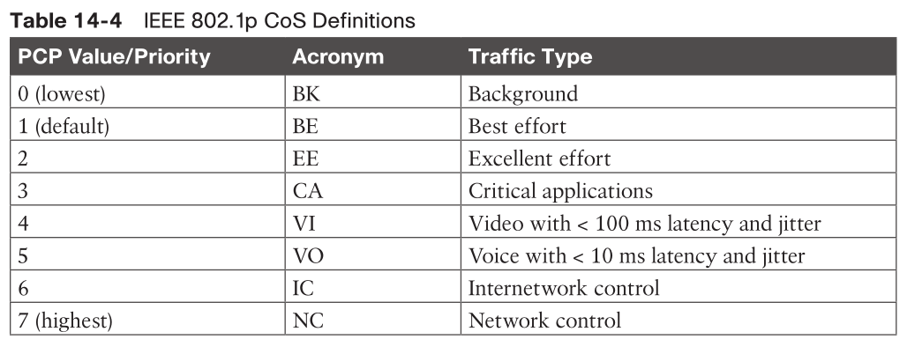
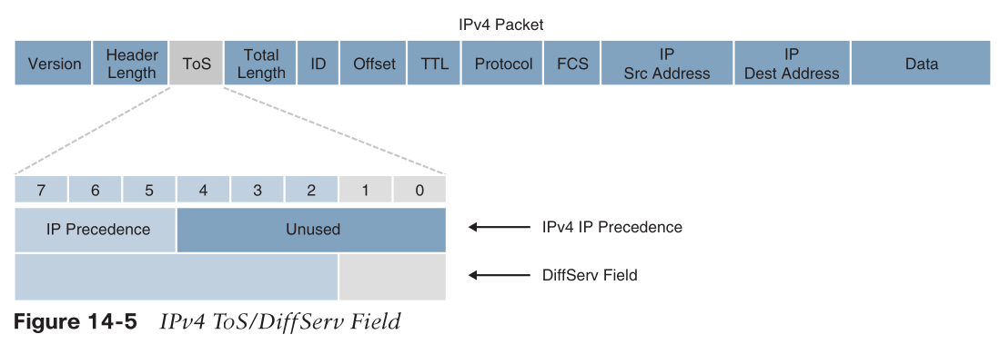
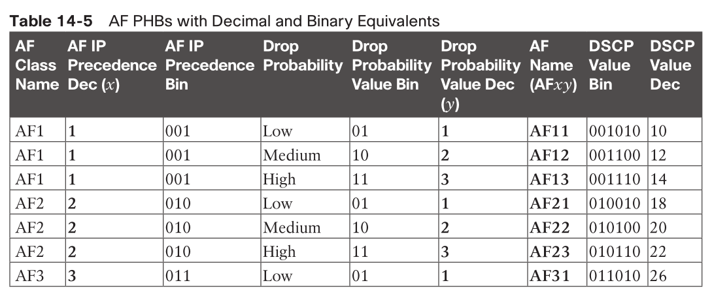

# Basics

* data packets are not equal
* leading trouble-makers
  * Lack of bandwidth
  * Latency and jitter
    * latency = one-way end-to-end delay
    * jitter = delay variance
  * Packet loss

## Latency

* ITU recommendation
  * < 400ms: usual application 
  * < 150ms: real-time traffic
    * cisco showed < 200ms is ok for video
* Causes
  * Propagation delay (fixed)
  * Serialization delay (fixed)
  * Processing delay (fixed)
    * take the packet from an input interface and place the packet onto the output queue of the output interface
  * Delay variation (variable)

### Propagation Delay

* lightspeed in fiber
  * impacted by refractive index 
  * the larger the refractive index value, the slower light travels.
  * refractive index = 1.5, lightspeed = 200,000,000 m/s (= 300,000,000 / 1.5)

###  Serialization delay (fixed)
* place all the bits of a packet onto a link
* e.g.: 1500-byte packet over a 1 Gbps
$(1500 bytes × 8) / 1 Gbps = 12,000 / 1,000,000,000 = 0.12us$

### Delay variation / Jitter

* difference in the latency between packets in a single flow
* factors
  * queuing delay
  * dejitter buffers
    * buffers at applications
      * ~30ms in length
        * If a packet is not received within the 30 ms window allowed for by the dejitter buffer, the packet is dropped by application
  * variable packet sizes
* LLQ: low-latency queuing

## Packet Loss

* solutions
  * Increase link speed.
  * Implement QoS congestion-avoidance and congestion-management mechanisms.
  * Implement traffic **policing to drop** low-priority packets and allow high-priority traffic through.
  * Implement traffic **shaping to delay** packets instead of dropping them because traffic may burst and exceed the capacity of an interface buffer. 
    * not recommended for real-time traffic because it relies on queuing that can cause jitter.
    > * Standard traffic shaping is unable to handle data bursts that occur on a microsecond time interval (that is, micro-bursts). 
    > * Microsecond or low-burst shaping is required for cases where micro-bursts need to be smoothed out by a shaper.

# QoS Models

* best effort
* Integrated Services (IntServ)
  * applications signal the network to make a bandwidth reservation
* Differentiated Services (DiffServ)
  * network identifies classes that require special QoS treatment

* network identifies classes that require special QoS treatment

## Integrated Services (IntServ)
* use RSVP
  * call admission control (CAC) to guarantee reserved bw
  * if reserved not used, it's wasted



* sender sends RSVP PATH message towards receiver
  * sender’s source address
  * receiver’s destination address
  * bandwidth they wish to reserve
* everyone along the path need maintain RSVP states
  * not scalable if large number of flows
* receiver sends RSVP RESV message towards sender
* everyone along the path reserves the requested bw

## Differentiated Services (DiffServ)

* no need of signaling protocol
* classify and mark traffic in network
* most popular and widely deployed

# Modular QoS CLI (MQC)

* class maps
  * classify the traffic
  * `class-map [match-any | match-all] <class-map-name>`
    * one or more `match` statements
      * match conditions are defined by [ACL or extended ACL](./acl.md)
  * implicitly configured default class called `class-default`
  * can nest and pointing to a child policy
* policy maps
  * actions
  * `policy-map <policy-map-name>`
    * one or more class maps
  * Class-based weighted fair queuing (CBWFQ)
  * Class-based policing
  * Class-based shaping
  * Class-based marking
* service policies
  * apply to the interface
  * `service-policy {input | output} <policy-map-name>`

> The class map and policy map names are case sensitive. Making the name all upper-case characters is a best practice and makes it easier to read in the configuration.




# QoS Mechanisms

## Classification and Marking

### classifying

* as close to the source as possible
* avail for layer 1 to 7
  * Internal: QoS groups (locally significant to a router)
  * Layer 1: Physical interface, subinterface, or port
  * Layer 2: MAC address and 802.1Q/p class of service (CoS) bits
  * Layer 2.5: MPLS experimental (EXP) bits
  * Layer 3: Differentiated Services Code Points (DSCP), IP Precedence (IPP), and
  source/destination IP address
  * Layer 4: TCP or UDP ports
  * Layer 7: Next-Generation Network-Based Application Recognition (NBAR2)
    * DPI, recognizing ~1500 applications
    * monthly updates
    * two independent modes:
      * protocol discovery
      * MQC mode: DPI, dns snooping etc
    



Example

```
ip access-list extended VOICE-TRAFFIC
    10 permit udp any any range 16384 32767
    20 permit udp any range 16384 32767 any
ip access-list extended CALL-CONTROL
    10 permit tcp any any eq 1719
    20 permit tcp any eq 1719 any
class-map match-all VOIP-TELEPHONY
    match dscp ef
    match access-group name VOICE-TRAFFIC
class-map match-any CONTROL
    match dscp cs3 af31 af32 af33
    match access-group name CALL-CONTROL
class-map match-any HTTP-VIDEO
    match protocol http mime "video/*"
class-map match-any P2P
    match protocol bittorrent
    match protocol soulseek
class-map match-all RTP-AUDIO
    match protocol rtp audio
class-map match-all HTTP-WEB-IMAGES
    match protocol http url "*.jpeg|*.jpg"
```

### marking

* Internal: QoS groups
* Layer 2: 802.1Q/p class of service (CoS) bits
* Layer 2.5: MPLS experimental (EXP) bits
* Layer 3: Differentiated Services Code Points (DSCP) and IP Precedence (IPP)

#### layer 2 marking, CoS

* inside 802.1q header
* TCI field: PCP (3b), DEI (1b), VlanID (12b)
  * CoS = PCP (Priority Code Point), 802.1p




* __drawback:__ frames lose their CoS markings when traversing a non-802.1Q link or a Layer 3 network
* Drop Eligible Indicator (DEI) field (1 bit)
  * to indicate frames that are eligible to be dropped during times of congestion
    * 0: not drop eligible, default
    * 1: drop eligible.
  * can be used independently or in conjunction with PCP

#### layer 3 marking, DSCP



* IPP: RFC791, original IP protocol
  * 3 bits
* DiffServ: RFC2474, TOS redefined
  * 6 bits for class
  * 2 bits for ECN: Explicit Congestion Notification
* Scavenger class
  * lower than best effort
  * DSCP: 001000 (CS1)

##### DSCP Per-Hop Behaviors (PHB)

* PHB: expediting, delaying, or dropping
  * edge router do most of the work
  * core router only do PHB based on DSCP
    * A DiffServ **Behavior Aggregates (BAs)** aggregates multiple applications (e.g., SSH/Telnet/SNMP/other mgmt apps) with the same DiffServ value
* four PHBs:
  * Class Selector (CS) PHB: 
    * The first 3 bits (b7-b5) of the DSCP field are used as CS bits / IPP
    * b4-b2: 000 
    * higher IPP, better
    * The CS bits make DSCP backward compatible with IP Precedence
  * Default Forwarding (DF) PHB: Used for best-effort service.
    * DSCP: 000000XX
  * Assured Forwarding (AF) PHB: Used for guaranteed bandwidth service.
  * Expedited Forwarding (EF) PHB: Used for low-delay service.

###### Assured Forwarding (AF) PHB

* DSCP: `aaadd0`
  * `aaa` is the binary value of the AF class (bits 5, 6, and 7), 
  * `dd` (bits 2, 3, and 4) is the drop probability
    * bit 2 is unused and always set to 0
* AF name: `AFxy`
  * `x`: AF IP Precedence value (in decimal)
  * `y`: Drop Probability value (in decimal)
  * `AF41` is a combination of IP Precedence 4 and Drop Probability 1.


* convert AF name to DSCP: $8x+2y$




> The AF class number does not represent precedence; for example, AF4 does not get any preferential treatment over AF1. Each class should be treated independently and placed into different queues

* AF spec only is the guide / requirement to the real implementation
* short-term congestion:
  * each class in a separate queue
    * using a class-based weighted fair queuing (CBWFQ)
* long-term congestion within each class
  * congestion-avoidance algorithm
    * weighted random early detection (WRED) based on DSCP
    * e.g.: as the queue length increases, WRED might start dropping email packets (low priority) earlier to maintain space for video packets (high priority).
      * Once the queue is almost full, WRED drops more packets for both types but still drops fewer video packets.

###### Expedited Forwarding (EF) PHB

* to build a low-loss, low-latency, low-jitter, assured bandwidth, end-to-end service
  * guarantees bandwidth by ensuring a minimum departure rate
  * lowest possible delay by implementing low-latency queuing. 
  * prevents starvation of other non-EF classes by policing EF traffic when congestion occurs.
* DSCP: 101110
  * b7-b5=101, aka IPP=5, highest user-defined value for real-time apps, backward compatibility

### about QoS group

> QoS groups are used to mark packets as they are received and processed internally within the router and are automatically removed when packets egress the router. They are used only in special cases in which traffic descriptors marked or received on an ingress interface would not be visible for packet classification on egress interfaces due to encapsulation or de-encapsulation.

### Trust boundary

* PC can mark their packets with DSCP, will switch trust it?
* IP telephony endpoint may do it
  * a PC may be behind IP phone

### example

```
policy-map INBOUND-MARKING-POLICY
    class VOIP-TELEPHONY
        set dscp ef
    class VIDEO
        set dscp af31
    class CONFERENCING
        set dscp af41
        set cos 4
    class class-default
        set dscp default
        set cos 0
```

### Wireless QoS

* wireless LAN controller (WLC)


## Policing and Shaping

* policer: drop
* shaper: delay


## Congestion Management and Avoidance