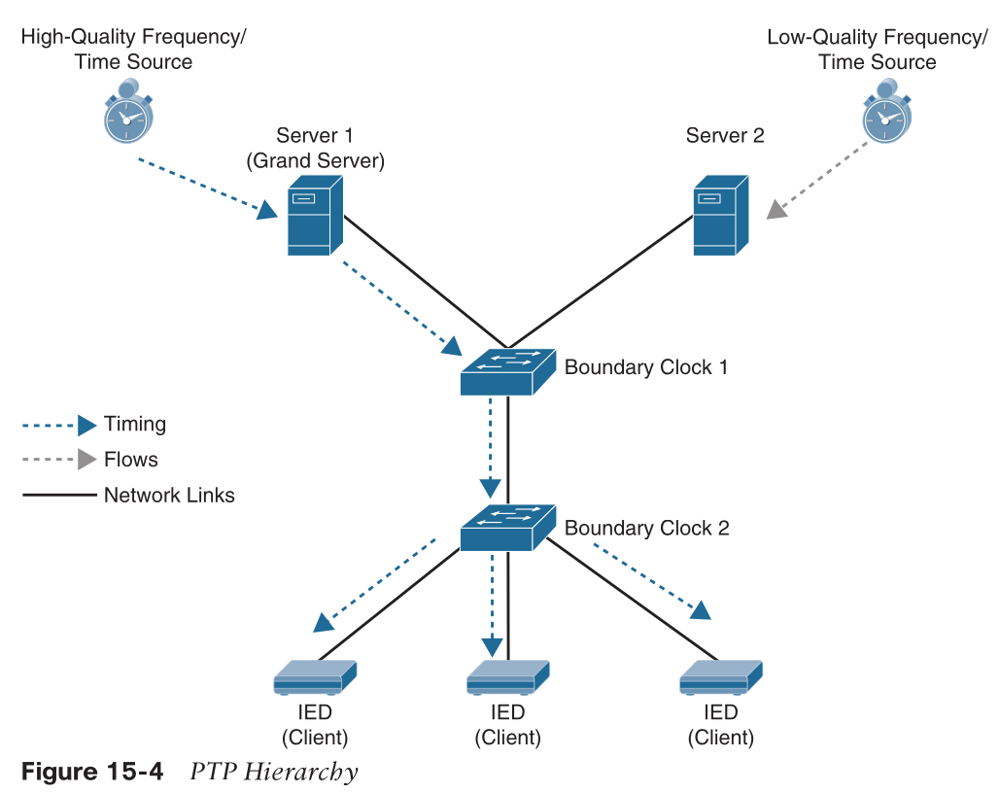
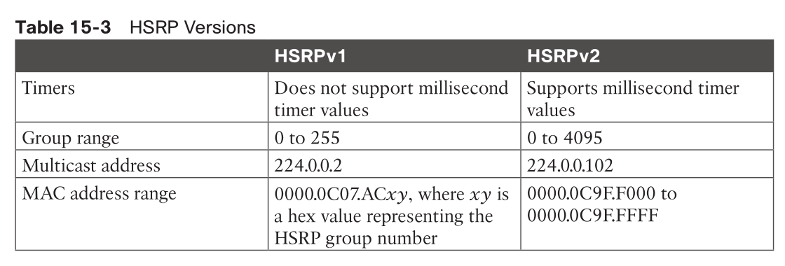
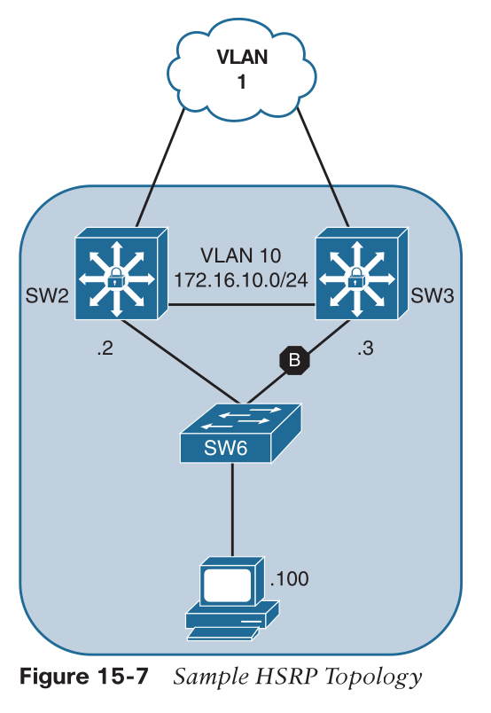
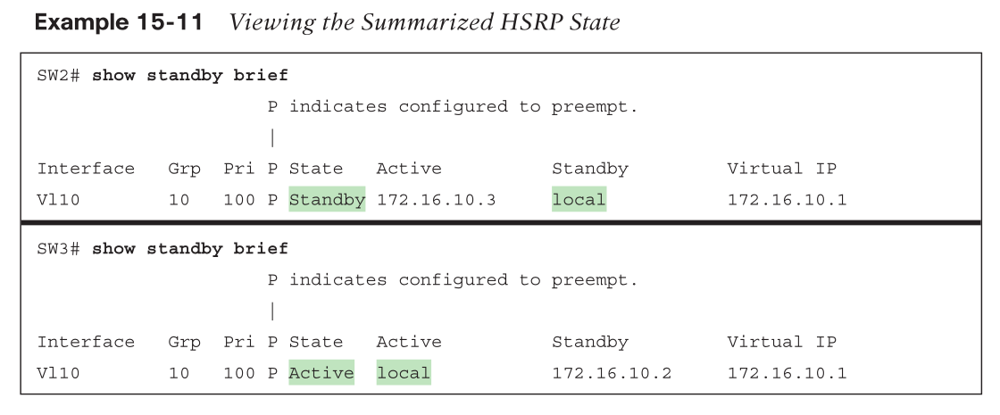
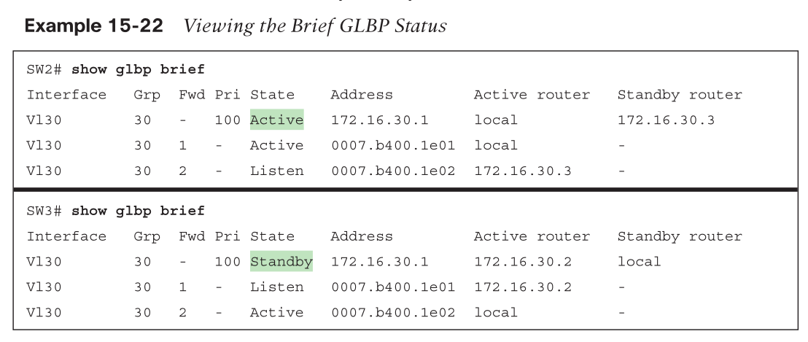
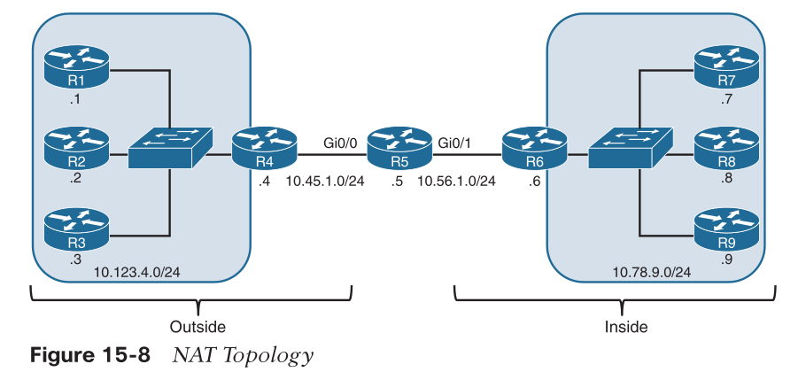

- [Time Synchronization (NTP)](#time-synchronization-ntp)
  - [NTP Config](#ntp-config)
  - [NTP Peers](#ntp-peers)
- [Precision Time Protocol (PTP)](#precision-time-protocol-ptp)
  - [Three PTP modes](#three-ptp-modes)
  - [PTP Config](#ptp-config)
- [First-Hop Redundancy Protocol (FHRP)](#first-hop-redundancy-protocol-fhrp)
  - [Object Tracking](#object-tracking)
  - [Hot Standby Router Protocol (HSRP)](#hot-standby-router-protocol-hsrp)
    - [HSRP config](#hsrp-config)
  - [Virtual Router Redundancy Protocol (VRRP)](#virtual-router-redundancy-protocol-vrrp)
    - [VRRPv2 config](#vrrpv2-config)
    - [VRRPv3 config](#vrrpv3-config)
  - [Gateway Load Balancing Protocol (GLBP)](#gateway-load-balancing-protocol-glbp)
    - [GLBP config](#glbp-config)
    - [Load balancing](#load-balancing)
- [Network Address Translation (NAT)](#network-address-translation-nat)
  - [RFC1918](#rfc1918)
  - [Basics](#basics)
  - [Static NAT](#static-nat)
    - [Inside Static NAT](#inside-static-nat)
    - [Outside Static NAT](#outside-static-nat)
  - [Pooled NAT](#pooled-nat)
  - [PAT](#pat)

# Time Synchronization (NTP)

* RFC958
* port: 123
* NTP sever: w/ atomic clock
  * stratum 1 server
* NTP client: within a couple of seconds of accuracy
  * stratum 2 client if query stratum 1 server
  * stratum 3 client if query stratum 2 client
  
## NTP Config

* `ntp server <ip-address> [prefer] [source interface-id]`
* multiple servers are allowed
  * but use only the NTP server with the lowest stratum
* can also act as a ntp server: `ntp master <stratum number>`
* `show ntp status` or `show ntp associations`

```
R2# show ntp status
Clock is synchronized, stratum 2, reference is 192.168.1.1
nominal freq is 250.0000 Hz, actual freq is 249.8750 Hz, precision is 2**10
ntp uptime is 2890200 (1/100 of seconds), resolution is 4016
reference time is E0E2CD87.28B45C3E (07:28:55.159 EST Wed Jul 24 2019)
clock offset is 1192351.4980 msec, root delay is 1.00 msec
root dispersion is 1200293.33 msec, peer dispersion is 7938.47 msec
loopfilter state is 'SPIK' (Spike), drift is 0.000499999 s/s
system poll interval is 64, last update was 1 sec ago.
```

## NTP Peers

* A common scenario is to designate two devices to query a different external NTP source and then to peer their local stratum 2 NTP devices.
* NTP peers act as clients and servers to each other, in the sense that they try to blend their time to each other.
* The peers adjust at a maximum rate of two minutes per query, so large discrepancies take some time to correct.

# Precision Time Protocol (PTP)

* IEEE standard
* PTPv2 is NOT backward compatible with PTPv1
* how to compensate the various delays due to communication over a network?
  * PTP adjusts the distributed clocks on the devices to accommodate all kinds of delays 
    * This adjustment is achieved through a series of PTPv2 message exchanges between other devices. 
      * These messages are then measured to look at the delay received in each direction between devices. 
        * This delay is an average that is run on all the received and transmitted messages to come up with the calculation.
* Two PTPv2 message types
  * Event
    * timestamped to measure the delay
  * General
    * to build server/client topology
    * not timestamped


## Three PTP modes

* PTP Boundary Mode
    > A boundary clock is a device that is between areas of the network that can exchange these messages with other devices that are closer to them, like a geographic hierarchy.
* PTP Forward Mode
* PTP Transparent Mode
  * default mode

## PTP Config

`ptp mode boundary`
`show ptp clock`
`show ptp port fa1/1`

# First-Hop Redundancy Protocol (FHRP)

* solves the problem of hosts configuring multiple gateways
* by creating a virtual IP (VIP) gateway instance that is shared between the Layer 3 devices
* three protocols
  * Hot Standby Router Protocol (HSRP)
  * Virtual Router Redundancy Protocol (VRRP)
  * Gateway Load Balancing Protocol (GLBP)

## Object Tracking

* track the changes of routes or link state
* works with FHRP
  > FHRP commonly tracks the availability of the WAN interface or the existence of a route learned via that next hop.

```
track <object-number> ip route <route/prefix-length> reachability
track <object-number> interface <interface-id> line-protocol
show track [object-number]
```

* examples

```
R1(config)# track 1 ip route 192.168.3.3/32 reachability
R1# show track
Track 1
    IP route 192.168.3.3 255.255.255.255 reachability
    Reachability is Up (EIGRP)
        1 change, last change 00:00:32
    First-hop interface is GigabitEthernet0/0

R2(config)# track 2 interface GigabitEthernet0/1 line-protocol
R2# show track
Track 2
    Interface GigabitEthernet0/1 line-protocol
    Line protocol is Up
        1 change, last change 00:00:37

! event happened
R2(config)# interface GigabitEthernet0/1
R2(config-if)# shutdown
*03:04:18.975: %TRACK-6-STATE: 2 interface Gi0/1 line-protocol Up -> Down
*03:04:18.980: %DUAL-5-NBRCHANGE: EIGRP-IPv4 100: Neighbor 10.23.1.3 (GigabitEther-
net0/1) is * 03:04:20.976: %LINK-5-CHANGED: Interface GigabitEthernet0/1, changed
state to administratively down
* 03:04:21.980: %LINEPROTO-5-UPDOWN: Line protocol on Interface GigabitEthernet0/1,
changed state to down

R1#
03:04:24.007: %TRACK-6-STATE: 1 ip route 192.168.3.3/32 reachability Up -> Down
```

## Hot Standby Router Protocol (HSRP)

* cisco proprietary
* provides routing redundancy for IP hosts on an Ethernet network configured with a default gateway IP address
* virtual IP/MAC is configured on each HSRP-enabled interface
  * per HSRP group
* need two devices at least
  * one active, one standby
    * highest priority, then highest IP wins
    * default priority: 100
    * active router receives and routes the packets destined for the virtual MAC address of the group.
  * active dies, standby take over
    * UDP-based hello message as heartbeat
> HSRP does not support preemption _by default_, so when a router with lower priority becomes active, it does not automatically transfer its active status to a superior router.



### HSRP config



```
SW2# configure terminal
Enter configuration commands, one per line. End with CNTL/Z.
SW2(config)# interface vlan 10
03:55:35.148: %LINEPROTO-5-UPDOWN: Line protocol on Interface Vlan10, changed state to down
SW2(config-if)# ip address 172.16.10.2 255.255.255.0
SW2(config-if)# standby 10 ip 172.16.10.1
03:56:00.097: %HSRP-5-STATECHANGE: Vlan10 Grp 10 state Speak -> Standby
SW2(config-if)# standby 10 preempt

SW3(config)# interface vlan 10
03:56:04.478: %LINEPROTO-5-UPDOWN: Line protocol on Interface Vlan10, changed state to down
SW3(config-if)# ip address 172.16.10.3 255.255.255.0
SW3(config-if)# standby 10 ip 172.16.10.1
SW3(config-if)# standby 10 preempt
03:58:22.113: %HSRP-5-STATECHANGE: Vlan10 Grp 10 state Standby -> Active
```


* working with object tracking
  * tracking SW2's WAN interface, if it's down, use SW3 as active router
    * by lowering SW2's HSRP priority if tracking event happened

```
SW2(config)# track 1 interface vlan 1 line-protocol
SW2(config-track)# interface vlan 10
SW2(config-if)# standby 10 priority 110
04:44:16.973: %HSRP-5-STATECHANGE: Vlan10 Grp 10 state Standby -> Active
SW2(config-if)# standby 10 track 1 decrement 20

! simulating WAN link failure
SW2(config)# interface vlan 1
SW2(config-if)# shut
04:53:16.490: %TRACK-6-STATE: 1 interface Vl1 line-protocol Up -> Down
04:53:17.077: %HSRP-5-STATECHANGE: Vlan10 Grp 10 state Active -> Speak
04:53:18.486: %LINK-5-CHANGED: Interface Vlan1, changed state to administratively down
04:53:19.488: %LINEPROTO-5-UPDOWN: Line protocol on Interface Vlan1, changed state to down
04:53:28.267: %HSRP-5-STATECHANGE: Vlan10 Grp 10 state Speak -> Standby
```

> It is possible to create multiple HSRP instances for the same interface. Some network architects configure half of the hosts for one instance and the other half of the hosts for a second instance. Setting different priorities for each instance makes it possible to load balance the traffic across multiple routers.

## Virtual Router Redundancy Protocol (VRRP)

* standard
* very similar to HSRP, only diff
  * name: master router, backup router
  * enables preemption by default
  * VRRP uses the multicast address 224.0.0.18 for communication.
  * The MAC address of the VIP gateway uses the structure 0000.5e00.01xx, where xx reflects the group ID in hex.
* two versions of VRRP:
  * VRRPv2: Supports IPv4
  * VRRPv3: Supports IPv4 and IPv6
  * VRRPv2 and VRRPv3 are not compatible.

### VRRPv2 config

* R2 and R3 are two routers that share a connection to a Layer 2 switch with their Gi0/0 inter- faces, which both are on the 172.16.20.0/24 network. R2 and R3 use VRRP to create the VIP gateway 172.16.20.1.

```
R2(config)# interface GigabitEthernet 0/0
R2(config-if)# ip address 172.16.20.2 255.255.255.0
R2(config-if)# vrrp 20 ip 172.16.20.1
04:32:14.109: %VRRP-6-STATECHANGE: Gi0/0 Grp 20 state Init -> Backup
04:32:14.113: %VRRP-6-STATECHANGE: Gi0/0 Grp 20 state Init -> Backup
04:32:17.728: %VRRP-6-STATECHANGE: Gi0/0 Grp 20 state Backup -> Master
04:32:47.170: %VRRP-6-STATECHANGE: Gi0/0 Grp 20 state Master -> Backup

R3(config)# interface GigabitEthernet0/0
R3(config-if)# ip add 172.16.20.3 255.255.255.0
R3(config-if)# vrrp 20 ip 172.16.20.1
04:32:43.550: %VRRP-6-STATECHANGE: Gi0/0 Grp 20 state Init -> Backup
04:32:43.554: %VRRP-6-STATECHANGE: Gi0/0 Grp 20 state Init -> Backup
04:32:47.170: %VRRP-6-STATECHANGE: Gi0/0 Grp 20 state Backup -> Master
```


### VRRPv3 config

* supports multi-address format that is hierarchical.

```
SW2(config)# fhrp version vrrp v3
SW2(config)# interface vlan 22
19:45:37.385: %LINEPROTO-5-UPDOWN: Line protocol on Interface Vlan22, changed state to up
SW2(config-if)# ip address 172.16.22.2 255.255.255.0
SW2(config-if)# vrrp 22 address-family ipv4
SW2(config-if-vrrp)# address 172.16.22.1
SW2(config-if-vrrp)# track 1 decrement 20
SW2(config-if-vrrp)# priority 110
SW2(config-if-vrrp)# track 1 decrement 20
19:48:00.338: %VRRP-6-STATE: Vlan22 IPv4 group 22 state INIT -> BACKUP
19:48:03.948: %VRRP-6-STATE: Vlan22 IPv4 group 22 state BACKUP -> MASTER

SW3# configure terminal
Enter configuration commands, one per line. End with CNTL/Z.
SW3(config)# fhrp version vrrp v3
SW3(config)# interface vlan 22
19:46:13.798: %LINEPROTO-5-UPDOWN: Line protocol on Interface Vlan22, changed state to up
SW3(config-if)# ip address 172.16.22.3 255.255.255.0
SW3(config-if)# vrrp 22 address-family ipv4
SW3(config-if-vrrp)# address 172.16.22.1
19:48:08.415: %VRRP-6-STATE: Vlan22 IPv4 group 22 state INIT -> BACKUP

SW2# show vrrp
Vlan22 - Group 22 - Address-Family IPv4
    State is MASTER
    State duration 51.640 secs
    Virtual IP address is 172.16.22.1
    Virtual MAC address is 0000.5E00.0116
    Advertisement interval is 1000 msec
    Preemption enabled
    Priority is 110
    Track object 1 state UP decrement 20
    Master Router is 172.16.22.2 (local), priority is 110
    Master Advertisement interval is 1000 msec (expires in 564 msec)
    Master Down interval is unknown
    FLAGS: 1/1
```

## Gateway Load Balancing Protocol (GLBP)

* cisco proprietary
* active/standby gateway
* each member of the GLBP group takes care of forwarding the traffic to the appropriate gateway
* based on who and what to reply of ARP
  * ARP reply is unicast
* two roles
  * Active virtual gateway (AVG)
    * elect one AVG router to respond ARP requests
      * (VIP, virtual Mac of AVF)
  * Active virtual forwarder (AVF)
    * AVF routes traffic received from assigned hosts
* one GLBP group support 4x AVF and 1x AVG
* in case of AVG failure, standby AVG takes care of the business
* in case of AVF failure, another AVF takes over
  * AVG will not use failed AVF to respond ARP ?

### GLBP config

```
SW2(config)# interface vlan 30
SW2(config-if)# ip address 172.16.30.2 255.255.255.0
SW2(config-if)# glbp 30 ip 172.16.30.1
05:41:15.802: %GLBP-6-STATECHANGE: Vlan30 Grp 30 state Speak -> Active
05:41:25.938: %GLBP-6-FWDSTATECHANGE: Vlan30 Grp 30 Fwd 1 state Listen -> Active
SW2(config-if)# glbp 30 preempt

SW3(config)# interface vlan 30
SW3(config-if)# ip address 172.16.30.3 255.255.255.0
SW3(config-if)# glbp 30 ip 172.16.30.1
05:41:32.239: %GLBP-6-FWDSTATECHANGE: Vlan30 Grp 30 Fwd 2 state Listen -> Active
SW3(config-if)# glbp 30 preempt

SW2# show glbp
Vlan30 - Group 30
    State is Active
        1 state change, last state change 00:01:26
    Virtual IP address is 172.16.30.1
    Hello time 3 sec, hold time 10 sec
    Next hello sent in 1.664 secs
    Redirect time 600 sec, forwarder time-out 14400 sec
    Preemption enabled, min delay 0 sec
    Active is local
    Standby is 172.16.30.3, priority 100 (expires in 7.648 sec)
    Priority 100 (default)
    Weighting 100 (default 100), thresholds: lower 1, upper 100
    Load balancing: round-robin
    Group members:
        70b3.17a7.7b65 (172.16.30.3)
        70b3.17e3.cb65 (172.16.30.2) local
    There are 2 forwarders (1 active)
    Forwarder 1
        State is Active
            1 state change, last state change 00:01:16
        MAC address is 0007.b400.1e01 (default)
        Owner ID is 70b3.17e3.cb65
        Redirection enabled
        Preemption enabled, min delay 30 sec
        Active is local, weighting 100
    Forwarder 2
        State is Listen
        MAC address is 0007.b400.1e02 (learnt)
        Owner ID is 70b3.17a7.7b65
        Redirection enabled, 597.664 sec remaining (maximum 600 sec)
        Time to live: 14397.664 sec (maximum 14400 sec)
        Preemption enabled, min delay 30 sec
        Active is 172.16.30.3 (primary), weighting 100 (expires in 8.160 sec)
```



* The first entry contains a hyphen (-) for the Fwd state, which means that it is the entry for the AVG

### Load balancing

* Round robin: 
  * Uses each virtual forwarder MAC address to sequentially reply for the virtual IP address.
* Weighted: 
  * Defines weights to each device in the GLBP group to define the ratio of load balancing between the devices. 
  * This allows for a larger weight to be assigned to bigger routers that can handle more traffic.
* Host dependent: 
  * Uses the host MAC address to decide to which virtual forwarder MAC to redirect the packet. 
  * This method ensures that the host uses the same virtual MAC address as long as the number of virtual forwarders does not change within the group.

`glbp <instance-id> load-balancing {host-dependent | round-robin | weighted}`

# Network Address Translation (NAT)

## RFC1918

* 10.0.0.0/8 accommodates 16,777,216 hosts.
* 172.16.0.0/12 accommodates 1,048,576 hosts.
* 192.168.0.0/16 accommodates 65,536 hosts.

## Basics

* terms
  * Inside local
    * private IP address
  * Inside global
    * public IP address
  * Outside local
    * The IP address of an outside host as it appears to the inside network. 
    * The IP address does not have to be reachable by the outside but is considered private and must be reachable by the inside network.
  * Outside global
    * The public IP address assigned to a host on the outside network. 
    * This IP address must be reachable by the outside network.
* 3 types
  * Static NAT
    * Provides a static one-to-one mapping of a local IP address to a global IP address.
  * Pooled NAT
    * Provides a dynamic one-to-one mapping of a local IP address to a global IP address. 
    * The global IP address is temporarily assigned to a local IP address. 
      * After a certain amount of idle NAT time, the global IP address is returned to the pool.
  * Port Address Translation (PAT)
    * Provides a dynamic many-to-one mapping of many local IP addresses to one global IP address.
    * (local private IP, port X) <-> (port Y)
      * port Y is unique which enables the NAT device to track the global IP address to local IP addresses (and local port) based on the unique port mapping.
  
## Static NAT

* only source IP got altered


### Inside Static NAT

* inside local -> inside global

```
R5(config)# interface GigabitEthernet0/0
R5(config-if)# ip nat outside
R5(config-if)# interface GigabitEthernet0/1
R5(config-if)# ip nat inside
R5(config-if)# exit
R5(config)# ip nat inside source static 10.78.9.7 10.45.1.7
```


### Outside Static NAT

* outside global -> outside local

```
R5(config)# interface GigabitEthernet0/0
R5(config-if)# ip nat outside
R5(config-if)# interface GigabitEthernet0/1
R5(config-if)# ip nat inside
R5(config-if)# exit
R5(config)# ip nat outside source static 10.123.4.2 10.123.4.222
```


> Outside static NAT configuration is not very common and is typically used to overcome the problems caused by duplicate IP/network addresses in a network.

## Pooled NAT

```
R5(config)# ip access-list standard ACL-NAT-CAPABLE
R5(config-std-nacl)# permit 10.78.9.0 0.0.0.255
R5(config-std-nacl)# exit
R5(config)# interface GigabitEthernet0/0
R5(config-if)# ip nat outside
R5(config-if)# interface GigabitEthernet0/1
R5(config-if)# ip nat inside
R5(config-if)# exit
!
! Define the global pool of IP addresses
! `ip nat pool <nat-pool-name> <starting-ip> <ending-ip> prefix-length <prefix-length>`
!
R5(config)# ip nat pool R5-OUTSIDE-POOL 10.45.1.10 10.45.1.11 prefix-length 24
!
! Configure the inside pooled NAT
! `ip nat inside source list <acl> pool <nat-pool-name>`
!
R5(config)# ip nat inside source list ACL-NAT-CAPABLE pool R5-OUTSIDE-POOL
```


* Based on the mapping before the flow, the additional flows from R8 (10.78.9.8) should be mapped to the global IP address 10.45.1.11.
* if pool is smaller than inside local addresses, NAT may fail
  * it's a one-to-one mapping after all
* if R9 want to be NAT'd, it will fail, because pool only has two inside global IP addresses

```
R5#
02:22:58.685: NAT: failed to allocate address for 10.78.9.9, list/map ACL-NAT-CAPABLE
02:22:58.685: mapping pointer available mapping:0
02:22:58.685: NAT*: Can't create new inside entry - forced_punt_flags: 0
02:22:58.685: NAT: failed to allocate address for 10.78.9.9, list/map ACL-NAT-CAPABLE
02:22:58.685: mapping pointer available mapping:0
02:22:58.685: NAT: translation failed (A), dropping packet s=10.78.9.9 d=10.123.4.1
```

* translation expiration time
  * default: 24 hours
  * `ip nat translation timeout <seconds>`
* clear translations
  * `clear ip nat translation {<ip-address> | *}`

## PAT

* aka, NAT overload

```
R5(config)# ip access-list standard ACL-NAT-CAPABLE
R5(config-std-nacl)# permit 10.78.9.0 0.0.0.255
R5(config-std-nacl)# exit
R5(config)# interface GigabitEthernet0/0
R5(config-if)# ip nat outside
R5(config-if)# interface GigabitEthernet0/1
R5(config-if)# ip nat inside
R5(config)# ip nat inside source list ACL-NAT-CAPABLE interface GigabitEthernet0/0
overload
```


