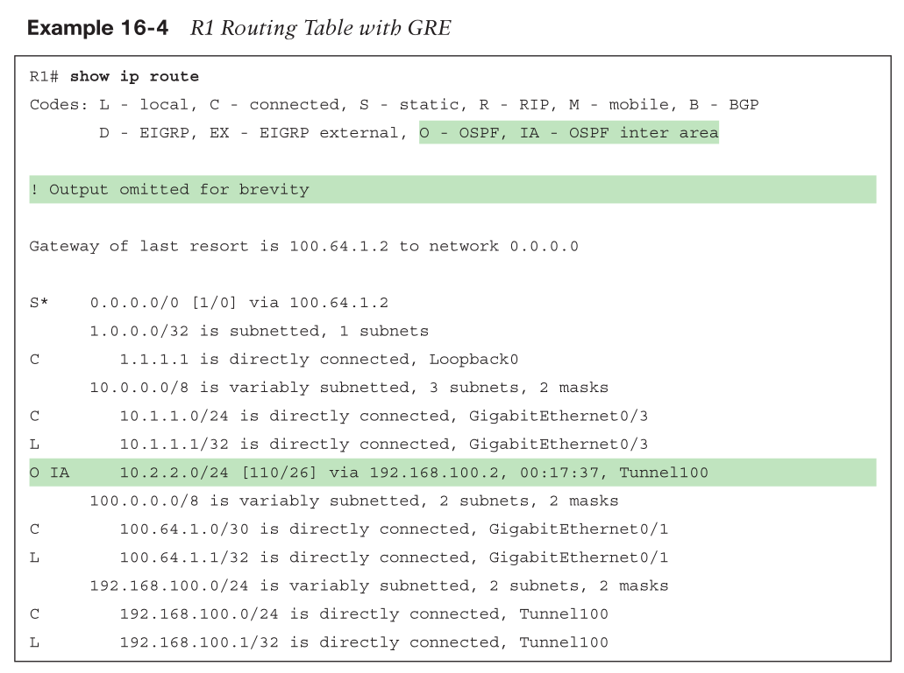
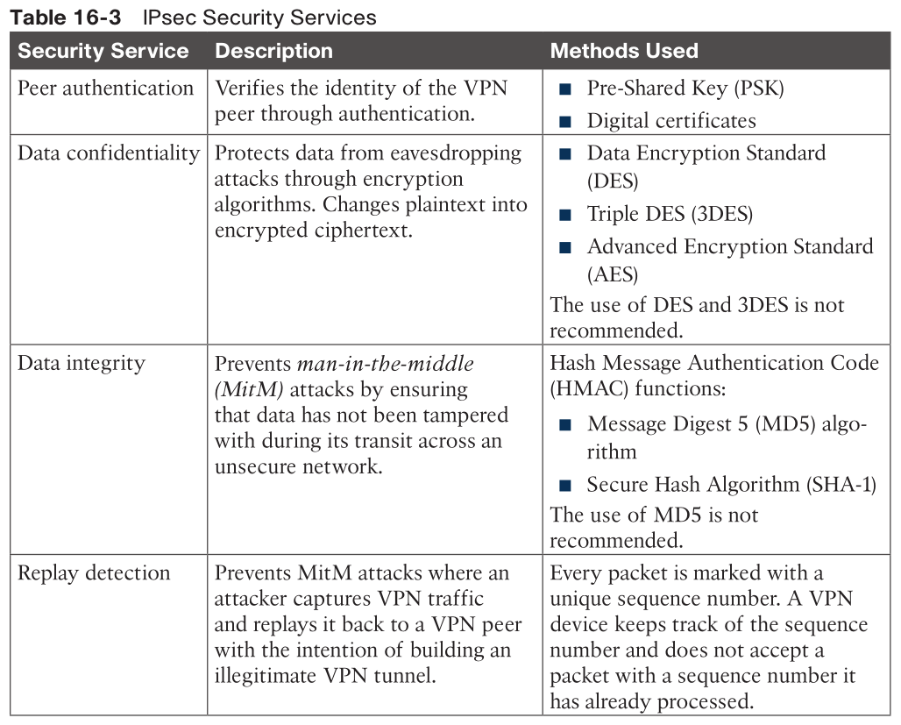
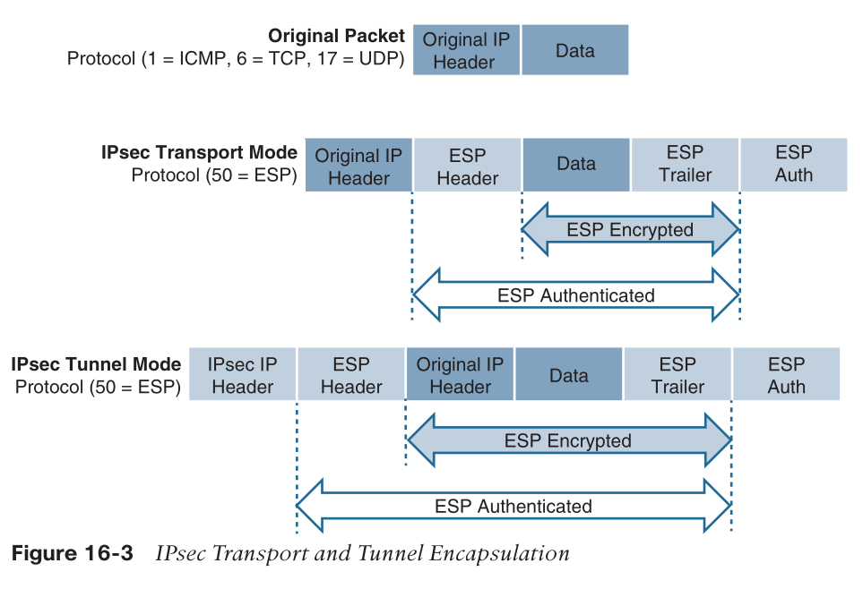

- [Basics](#basics)
- [Generic Routing Encapsulation (GRE) Tunnels](#generic-routing-encapsulation-gre-tunnels)
  - [config](#config)
  - [GRE works with IGP](#gre-works-with-igp)
    - [recursive routing](#recursive-routing)
- [IPsec Fundamentals](#ipsec-fundamentals)
  - [Authentication header (AH)](#authentication-header-ah)
  - [Encapsulating Security Payload (ESP)](#encapsulating-security-payload-esp)
    - [Two modes of transport](#two-modes-of-transport)
  - [Diffie-Hellman (DH)](#diffie-hellman-dh)
  - [Transform Sets](#transform-sets)
    - [HMAC](#hmac)
  - [Internet Key Exchange / IKEv1](#internet-key-exchange--ikev1)
    - [Phase 1 (Main Mode)](#phase-1-main-mode)
    - [Phase 1 (Aggressive mode)](#phase-1-aggressive-mode)
    - [Phase 2 (Quick Mode)](#phase-2-quick-mode)
  - [IKEv2](#ikev2)
- [Cisco Locator/ID Separation Protocol (LISP)](#cisco-locatorid-separation-protocol-lisp)
- [Virtual Extensible Local Area Network (VXLAN):](#virtual-extensible-local-area-network-vxlan)

# Basics

* an overlay tunnel can be built on top of another overlay tunnel
  * e.g.: MPLS tunnel is tunneled via GRE to reach another AS, and GRE tunnel is tunneled over IPSec for security
    * MPLS over GRE over IPSec
* Different combinations of overlay tunneling and encryption technologies opened the door to next-generation overlay fabric networks such as:
  * Software-Defined WAN (SD-WAN)
  * Software-Defined Access (SD-Access)
  * Application Centric Infrastructure (ACI)
  * Cisco Virtual Topology System (VTS)

# Generic Routing Encapsulation (GRE) Tunnels

* originally created to provide transport for non-routable legacy protocols such as Internetwork Packet Exchange (IPX) across an IP network
* use cases
  * penetrating firewall/ACL
  * connect discontiguous networks
  * create VPNs
* over both IPv4 and IPv6


* GRE header: 24B

## config


* GRE tunnel can act as an interface
  * use loopback IP for src/dst IP
  * the line protocol enters an up state when the router detects that a route to the tunnel destination exists in the routing table.

```
R1#
interface Tunnel100
    bandwidth 4000
    ip address 192.168.100.1 255.255.255.0
    ip mtu 1400
    keepalive 5 3
    tunnel source GigabitEthernet0/1
    tunnel destination 100.64.2.2
!
router ospf 1
    router-id 1.1.1.1
    network 10.1.1.1 0.0.0.0 area 1
    network 192.168.100.1 0.0.0.0 area 0
!
ip route 0.0.0.0 0.0.0.0 100.64.1.2

R2
interface Tunnel100
    bandwidth 4000
    ip address 192.168.100.2 255.255.255.0
    ip mtu 1400
    keepalive 5 3
    tunnel source GigabitEthernet0/1
    tunnel destination 100.64.1.1
!
router ospf 1
    router-id 2.2.2.2
    network 10.2.2.0 0.0.0.255 area 2
    network 192.168.100.2 0.0.0.0 area 0
!
ip route 0.0.0.0 0.0.0.0 100.64.2.1

R1# show interfaces tunnel 100 | include Tunnel.*is|Keepalive|Tunnel s|Tunnel p
    Tunnel100 is up, line protocol is up
    Keepalive set (5 sec), retries 3
    Tunnel source 100.64.1.1 (GigabitEthernet0/1), destination 100.64.2.2
    Tunnel protocol/transport GRE/IP
```

* optionally, define
  * _tunnel BW_ as reference bandwidth for IGP calculation
    * `bandwidth [1-10000000 in kbps]`
  * _keepalives_
    * `keepalive [seconds [retries]]`
    * default: 10s, retries: 3
  * _MTU_
    * `ip mtu mtu`


## GRE works with IGP

* tunnel interface acts as a virtual link across the underlay network



### recursive routing

* use the tunnel to reach the tunnel endpoint address
  * e.g.: R1 and R2 advertise 100.64/16, the internet-facing IP, to IGP
  * R1 GRE dst IP is 100.64.2.2
  * R1 routing table shows to reach 100.64.2.2, go GRE tunnel interface
* GRE tunnel endpoint interface/addressing / underlaying network interfaces/addressing should not be advertised via IGP

# IPsec Fundamentals

* security services
  * authentication
  * confidentiality
  * integrity
  * replay detection



## Authentication header (AH)

* protocol: 51
* no encryption/confidentiality
* no support NAT traversal
* its use is not recommended, unless authentication is all that is desired

## Encapsulating Security Payload (ESP)

* protocol: 50
* _payload_ is the portion of the original packet that is encapsulated within the IPsec headers
* support confidentiality and NAT traversal

### Two modes of transport

* _Tunnel mode_: Encrypts the entire original packet and adds a new set of IPsec headers. These new headers are used to route the packet and also provide overlay functions.
* _Transport mode_: Encrypts and authenticates only the packet payload. This mode does not provide overlay functions and routes based on the original IP headers.



## Diffie-Hellman (DH)

* An asymmetric key exchange protocol that enables two peers to establish a shared secret key
  * Agree on a public key: Alice and Bob agree on a large prime number, \(p\), and a generator, \(g\).
  * Choose private keys: Alice chooses a secret integer, \(a\), as her private key. Bob chooses his own private key, \(b\).  
  * Calculate public keys: Alice calculates her public key as \(g^{a}\bmod p\). Bob calculates his public key in the same way.  
  * Compute the shared secret: Alice and Bob can both compute the same shared secret number by combining their private keys with the other party's public key. The shared secret is \(g^{ab}\bmod p\).  
  * Diffie-Hellman Key Agreement Method (RFC 2631)

* Cisco recommends avoiding DH groups 1, 2, and 5 and instead using DH groups 14 and higher.
  * group 1 uses 768 bits, group 2 uses 1024, and group 5 uses 1536

## Transform Sets

* a combination of security protocols and algorithms
  * e.g.: ah-sha256-hmac, esp-aes 256, esp-sha-hmac
* negotiated during IPSec security associations (SA) establishment

### HMAC 

* Hash-based Message Authentication Code
* verify both the integrity and authenticity of a message
* uses a cryptographic hash function in combination with a secret key to produce a hash value
* requires a secret cryptographic key shared between the sender and the receiver a prior

## Internet Key Exchange / IKEv1

* RFC2409
* UDP port: 500
* Internet Security Association and Key Management Protocol (ISAKMP)
  * a framework for authentication and key exchange between two peers to establish, modify, and tear down SAs
* IKE is the implementation of ISAKMP using the Oakley and Skeme key exchange techniques. 
  * Oakley provides Perfect Forward Secrecy (PFS) for keys, identity protection, and authentication; 
    * PFS: a compromised key does not compromise future keys
  * Skeme provides anonymity, repudiability, and quick key refreshment.
* Two phases
  * phase 1: ISAKMP SA - Security Association Setup
    * bidrectional
    * Establishes a secure and authenticated communication channel between the two peers (devices). The key exchange in this phase allows the peers to securely authenticate each other and negotiate cryptographic parameters.
  * phase 2: IPsec SA - Data Protection Setup
    * unidirectional
    * Uses the secure channel established in Phase 1 to negotiate and establish the actual IPsec Security Associations (SAs) for encrypting the data traffic between the devices.

### Phase 1 (Main Mode)

* 6 messages exchanged
* Initial exchange
  * MM1: Initiator → Proposes algorithms, DH group, and nonce.
    * Hash algorithm
    * Encryption algorithm
    * Authentication algorithm
    * parameters
      * DH group #
      * lifetime
  * MM2: Responder → Accepts or rejects proposals and sends alternative.
* DH key exchange
  * MM3: Initiator → Sends its identity.
  * MM4: Responder → Sends its identity.
    * encryption key established
* Authentication
  * MM5: Initiator → Verifies the authentication (e.g., PSK or public-key).
  * MM6: Responder → Acknowledges authentication

### Phase 1 (Aggressive mode)

* 3 messages exchanged 
* AM1: In this message, the initiator sends all the information contained in MM1 through MM3 and MM5.
* AM2: This message sends all the same information contained in MM2, MM4, and MM6.
* AM3: This message sends the authentication that is contained in MM5.
* comparing to main mode: AM faster, fewer messages, but less secure, not as much identity protection.

### Phase 2 (Quick Mode) 

* 3 messages exchanged
* QM1: Initiator → Proposes IPsec parameters (encryption, integrity).
* QM2: Responder → Accepts or rejects proposals.
* QM3: Initiator → Acknowledges the final parameters.

## IKEv2

* communications consist of request and response pairs called exchanges and sometimes just called request/response pairs.
* IKE_SA_INIT (Initiator → Responder): Proposes algorithms and nonce, begins Diffie-Hellman exchange.
* IKE_SA_INIT Response (Responder → Initiator): Responds with chosen algorithms and nonce, sends public keys.
* IKE_AUTH (Initiator → Responder): Sends identity and authentication data (e.g., certificate or PSK).
* IKE_AUTH Response (Responder → Initiator): Responds with authentication and identity verification.
* CREATE_CHILD_SA (Initiator → Responder): Requests the creation of the IPsec tunnel.
* CREATE_CHILD_SA Response (Responder → Initiator): Responds with confirmation, IPsec tunnel established.

# Cisco Locator/ID Separation Protocol (LISP)

# Virtual Extensible Local Area Network (VXLAN):
