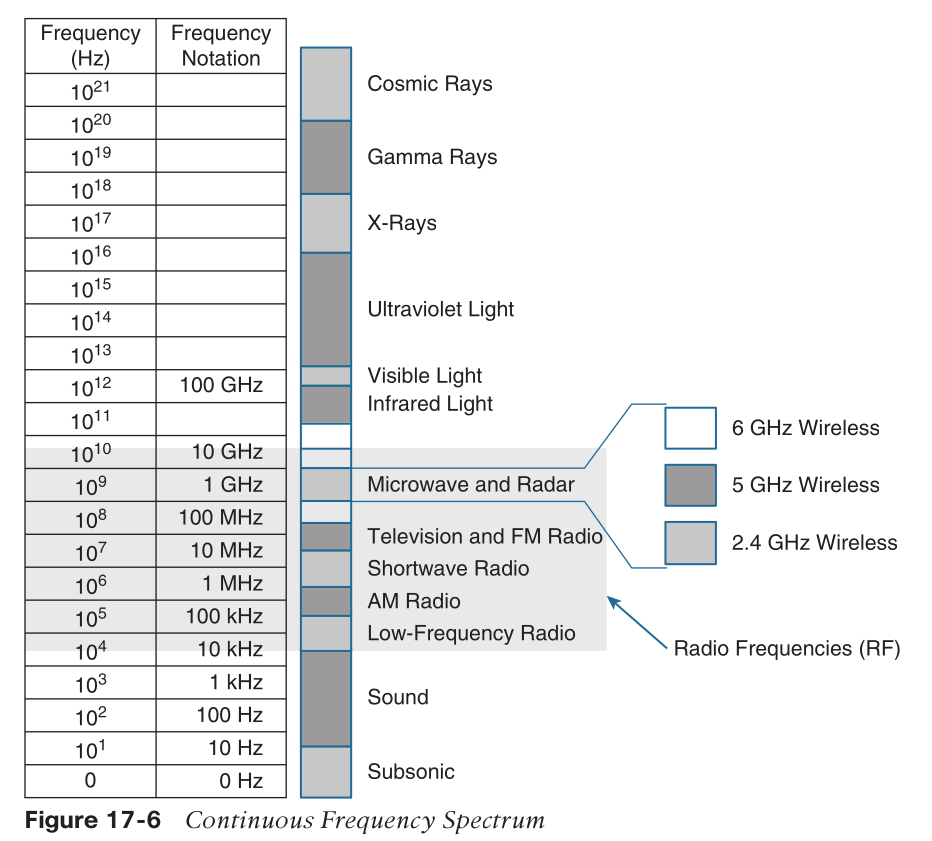
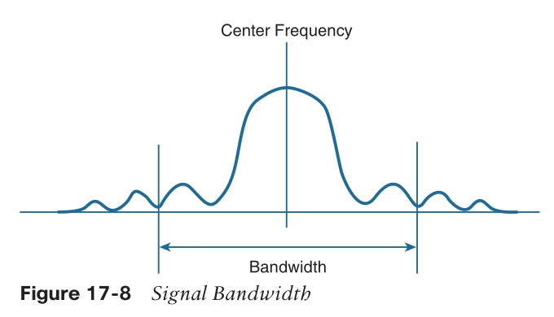
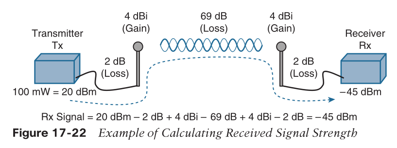

- [Basics](#basics)
  - [Frequency](#frequency)
    - [Band](#band)
    - [Channel](#channel)
    - [Bandwidth](#bandwidth)
  - [Phase](#phase)
  - [Wavelength](#wavelength)
  - [RF Power and dB](#rf-power-and-db)
    - [dB laws](#db-laws)
    - [dBm](#dbm)
  - [Power Changes Along the Signal Path](#power-changes-along-the-signal-path)
    - [Free Space Path Loss](#free-space-path-loss)
  - [Power Levels at Receiver](#power-levels-at-receiver)
- [Carrying data over an RF signal](#carrying-data-over-an-rf-signal)

# Basics

* The electric and magnetic fields travel along together and are always at right angles to each other
* The signal must keep changing, or alternating, by cycling up and down, to keep the electric and magnetic fields cycling and pushing ever outward.

## Frequency

* number of times the signal makes one complete up and down cycle in 1 second

* RF: 3K-300GHz

### Band

* a continuous range of frequencies
* AM band: 530K - 1710K
* WiFi RF:
  * 2.4G band: 2.4G - 2.4835G
    * aka ISM band (Industry, Scientific, and Medical)
      * can use w/o a license
  * 5G band: 5.15G - 5.825G
    * 5.150 to 5.250 GHz: U-NII-1
    * 5.250 to 5.350 GHz: U-NII-2A
    * > 5.350 to 5.470GHz: U-NII-2B, not usable by wifi now, but may change in the future
    * 5.470 to 5.725 GHz: U-NII-2C
    * 5.725 to 5.825 GHz: U-NII-3
    * > 5.825 to 5.925 GHz: U-NII-4, efforts are underway to add it for wifi
  * 6G band
    * 5.925 to 6.425 GHz, U-NII-5
    * 6.425 to 6.525 GHz, U-NII-6
    * 6.525 to 6.875 GHz, U-NII-7
    * 6.875 to 7.125 GHz, U-NII-8

### Channel

* bands are usually divided into a number of distinct channels
* each channel is assigned a number and a frequency

* spacing / channel width: 5Mhz
  * except for channel 14

### Bandwidth

* an RF signal spills above and below a center frequency

* Wifi devices use spectral mask to ignore parts of signals which falls outside of bandwidth boundaries.
* ideally, *bandwidth < channel width*
  * 2.4G wifi channel width: 22Mhz
    * so 2.4G channels will overlap
      * less usable channels
  * 5G/6G wifi channel width: 20Mhz

## Phase

* a measure of shift in time relative to the start of a cycle
  * measured by degree
* Phase becomes important as RF signals are received. 
  * signals that are _in phase (cycles matched up)_ tend to add together
  * signals that are 180 degrees _out of phase (one signal is delayed from the other)_ tend to cancel each other out.

## Wavelength

* denoted by $\lambda$
* a measure of the physical distance that a wave travels over one complete cycle
  * a 2.4 GHz signal would have a wavelength of 4.92 inches
  * a 5 GHz signal would be 2.36 inches
  * a 6 GHz signal would be 1.97 inches.

## RF Power and dB

* energy to make RF signal propagating
  * can be measured by amplitude
* absolute power is measured in watts (W)
  * a typical AM radio station broadcasts at a power of 50,000 W
  * an FM radio station might use 16,000 W
  * a wireless LAN transmitter usually use between 0.1 W (100 mW) and 0.001 W (1 mW)
* relative power is measured in decibel (dB)
  * power level comparison between two different transmitters
  * why relative?
    * change exponential range into linear
  * $dB = 10 log_{10} \frac{P2}{P1}$ where 
    * $P1$ and $P2$ are absolute power level
    * $P1$: reference
    * $P2$: source of interest

### dB laws

* Law of Zero / $dB=0$
  * two absolute power values are equal.
* Law of 3s / $dB=\pm3$
  * $dB=3$: power of interest is double the reference
  * $dB=–3$: power of interest is half the reference
  * $log_{10}2 = 3$
  * Whenever a power level doubles, it increases by 3 dB. Whenever it is cut in half, it decreases by 3 dB.
    * 16mW to 4mW, dB decreased by 6
* Law of 10s / $dB=\pm10$
  * $dB=10$: power of interest is 10 times the reference
  * $dB=-10$: power of interest is 1/10 of the reference

### dBm

* dB-millwatt
* comparing against a reference
  * reference = 1mW
* The transmitter dBm **plus** the net loss in dB equals the received signal in dBm.

## Power Changes Along the Signal Path

* antennas provide positive gain
* reference antenna is an _isotropic_ antenna
  * the gain is measured in _dBi_ (dB-isotropic)
* effective isotropic radiated power (EIRP)
  * EIRP = Tx Power – Tx Cable + Tx Antenna
  * in dBm
  > Suppose a transmitter is configured for a power level of 10 dBm (10 mW). A cable with 5 dB loss connects the transmitter to an antenna with an 8 dBi gain. The resulting EIRP of the system is $10 dBm – 5 dB + 8 dBi$, or 13 dBm.
  > Even though the units appear to be different, you can safely combine them for the purposes of calculating the EIRP.
* _dBd_ (dB-dipole)
  * a dipole antenna as the reference, which has a gain of 2.14 dBi
    * add 2.14 dB to get dBi
* _link budget_
  * to make sure that the transmitted signal has sufficient power so that it can effectively reach and be understood by a receiver

### Free Space Path Loss

* RF signal propagates as a wave/sphere
  * energy gets spread thinner
* $FSPL(dB) = 20log_{10}(d) + 20log_{10}(f) + 32.44$
  * $d$: distance in km
  * $f$: frequency in MHz
  * The loss is a function of distance and frequency only
> Even at 1 meter away, the effects of free space cause a loss of around 46 dBm!
> For perspective, you might see a 69 dB Wi-Fi loss over a distance of about 13 to 28 meters.

## Power Levels at Receiver

* well below 1mW / 0dBm
* _received signal strength indicator (RSSI)_
  * IEEE 802.11
  * 1B value: 0-255, 0: weakest
  * no uint
    * but many vendors convert RSSI value into dBm in their own way
* every receiver has a _sensitivity level_
  * e.g.: -82dBm
* _noise floor_: the average signal strength of the noise
* _signal-to-noise ratio (SNR)_
  * the difference between signal and noise

> On the left side of the graph, the noise floor is –90 dBm. The resulting SNR is –54 dBm – (–90) dBm or 36 dB.

# Carrying data over an RF signal