- [Basics](#basics)
  - [Frequency](#frequency)
    - [Band](#band)
    - [Channel](#channel)
    - [Bandwidth](#bandwidth)
  - [Phase](#phase)
  - [Wavelength](#wavelength)
  - [RF Power and dB](#rf-power-and-db)
    - [dB laws](#db-laws)
    - [dBm](#dbm)
  - [Power Changes Along the Signal Path](#power-changes-along-the-signal-path)
    - [Free Space Path Loss](#free-space-path-loss)
  - [Power Levels at Receiver](#power-levels-at-receiver)
- [Carrying data over an RF signal](#carrying-data-over-an-rf-signal)
  - [Maintaining AP–Client Compatibility](#maintaining-apclient-compatibility)
  - [Using Multiple Radios to Scale Performance](#using-multiple-radios-to-scale-performance)
    - [Spatial Multiplexing](#spatial-multiplexing)
    - [Transmit Beamforming](#transmit-beamforming)
    - [Maximal-Ratio Combining (MRC)](#maximal-ratio-combining-mrc)
  - [Maximizing the AP–Client Throughput](#maximizing-the-apclient-throughput)
- [Wireless Infrastructure](#wireless-infrastructure)
  - [Autonomous Deployment](#autonomous-deployment)
  - [Cisco AP Operation](#cisco-ap-operation)
  - [Cisco Wireless Deployments](#cisco-wireless-deployments)
    - [Centralized Wireless Deployment](#centralized-wireless-deployment)
    - [Cloud-Based Wireless Deployment](#cloud-based-wireless-deployment)
    - [Distributed Wireless Deployment](#distributed-wireless-deployment)
    - [Controller-less Deployment](#controller-less-deployment)
  - [Pairing Lightweight APs and WLCs](#pairing-lightweight-aps-and-wlcs)
    - [onboarding a new AP](#onboarding-a-new-ap)
    - [AP States](#ap-states)
    - [Discovering a WLC](#discovering-a-wlc)
      - [router helper](#router-helper)
    - [Selecting a WLC](#selecting-a-wlc)
    - [Maintaining WLC Availability](#maintaining-wlc-availability)
  - [Segmenting Wireless Configurations](#segmenting-wireless-configurations)
  - [Leveraging Antennas for Wireless Coverage](#leveraging-antennas-for-wireless-coverage)
    - [Radiation Patterns](#radiation-patterns)
    - [Gain](#gain)
      - [Beamwidth](#beamwidth)
    - [Polarization](#polarization)
      - [Production of Electromagnetic Waves](#production-of-electromagnetic-waves)
    - [Omnidirectional Antennas](#omnidirectional-antennas)
    - [Directional Antennas](#directional-antennas)
      - [patch antenna](#patch-antenna)
      - [Yagi antenna](#yagi-antenna)
      - [Parabolic Dish Antenna](#parabolic-dish-antenna)
- [Understanding Wireless Roaming and Location Services](#understanding-wireless-roaming-and-location-services)
  - [Roaming Between Autonomous APs](#roaming-between-autonomous-aps)
  - [Intracontroller Roaming](#intracontroller-roaming)
  - [Intercontroller Roaming](#intercontroller-roaming)
    - [Layer 2 Roaming](#layer-2-roaming)
    - [Layer 3 Roaming](#layer-3-roaming)
    - [Scaling Mobility with Mobility Groups](#scaling-mobility-with-mobility-groups)
  - [Locating Devices in a Wireless Network](#locating-devices-in-a-wireless-network)

# Basics

* The electric and magnetic fields travel along together and are always at right angles to each other
* The signal must keep changing, or alternating, by cycling up and down, to keep the electric and magnetic fields cycling and pushing ever outward.

## Frequency

* number of times the signal makes one complete up and down cycle in 1 second

* RF: 3K-300GHz

### Band

* a continuous range of frequencies
* AM band: 530K - 1710K
* WiFi RF:
  * 2.4G band: 2.4G - 2.4835G
    * aka ISM band (Industry, Scientific, and Medical)
      * can use w/o a license
  * 5G band: 5.15G - 5.825G
    * 5.150 to 5.250 GHz: U-NII-1
    * 5.250 to 5.350 GHz: U-NII-2A
    * > 5.350 to 5.470GHz: U-NII-2B, not usable by wifi now, but may change in the future
    * 5.470 to 5.725 GHz: U-NII-2C
    * 5.725 to 5.825 GHz: U-NII-3
    * > 5.825 to 5.925 GHz: U-NII-4, efforts are underway to add it for wifi
  * 6G band
    * 5.925 to 6.425 GHz, U-NII-5
    * 6.425 to 6.525 GHz, U-NII-6
    * 6.525 to 6.875 GHz, U-NII-7
    * 6.875 to 7.125 GHz, U-NII-8

### Channel

* bands are usually divided into a number of distinct channels
* each channel is assigned a number and a frequency


* spacing / channel width: 5Mhz
  * except for channel 14

### Bandwidth

* an RF signal spills above and below a center frequency


* Wifi devices use spectral mask to ignore parts of signals which falls outside of bandwidth boundaries.
* ideally, *bandwidth < channel width*
  * 2.4G wifi channel width: 22Mhz
    * so 2.4G channels will overlap
      * less usable channels
  * 5G/6G wifi channel width: 20Mhz

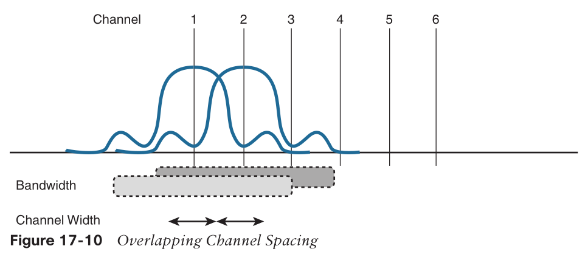

## Phase

* a measure of shift in time relative to the start of a cycle
  * measured by degree
* Phase becomes important as RF signals are received. 
  * signals that are _in phase (cycles matched up)_ tend to add together
  * signals that are 180 degrees _out of phase (one signal is delayed from the other)_ tend to cancel each other out.

## Wavelength

* denoted by $\lambda$
* a measure of the physical distance that a wave travels over one complete cycle
  * a 2.4 GHz signal would have a wavelength of 4.92 inches
  * a 5 GHz signal would be 2.36 inches
  * a 6 GHz signal would be 1.97 inches.

## RF Power and dB

* energy to make RF signal propagating
  * can be measured by amplitude
* absolute power is measured in watts (W)
  * a typical AM radio station broadcasts at a power of 50,000 W
  * an FM radio station might use 16,000 W
  * a wireless LAN transmitter usually use between 0.1 W (100 mW) and 0.001 W (1 mW)
* relative power is measured in decibel (dB)
  * power level comparison between two different transmitters
  * why relative?
    * change exponential range into linear
  * $dB = 10 * log_{10} (\frac{P2}{P1})$ where 
    * $P1$ and $P2$ are absolute power level
    * $P1$: reference
    * $P2$: source of interest

### dB laws

* Law of Zero
  * $dB=0$
  * two absolute power values are equal.
* Law of 3s
  * $dB=\pm3$
  * $dB=3$: power of interest is double the reference
  * $dB=–3$: power of interest is half the reference
  * $10 * log_{10}2 = 3$
  * Whenever a power level doubles, it increases by 3 dB. Whenever it is cut in half, it decreases by 3 dB.
    * 16mW to 4mW, dB decreased by 6
* Law of 10s
  * $dB=\pm10$
  * $dB=10$: power of interest is 10 times the reference
  * $dB=-10$: power of interest is 1/10 of the reference

* LZ 
  * if dB=20, then power difference is 2 magnitude
    $$
    20=10log_{10}(\frac{p1}{p2}) \newline
    2=log_{10}(\frac{p1}{p2}) \newline
    10^2=10^{log_{10}(\frac{p1}{p2})} \newline
    10^2=\frac{p1}{p2}
    $$
  * if dB=40, then power difference is 4 magnitude

### dBm

* dB-millwatt
* comparing against a reference
  * reference = 1mW
* The transmitter dBm **plus** the net loss in dB equals the received signal in dBm.

## Power Changes Along the Signal Path

* antennas provide positive gain
* reference antenna is an _isotropic_ antenna
  * the gain is measured in _dBi_ (dB-isotropic)
* effective isotropic radiated power (EIRP)
  * EIRP = Tx Power – Tx Cable + Tx Antenna
  * in dBm
  * Tx only
  > Suppose a transmitter is configured for a power level of 10 dBm (10 mW). A cable with 5 dB loss connects the transmitter to an antenna with an 8 dBi gain. The resulting EIRP of the system is $10 dBm – 5 dB + 8 dBi$, or 13 dBm.
  > Even though the units appear to be different, you can safely combine them for the purposes of calculating the EIRP.
* _dBd_ (dB-dipole)
  * a dipole antenna as the reference, which has a gain of 2.14 dBi
    * add 2.14 dB to get dBi
* _link budget_
  * to make sure that the transmitted signal has sufficient power so that it can effectively reach and be understood by a receiver


### Free Space Path Loss

* RF signal propagates as a wave/sphere
  * energy gets spread thinner
* $FSPL(dB) = 20log_{10}(d) + 20log_{10}(f) + 32.44$
  * $d$: distance in km
  * $f$: frequency in MHz
  * The loss is a function of distance and frequency only
> Even at 1 meter away, for 5G wifi, the effects of free space cause a loss of around 46 dBm!
> For perspective, you might see a 69 dB Wi-Fi loss over a distance of about 13 to 28 meters.

## Power Levels at Receiver

* well below 1mW / 0dBm
* _received signal strength indicator (RSSI)_
  * IEEE 802.11
  * 1B value: 0-255
    * 0: weakest
  * no uint
    * but many vendors convert RSSI value into dBm in their own way
* every receiver has a _sensitivity level_
  * e.g.: -82dBm
  * data can be understood if power level > sensitivity level
* _noise floor_
  * the average signal strength of the noise
* _signal-to-noise ratio (SNR)_
  * the difference between signal and noise
  * in dB
  * SNR = signal dB - noise dB


> On the left side of the graph, the noise floor is –90 dBm. The resulting SNR is –54 dBm – (–90) dBm or 36 dB.

# Carrying data over an RF signal

* carrier signal
  * constant f, amplitude, phase
  * f must be preserved after adding data
* modulation
  * in one cycle, add 1 or 0
  * narrowband
    * low f signals
    * for FM/AM radio
  * spread spectrum
    * data spread across a range of f
* Direct sequence spread spectrum (DSSS)
  * used in 2.4G wifi
* Orthogonal Frequency Division Multiplexing (OFDM)
  * used in 2.4G, 5G, and 6G wifi
  * alter phase and amplitude
    * QAM

## Maintaining AP–Client Compatibility

* 802.11
  * defines carrier signals, modulation, coding, bands, channels, and data rates
  * since 1997
  * 802.11b/a/g/n/ac/ax
  * Wi-Fi Alliance’s endorsement

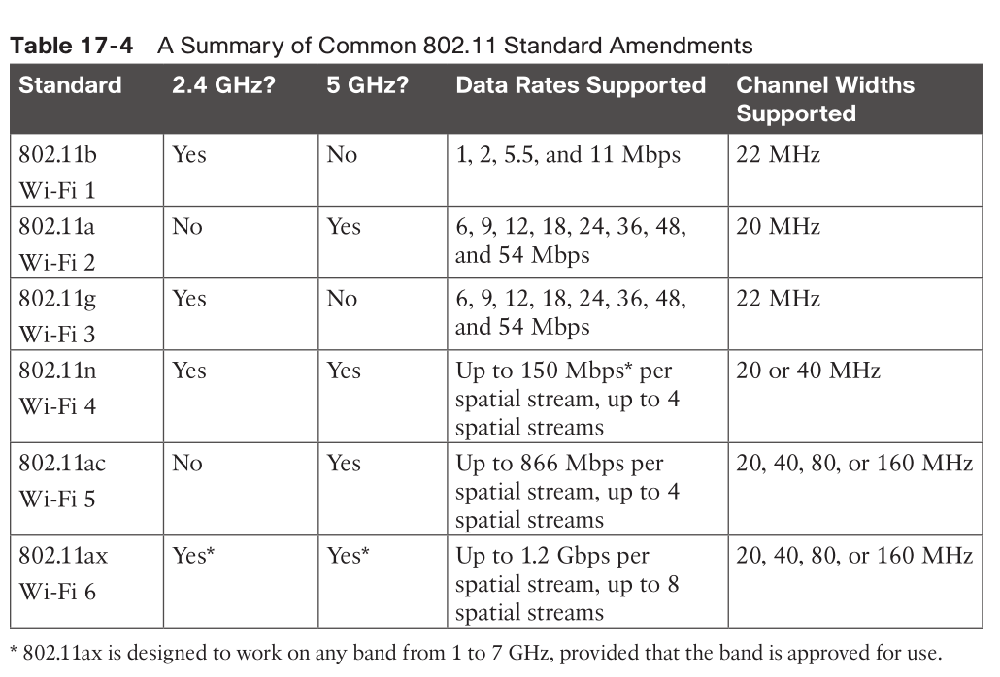

> 802.11ac offers around 320 different data rates because there are so many combinations of modulation and efficiency parameters

* up to 802.11ac, at any time only one talker in one channel
* 802.11ax allows multiple talkers

## Using Multiple Radios to Scale Performance

* single-in, single-out (SISO)
  * wireless devices used a single transmitter and a single receiver
    * = a single radio chain
* multiple-input, multiple-output (MIMO)
  * a device can have multiple antennas, multiple transmitters, and multiple receivers
    * = multiple radio chain
      * to improve reception (max-radio combing)
      * to improve transmission to specific client location (beamforming)
      * to carry data for multiple clients
  * TxR
    * T: number of transmitters
    * R: number of receivers
  * 2x2 MIMO device

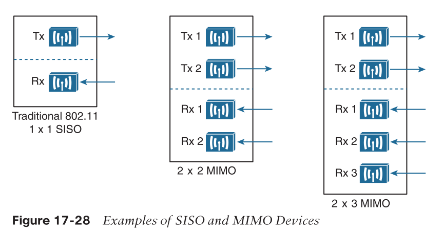

### Spatial Multiplexing

* data distributed across two or more radio chains
  * all operating on the same channel 
  * but separated through spatial diversity
  * to increase data throughput
* to reduce interference
  * try make signals arrived out of phase
    * travel along slightly different paths
      * space tx/rx antennas appropriately
* spatial streams
  * independent data streams multiplexed over the radio chains
  * 3×3:2
    * three transmitters
    * three receivers
    * support two unique spatial streams

> Notice that a MIMO device can support a number of unique spatial streams that differs from the number of its transmitters or receivers. It might seem logical that each spatial stream is assigned to a transmitter/receiver, but that is not true. Spatial streams are processed so that they are distributed across multiple radio chains. The number of possible spatial streams depends on the processing capacity and the transmitter feature set of the device—not on the number of its radios.

### Transmit Beamforming

* same signal transmitted over multiple antennas to reach specific client locations
* try make signals arrived in phase
  * the phase of the signal is altered as it is fed into each transmitting antenna so that the resulting signals will all arrive in phase at a specific receiver
* explicit feedback from receiver
* tx keeps a table (receiver, phase adjustment)

### Maximal-Ratio Combining (MRC)

* receiving device can use multiple antennas and radio chains to receive the multiple transmitted copies of the signal
  * one copy may be better than the other
  * one copy may be better for a time
* produce one resulting signal

## Maximizing the AP–Client Throughput

* Tx and Rx need agree on modulation method (and the resulting data rate)
* negotiate it dynamically
  * based on current RSSI and SNR
  * dynamic rate shifting (DRS)
    * also known as link adaptation, adaptive modulation and coding (AMC), and rate adaptation
  
  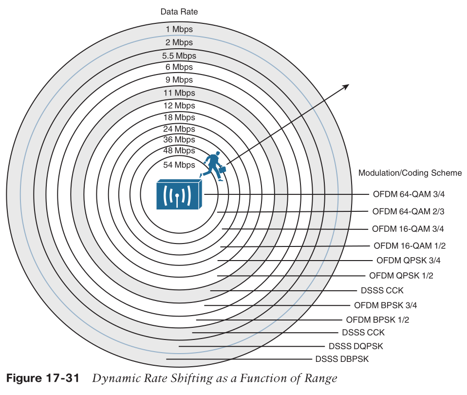

# Wireless Infrastructure

* lightweight mode
* _BSS_: Basic Service Set
* _SSID_: Service Set Identifier
* Control and Provisioning of Wireless Access Points (CAPWAP)
  * RFC 5415
    * access controller (AC) = WLC
    * wireless termination point (WTP) = AP

> Cisco has offered two WLC platforms. The most recent is based on hardware that runs the IOS XE operating system, while its predecessor was based on the AireOS operating system. From the AP’s perspective, both platforms connect to it via CAPWAP tunnels

## Autonomous Deployment

* Autonomous APs
  * self-contained, offer standalone BSS
  * need config a management IP and join the mgmt vlan
  * same SSID on many APs
  * users roaming only at L2
  * shortest path for wifi users with same AP


## Cisco AP Operation

* AP need WLC to work together to offer BSS
  * split-MAC arch.
    * AP do 802.11
    * WLC do the management
  * AP<->WLC control/data go through CAPWAP tunnel
  * each AP has a management IP
    * to terminate CAPWAP tunnel
  * wifi user <-> AP <-(CAPWAP)-> WLC <-> destination
* AP mode:
  * Local
    * default mode
    * providing BSSs and connecting WiFi clients
  * FlexConnect
    * CAPWAP only for control traffic
    * if control down, AP still can switch traffic locally
  * Monitor
    * receiver only in promiscuous mode
    * detect intrusions, rogue AP, etc.
  * Sniffer
    * capture traffic and send to sth. like wireshark
  * Rogue device detector
    * correlating MAC addresses heard on both wired and wifi network
      * Rogue devices are those that appear on both networks
  * Bridge
    * P2P or P2MP
    * two APs in bridge mode can bridge two locations separated by distance
    * multiple APs in bridge mode can form a mesh network 
  * Flex+Bridge
    * FlexConnect operation is enabled on a mesh AP
  * Se-Connect
    * spectrum analysis to analyze interferences
      * MetaGeek Chanalyzer
      * Cisco Spectrum Expert

> a lightweight AP is normally in local mode when it is providing BSSs and allowing client devices to associate to wireless LANs. When an AP is configured to operate in one of the other modes, local mode (and the BSSs) is disabled.

## Cisco Wireless Deployments

### Centralized Wireless Deployment

* WLC located near the core layer
  * for users to reach internet, data center
* A typical centralized WLC can support up to 6000 APs and up to 64,000 wireless clients

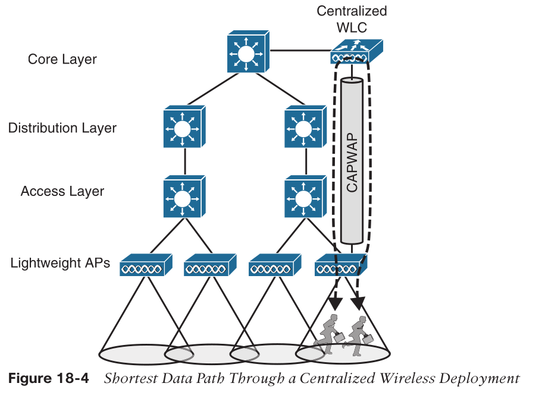

* data path may not be optimal
  * wifi user -> AP -(CAPWAP)-> WLC -(CAPWAP)-> AP -> wifi user
  * RTT(AP<->WLC) should < 100ms
    * AP may timeout connectionto WLC

### Cloud-Based Wireless Deployment

* WLC located in private/public cloud
  * for public cloud, APs must operate only in FlexConnect mode
    * b/c RTT

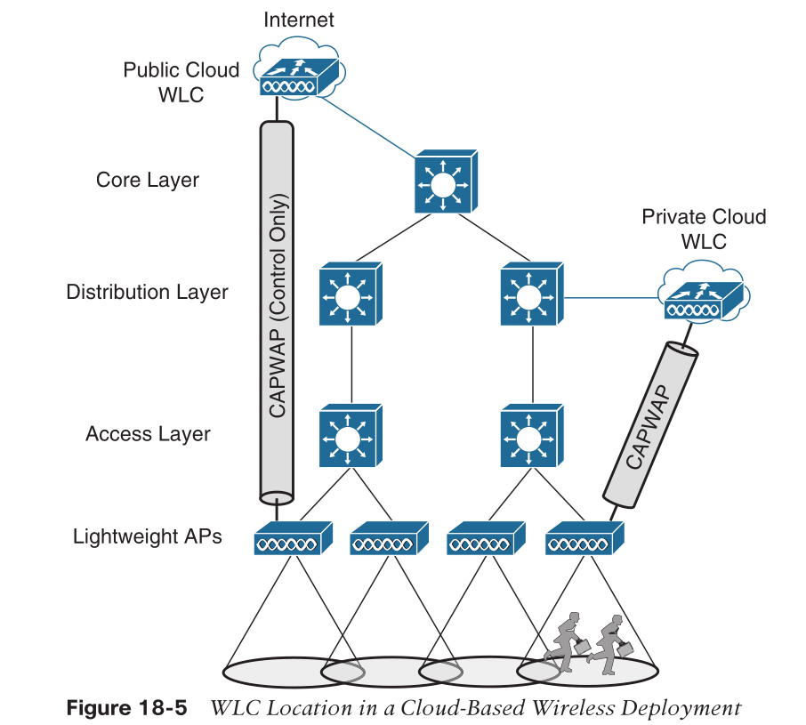

### Distributed Wireless Deployment

* WLC located near access layer

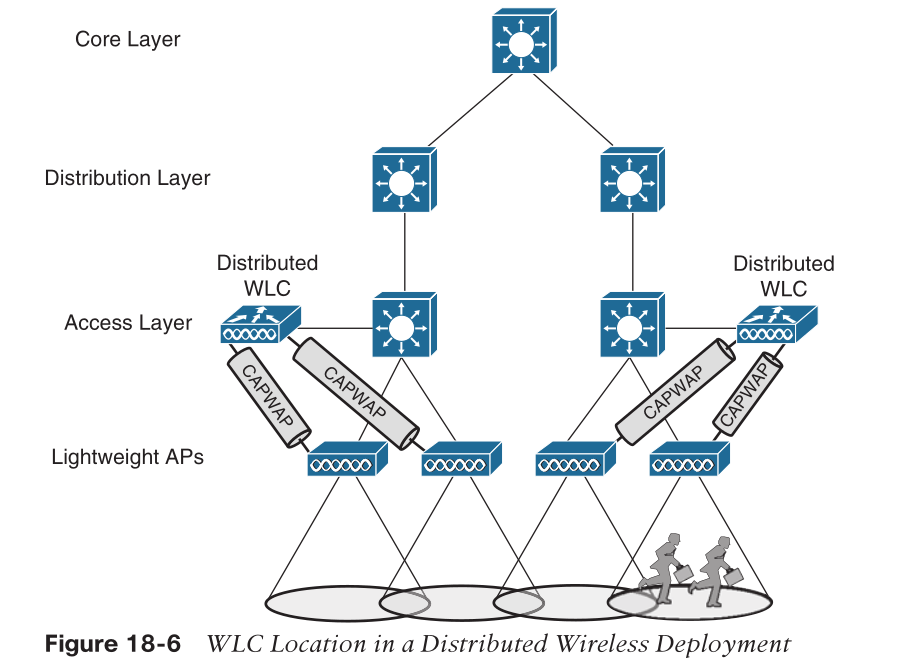

* 1x WLC can support up to 250 APs and 5,000 wireless clients

### Controller-less Deployment

* WLC is embedded in an AP itself
  * embedded wireless controllers (EWCs)
* EWC typically supports up to 100 APs and up to 2,000 wireless clients

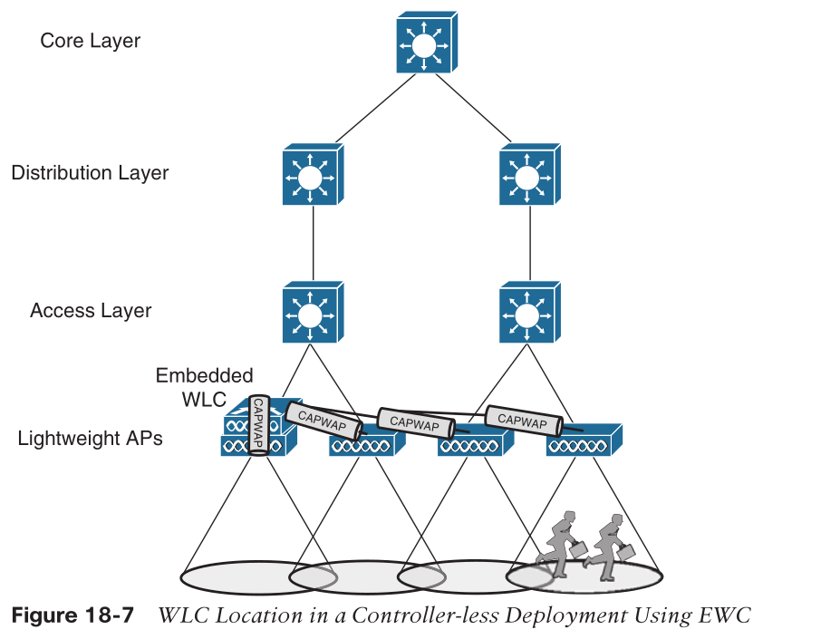

## Pairing Lightweight APs and WLCs

### onboarding a new AP

* connect AP to switch
* configure switch port
  * access mode
  * VLAN
  * inline power setting
* AP power up and looking for WLC to bind

### AP States

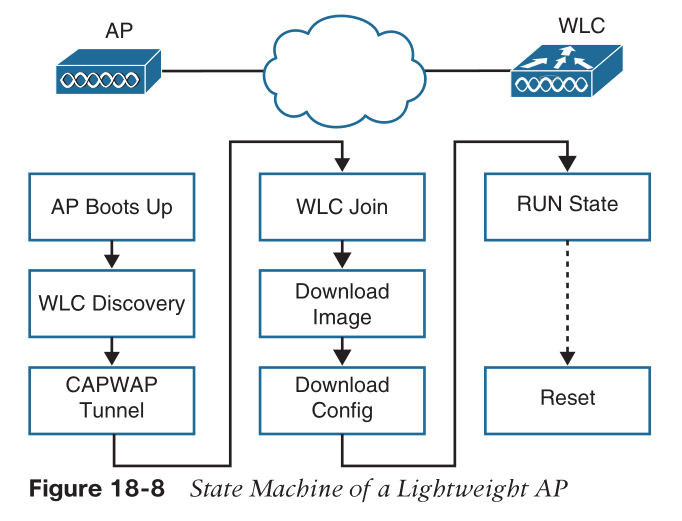

1. AP boots
   * get an IP from DHCP or static config
2. WLC discovery
3. CAPWAP tunnel
   * try build tunnel with one or more WLCs
     * will pick one to bind
   * Datagram Transport Layer Security (DTLS) for control messages
   * authenticate each other via digital certificates
     * who pre-configured AP certs?
4. WLC join
   * CAPWAP Join Request message
   * CAPWAP Join Response message
5. Download image
   * after download, reboot and got to step 1
   * be cautious!
     * existing AP reboots
       * it may start downloading for a while
     * WLC code upgrade
       * disruptive
       * in a maintenance window
     * WLC reboot
       * all APs join a different WLC which may run a different version
         * keep WLC version in sync
   * pre-downloading
     * WLC download new image, no reboot yet
     * AP will also download it
     * then WLC reboot, AP no need download, it already has it
6. Download config
   * RF
   * SSID
   * security
   * QoS
7. Run state

### Discovering a WLC

* build a list of candidate WLCs to join via
  * Broadcast on the local subnet to solicit controllers
    * CAPWAP Discovery Request
      * broadcast to subnet
      * unicast to known controller's IP
      * UDP port 5246
  * Prior knowledge of WLCs
    * if AP has previously joined a WLC
      * AP remembers WLCs it contacted
      * WLC also send a list of available WLCs
  * DHCP and DNS information to suggest a list of controllers
    * DHCP option 43
    * dns name: CISCO-CAPWAP-CONTROLLER.localdomain
  * Plug-and-play with Cisco DNA Center

#### router helper

* if AP and WLC on different subnets

```
router(config) # ip forward-protocol udp 5246
router(config) # interface vlan vlan-number
router(config-int) # ip helper-address WLC1-MGMT-ADDR
router(config-int) # ip helper-address WLC2-MGMT-ADDR
```

### Selecting a WLC

1. If the AP has previously joined a controller and has been configured
2. If a controller has been configured as a master controller, it responds
3. join the least-loaded WLC
   * load = currently joined AP / max AP allowed
     * max AP allowed is defined by platform or license

> If an AP discovers a controller but gets rejected, it may be the controller reached its max

* AP also can configure its priority to influence controller
  * low (default), medium, high, critical
  * controller kick some AP out to make room for high pri. AP

### Maintaining WLC Availability

* keepalive/heartbeat
  * sent from AP to WLC
    * every 30s
      * configurable from 1-30s
  * WLC must answer
    * If a keepalive is not answered, an AP escalates the test by sending four more keepalives at 3-second intervals.
      * configurable from 1-10s
      * default WLC failure detection: 35s (should be 43s?)
      * fastest WLC failure detection: 6s
* AP switchover when WLC fails
  * every AP stores primary, secondary, and tertiary controller fields
  * switchover in that order
* WLC HA
  * stateful switchover (SSO) redundancy
    * SSO groups WLC into HA pairs
      * one active, one hot-standby
      * sync tunnels, AP states, client associations, etc.
  * AP only need know active WLC
  * active/standby switchover is transparent

## Segmenting Wireless Configurations

* config AP
  * Things that affect the AP controller and CAPWAP relationship and FlexConnect behavior on a per-site basis
  * Things that define the RF operation on each wireless band
  * Things that define each wireless LAN and security policies
* IOS XE
  * profiles
    * site
      * AP-WLC CAPWAP parameters
      * VLAN
    * RF
      * radio operation related parameters
      * dynamic transmit power
      * channel assignment algorithms
      * coverage hole detection
    * policy
      * WALN
        * a list of SSIDs
        * WLAN security
      * policy
        * traffic control (QoS, fw, etc.)
  * tags
    * tag individual AP to profiles
      * AP (join) profile
      * Flex profile
    * defaults
      * `default-site-tag`: maps to `default-ap-profile` and `default-flex-profile`
      * `default-rf-tag`: maps to the controller’s global RF configuration
      * `default-policy-tag`: maps to nothing, there is no default
    * customization
      1. Configure AP and Flex profiles and map them to site tags.
      2. Configure RF profiles and map them to RF tags.
      3. Configure WLAN and policy profiles and map them to policy tags.
      4. Assign the appropriate site, RF, and policy tags to the APs.


## Leveraging Antennas for Wireless Coverage

* When an alternating current is applied to an antenna, an electromagnetic wave is produced.
* client density
  * number of devices an AP can support

### Radiation Patterns

* A plot that shows the relative signal strength around an antenna
* 3D sphere -> 2D plot (polar plot)
  * XY: H plane / horizontal (azimuth) plane
  * XZ: E plane / elevation plane
  * polar plot does not depict signal propagation
  * polar plot depict direction of signal strength
    * It is a snapshot of the antenna's radiation strength at a **constant** radius around the antenna, showing how energy is distributed in different directions.


### Gain

* antenna amplify the signal
  * not by adding extra power
  * but by shaping/focusing the RF energy in a certain direction
* isotropic antenna
  * cannot focus at all
  * 0 dBi
* omnidirectional
  * donut-like
  * cover wider area
* directional
  * more gain

#### Beamwidth

* measure of antenna's focus

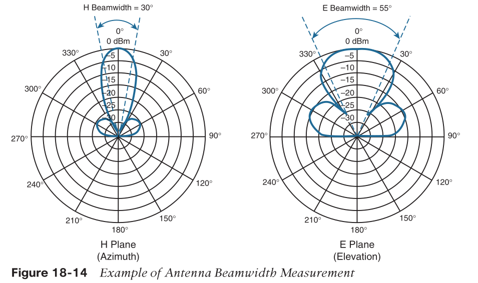

### Polarization

* electric field's orientation
  * vertical
  * horizontal
* Tx/Rx's polarization need match

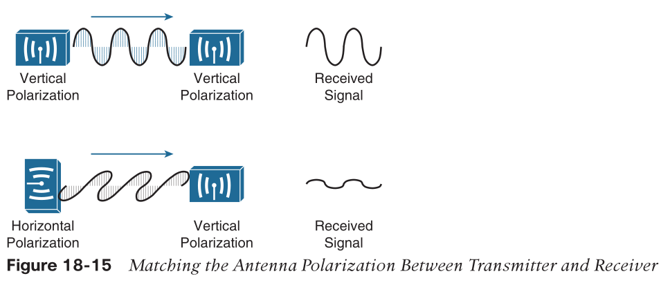

> a simple length of wire that is pointing vertically will produce a wave that oscillates up and down in a vertical direction

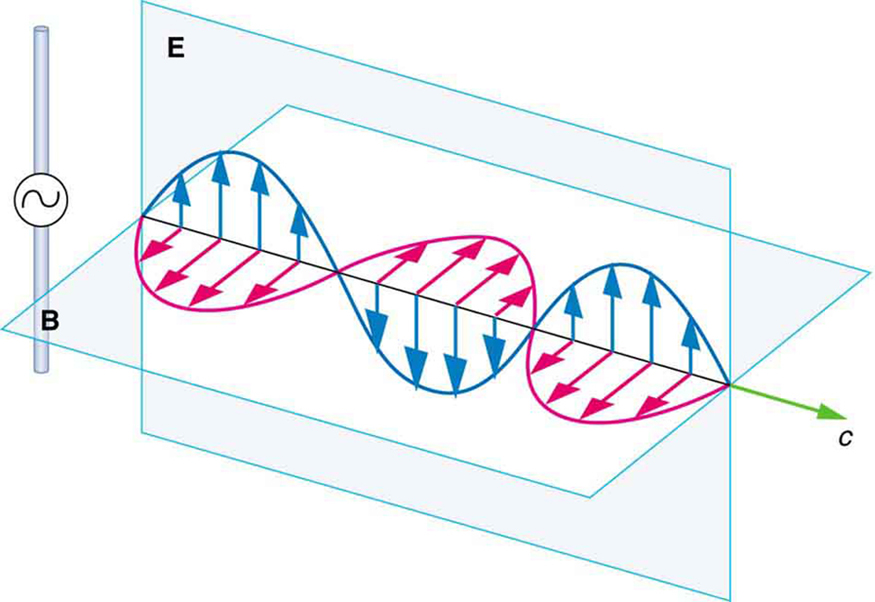

#### Production of Electromagnetic Waves

* [source](https://pressbooks.bccampus.ca/introductorygeneralphysics2phys1207opticsfirst/chapter/24-2-production-of-electromagnetic-waves/)

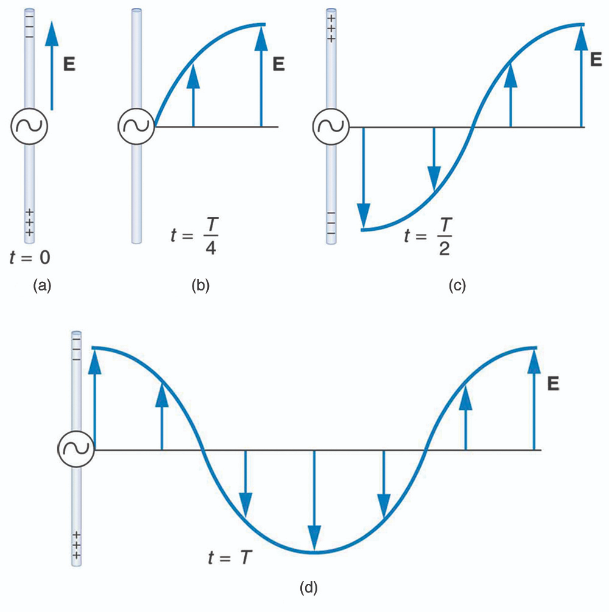

At time t=0, there is the maximum separation of charge, with negative charges at the top and positive charges at the bottom, producing the maximum magnitude of the electric field (or E-field) in the upward direction. One-fourth of a cycle later, there is no charge separation and the field next to the antenna is zero, while the maximum E-field has moved away at speed c.

As the process continues, the charge separation reverses and the field reaches its maximum downward value, returns to zero, and rises to its maximum upward value at the end of one complete cycle. The outgoing wave has an amplitude proportional to the maximum separation of charge. Its wavelength λ is proportional to the period of the oscillation and, hence, is smaller for short periods or high frequencies. (As usual, wavelength and frequency f are inversely proportional.)

* [khan academy](https://youtu.be/1OUW4nbrZgc)

### Omnidirectional Antennas

* extends further in the H plane than in the E plane
  * donut shape radiation pattern
* dipole
  * two wires 
  * +2 ~ +5 dBi

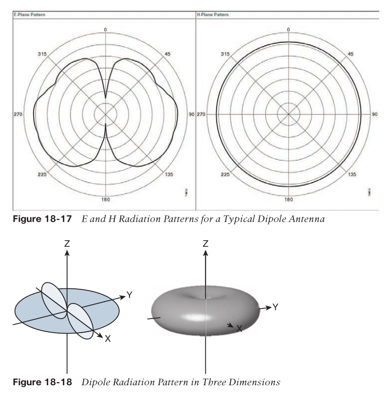

### Directional Antennas

#### patch antenna

* gain
  * 6 to 8 dBi in the 2.4 GHz
  * 7 to 10 dBi at 5 GHz

#### Yagi antenna

* gain
  * 10 to 14 dBi


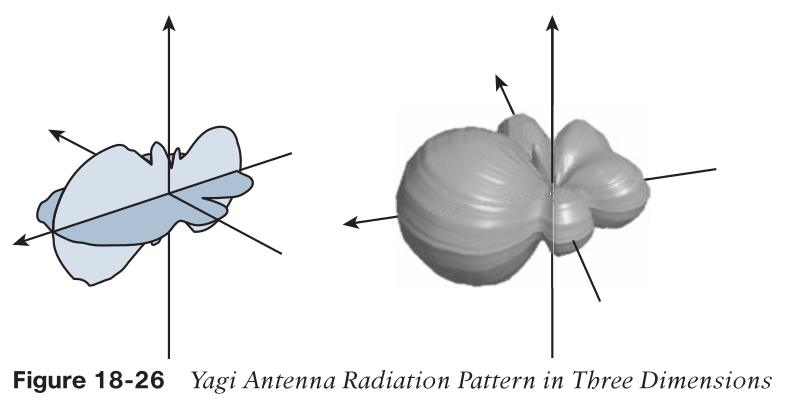

#### Parabolic Dish Antenna

* gain
  * 20 to 30 dBi

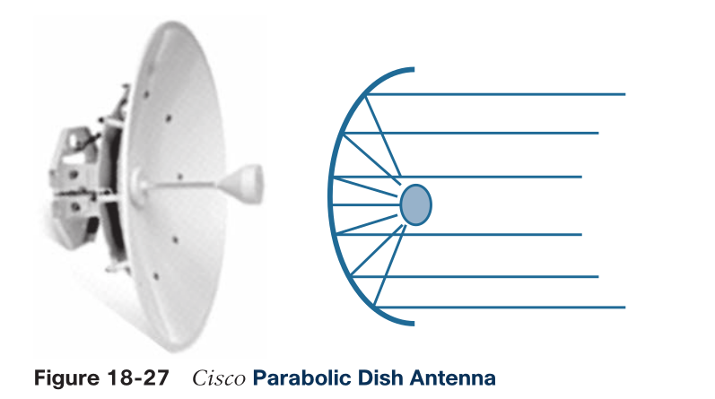

# Understanding Wireless Roaming and Location Services

## Roaming Between Autonomous APs

* client actively scans channels and sends probe requests to discover candidate APs
* if client found the signal degrades, it starts roaming algorithm
* client can send Association Request and Reassociation Request frames to an AP
  * Association Requests are used to form a new association, 
  * Reassociation Requests are used to roam from one AP to another, preserving the client’s original association status.
* If old AP still has any leftover wireless frames destined for the client after the roam, it forwards them to new AP over the wired infrastructure
  * because that is where the client’s MAC address now resides
    * how old AP know which new AP the client moved to

## Intracontroller Roaming

* WLC handles roaming process
  * update the table <AP, client>
    * affect which CAPWAP tunnel to use
  * only take ~10ms to complete roaming
* client does the same as with autonomous APs
* client (re)authentication: most time-consuming business
  * client <-> AP <-> WLC <-> RADIUS
* fast roaming
  * Cisco Centralized Key Management (CCKM)
    * One controller maintains a database of clients and keys
    * provides them to other controllers and their APs when needed during client roaming 
    * requires Cisco Compatible Extensions (CCX) support from clients
  * Key caching
    * client maintains a list of keys used with prior AP associations
    * presents them as it roams
    * The destination AP must be present in this list
      * limited to eight AP/key entries.
  * 802.11r
    * client cache auth. server's key
    * present that to new AP

## Intercontroller Roaming

### Layer 2 Roaming

* WLCs are in same VLAN/subnet
* local-to-local roam
* client keep its IP address
* < 20ms roaming

### Layer 3 Roaming

* WLCs in different VLAN/subnet
* local-to-foreign roam
* controller<->controller CAPWAP tunnel
  * anchor controller: original controller
  * foreign controller: roamed-to controller
* client keep its IP address
* guest users
  * config one controller to be static anchor
  * other controllers will direct guests to static anchor via CAPWAP


### Scaling Mobility with Mobility Groups

* mobility group
  * group of controllers
    * up to 24 controllers
* controllers within same group
  * support
    * L2/L3 roaming
    * CCKM/Key caching/802.11r
    * credentials are cached and shared
* controllers not in same group
  * credentials are not cached, nor shared
  * client need re-auth during roaming
* mobility domain
  * including multiple mobility groups
  * each controller maintains a list of
    * its own MAC
    * other controllers' MAC (in or not in same group)
    * up to 72 controllers
  * client cannot roam if move from WLC A to WLC B which is not in A's list
    * client need re-associate and re-auth

## Locating Devices in a Wireless Network

* AP use the received signal strength (RSS) as a measure of distance to client
* free space path loss (FSPL)
  * $FSPL(dB) = 20log_{10}(d) + 20log_{10}(f) + 32.44$
  * so $d = f(FSPL)$
* 3 or more APs do the measure
  * client is in intersect area
  * client keep sending 802.11 Probe Requests
    * on every possible channel
    * can be ID'd by MAC addr

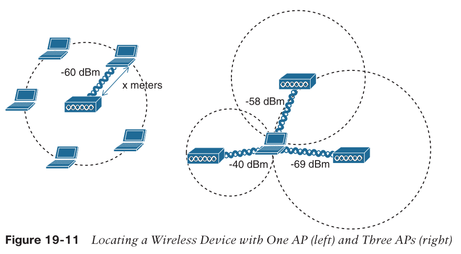

* RF fingerprinting
  * mainly for indoor
  * RF calibration template
    * walking and measuring attenuation