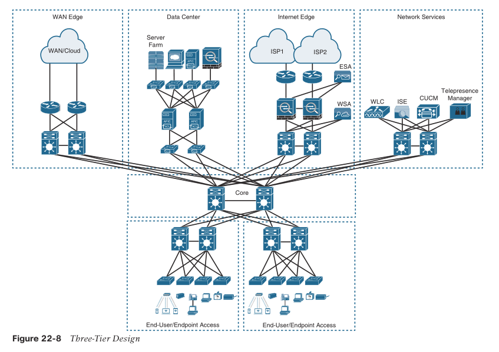
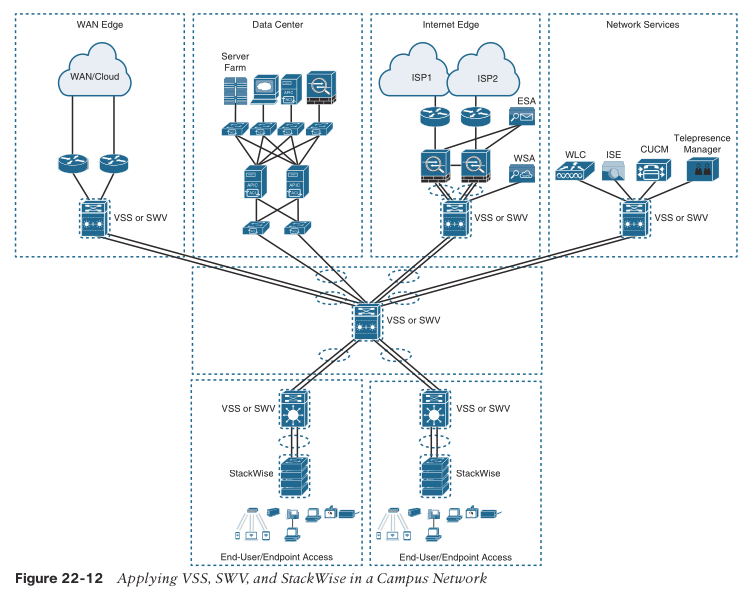

- [Hierarchical LAN Design Model](#hierarchical-lan-design-model)
  - [Access layer](#access-layer)
  - [Distribution layer](#distribution-layer)
  - [Core layer](#core-layer)
  - [Network Blocks](#network-blocks)
- [High Availability Network Design](#high-availability-network-design)
  - [Guidelines for network HA](#guidelines-for-network-ha)
  - [Guidelines for system HA](#guidelines-for-system-ha)
    - [SSO](#sso)
    - [NSF](#nsf)
    - [GR](#gr)
    - [NSR](#nsr)
    - [SSO and NSF](#sso-and-nsf)
    - [SSO and NSF with GR](#sso-and-nsf-with-gr)
    - [SSO and NSF with NSR](#sso-and-nsf-with-nsr)
    - [SSO and NSF with NSR and GR](#sso-and-nsf-with-nsr-and-gr)
- [Enterprise Network Architecture Options](#enterprise-network-architecture-options)
  - [Multi-tier design](#multi-tier-design)
  - [Data center](#data-center)
  - [LAN design](#lan-design)
    - [Loop-free topology](#loop-free-topology)
    - [Gateway Redundancy](#gateway-redundancy)
    - [Layer 3 access layer (routed access)](#layer-3-access-layer-routed-access)
    - [Simplified campus design](#simplified-campus-design)
    - [Software-Defined Access (SD-Access)](#software-defined-access-sd-access)

# Hierarchical LAN Design Model

* divides the enterprise network architecture into modular layers
* each modular layer to implement specific functions
* modular layers can be easily replicated
* benefits: (comparing to flat / full mesh)
  * simplifies the network design
    * easy to scale
    * consistent deployment method
  * fault containment
  * facilitates troubleshooting, problem isolation, and network management
* 3 layers
  * Access layer / Network Edge
  * Distribution layer
  * Core layer / Backbone

## Access layer

* connects different types of endpoints
* Wireless access points and IP phones are prime examples of devices that can be used to extend the access layer one more layer out from the access switch.
* can be segmented via VLAN to locate different devices to different logical networks
* must ensure the security, access control
* QoS trust boundary
* redundancy
  * access switches with redundant supervisor engines

## Distribution layer

* mainly to aggregate access layer switches
* a boundary between the access (L2) and the core (L3)
  * layer 2 side: boundary of STP
  * layer 3 side: summarize IP routing info. before entering core
* deployed in pairs for redundancy
  * also interconnected to each other of the pair

## Core layer

## Network Blocks

* building blocks or places in the network (PINs)
* data center
  * business critical servers
  * storage
  * big data
  * backups
  * etc.
* private / public cloud
* the WAN edge
  * dedicated/leased connections to
    * remote data centers
    * remote branches / campus
    * clouds (ASW, Azure, GCP)
* the Internet edge
  * internet access
  * remote VPN access
  * non-dedicated connections to
    * remote data centers / branches / campus
    * clouds (big 3)
* network services
  * wireless LAN controllers (WLCs)
  * Cisco Identity Services Engine (ISE)
  * Cisco TelePresence Manager
  * Cisco Unified Communications Manager (CUCM)

# High Availability Network Design

## Guidelines for network HA

* Adding redundant devices and links at different layers of the network architecture
* Ensuring the design has no single points of failure and it is fault tolerant
* Simplifying the network design by using _virtual network clustering_ technologies
* Implementing network monitoring systems to analyze all aspects of the network
  * network capacity
  * faulty hardware
  * security threats
* Enabling protocols that can detect link failures such as _BFD_ and _UDLD_
* Enabling first-hop redundancy (FHRP) protocols such as _HSRP_, _VRRP_, and _GLBP_

## Guidelines for system HA

* Using routers that support redundant hardware components such as redundant power supplies, redundant fans, redundant fan-trays, modular line cards, and dual route processor (RP) or supervisor engines
* Using routers that support hot-swappable and/or_ online insertion and removal (OIR)_ capable hardware components
* Enabling high availability technologies such as _Stateful Switchover (SSO)_ and _Nonstop Forwarding (NSF)_ with _Graceful Restart (GR)_ or _Nonstop Routing (NSR)_
  * when active RP (Route Processor) / Supervisor Engine fails, to allow the router to continue forwarding packets non-stop using the current Cisco Express Forwarding (CEF) entries in the FIB
  * while how to maintain neighboring session for routing protocols

### SSO

* an internal router redundancy feature that allows a router with redundant RPs to checkpoint (synchronize or mirror) the router configuration, line card operation, and Layer 2 protocol state information from the active RP to the standby RP. 

### NSF 

* an internal Layer 3 data forwarding plane redundancy feature that checkpoints and frequently updates the FIB from the active to the standby RP.

### GR

* GR: RFC4724
* a routing protocol extension signaling neighbor routers about RP switchover
* so that the neighbor routers will continue forwarding traffic
  * neighbor need GR as well
  * neighbor knows in advance the adjacency will be down for a little while
* three categories of GR routers:
  * SSO/NSF-capable router
  * GR-aware router (also referred to as GR Helper, or the misnomer NSF-aware)
    * supports GR routing protocol extensions
    * not require dual RPs
    * not require be SSO/NSF capable.
  * GR-unaware router
    * not support GR
    * not GR-aware.

### NSR

* an internal Cisco router feature that does not use routing protocol extensions to signal neighbor routers that an RP switchover has taken place
* Instead, the active RP is responsible for constantly checkpointing all relevant routing control plane information to the standby RP, including routing adjacency and TCP sockets
* During an RP switchover, the new RP uses the “checkpoint” state information to maintain the current routing adjacencies and recalculate the routing table
* no alerting the neighbor router that a switchover has occurred.
* but increases the workload on the router due to the constant checkpointing of the routing and forwarding information to the standby RP

### SSO and NSF

* interfaces up
* forwarding continue
* L3 neighbors down
* enable SSO = enable NSF

### SSO and NSF with GR

* L3 neighbor UP
* neighbor need to support GR

> NSF (SSO/NSF) is the term initially used by Cisco to refer to Graceful Restart, which is still prevalent in Cisco documentation and the IOS XE command line. SSO/NSF is not a configu- rable feature; it is enabled by default when SSO is enabled. 
> This means that any NSF command or keyword found in the documentation or the command line is referring to Graceful Restart.

### SSO and NSF with NSR

* L3 neighbor UP
* neighbor can any router

### SSO and NSF with NSR and GR

* use GR for neighbor routers that are GR-aware
* use NSR for peers that are GR-unaware

# Enterprise Network Architecture Options

## Multi-tier design

* Two-tier design (collapsed core)
* Three-tier design
  * when more than two pairs of distribution switches are needed

## Data center 

> The data center block is using the newer leaf–spine design, which is a common alternative to the three-tier design for modern data centers that have predominantly east–west traffic patterns between servers within the data center.
> The hierarchical LAN design is more appropriate for north–south traffic flows, such as endpoints communicating with the WAN edge, data center, Internet, or network services blocks.

* every leaf connects to every spine
  * so that server to server only take leaf->one spine->leaf
* spine switches are not connected with each other, same for leaf
  * leaf-spine topology is inherently loop-free
    * no STP needed
    * predictable performance
    * scalable
    * built-in redundancy and ECMP available

## LAN design

* Traditional LAN designs use a Layer 2 access layer and a Layer 3 distribution layer.
* Layer 2 access layer (STP based)

### Loop-free topology

* recommended to restrict a VLAN to a single access layer switch to eliminate topology loops -> topologically no loop
  * topology loop: common points of failure in LANs, even with STP
  * but not flexible

### Gateway Redundancy

* the distribution layer should have a pair of standalone switches
* configured with first-hop redundancy protocols (FHRPs)
  * to provide hosts with a consistent MAC address and gateway IP address for each configured VLAN
  * HSRP/VRRP
    * most popular
    * manual config to do load balancing
  * GLBP
    * auto load balancing
    * only work on loop-free topology

### Layer 3 access layer (routed access)

* layer 3 extended to access switch

* pros
  * no FHRP needed
  * no STP needed
* cons
  * cost more for access switches
  * no VLAN spanning to other switches

### Simplified campus design

* switch clustering technologies
* multiple switches act as if one logical switch
  * two switches
    * Virtual Switching System (VSS)
    * StackWise Virtual (SWV)
    * lean to distribution/core layer
  * more than 2 switches
    * StackWise
    * lean to access layer
* EtherChannel / LACP supported
  * Multichassis EtherChannels (MEC)
  * cross-stack EtherChannels

* pros
  * single switch now
    * no need for FHRP
    * no need for STP

### Software-Defined Access (SD-Access)

* built on the principles of the Cisco Digital Network Architecture (DNA)
* intent-based networking solution for the enterprise
* automation to add fabric capability, end-to-end segmentation, etc.