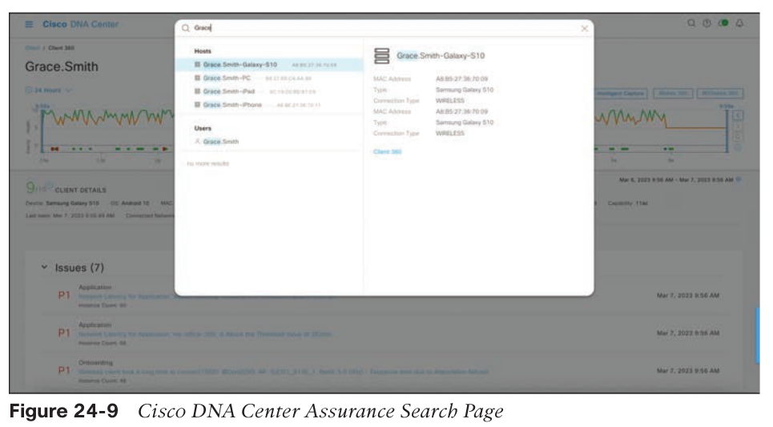
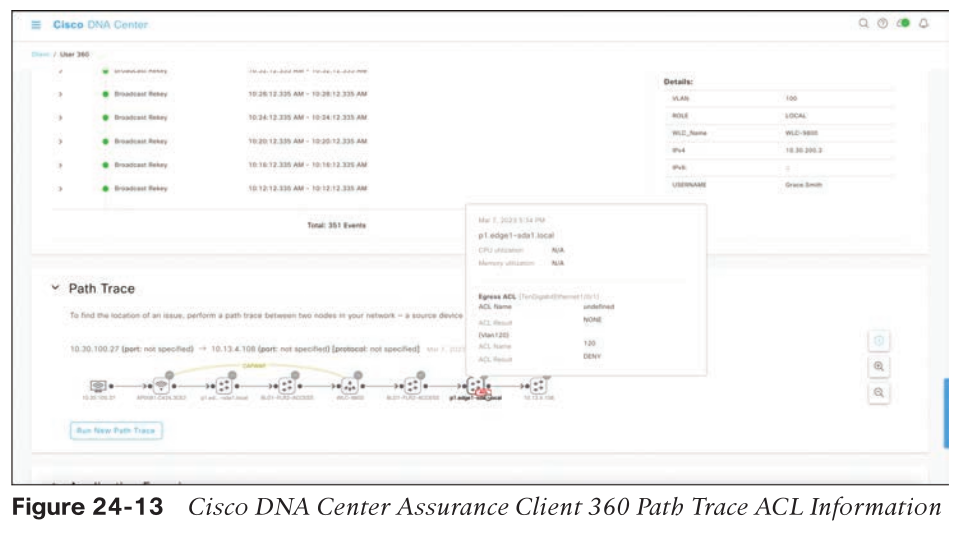
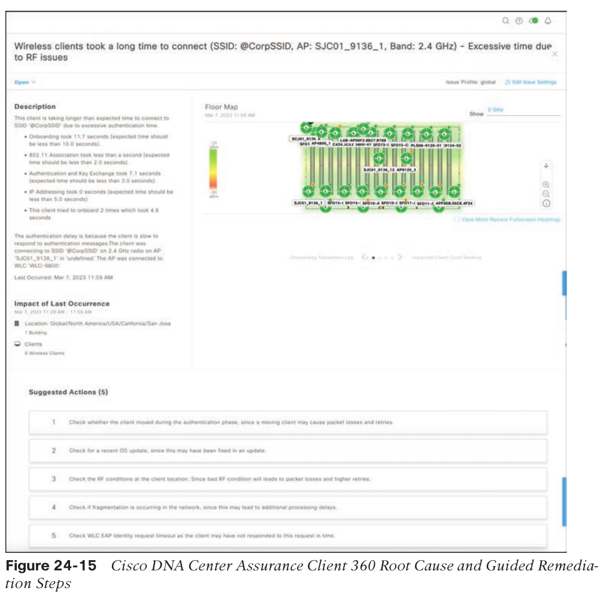

- [Basics](#basics)
- [Network Diagnostic Tools](#network-diagnostic-tools)
  - [ping](#ping)
  - [traceroute](#traceroute)
- [Debugging](#debugging)
  - [debugging OSPF](#debugging-ospf)
    - [MTU issues](#mtu-issues)
    - [Incorrect interface types](#incorrect-interface-types)
    - [Improperly configured network mask](#improperly-configured-network-mask)
  - [Conditional Debugging](#conditional-debugging)
    - [`debug ip packet`](#debug-ip-packet)
  - [SNMP](#snmp)
  - [syslog](#syslog)
- [NetFlow and Flexible NetFlow](#netflow-and-flexible-netflow)
  - [config](#config)
  - [Flexible Netflow](#flexible-netflow)
    - [flow record](#flow-record)
    - [flow exporter](#flow-exporter)
    - [flow monitor](#flow-monitor)
    - [apply to the interface](#apply-to-the-interface)
- [Switched Port Analyzer (SPAN)](#switched-port-analyzer-span)
  - [local SPAN](#local-span)
  - [Remote SPAN (RSPAN)](#remote-span-rspan)
  - [Encapsulated Remote (ERSPAN)](#encapsulated-remote-erspan)
- [IP SLA](#ip-sla)
  - [config ping probe](#config-ping-probe)
  - [config http probe](#config-http-probe)
  - [collect results](#collect-results)
- [Cisco DNA Center Assurance](#cisco-dna-center-assurance)
  - [user searchable](#user-searchable)
  - [Path Trace](#path-trace)
  - [guided remediation](#guided-remediation)

# Basics

> many small networks are very complex, and 
> many very large networks are simple in design and complexity

# Network Diagnostic Tools

## ping

* `ping x.x.x.x ?`
* MTU issue: send 1500-byte packets with the DF bit set
> Never underestimate the power of ping!

## traceroute

* tries up to 30 times/hops before completing

# Debugging

## debugging OSPF

* `debug ip ospf adj`
* `debug ip ospf hello`
* `undebug all`

### MTU issues

```
R1#
19:20:42.559: OSPF-1 ADJ Et0/1: Rcv DBD from 4.4.4.4 seq 0x247A opt 0x52 flag 0x7 len 32 mtu 1400 state EXCHANGE
19:20:42.559: OSPF-1 ADJ Et0/1: Nbr 4.4.4.4 has smaller interface MTU
```

### Incorrect interface types

* affect default hello timers


```
R4#
19:45:45.127: OSPF-1 HELLO Et0/1: Mismatched hello parameters from 192.168.14.1
! R4 is receiving a dead interval of 40, while it has a configured dead interval of 120
19:45:45.127: OSPF-1 HELLO Et0/1: Dead R 40 C 120, Hello R 10 C 30

! fix
R4(config)# interface ethernet0/1
R4(config-if)# ip ospf network broadcast
```

### Improperly configured network mask

```
R1#
20:55:05.468: OSPF-1 HELLO Et0/1: Rcv hello from 4.4.4.4 area 0 192.168.14.4
20:55:05.468: OSPF-1 HELLO Et0/1: No more immediate hello for nbr 4.4.4.4, which has been sent on this intf 2 times

R4#
21:05:57.927: OSPF-1 HELLO Et0/1: Mismatched hello parameters from 192.168.14.1
21:05:57.927: OSPF-1 HELLO Et0/1: Dead R 40 C 40, Hello R 10 C 10 Mask R 255.255.255.0 C 255.255.255.248
```

## Conditional Debugging

* debug can cause less resourceful network device unresponsive or crash

### `debug ip packet`

* better use an ACL to limit scope
* options:
  * <1-199>: Access list
  * <1300-2699>: Access list with expanded range
  * detail: More debugging detail

```
R4(config)# access-list 100 permit ip any 192.168.14.0 0.0.0.255
R4(config)# access-list 100 permit ip 192.168.14.0 0.0.0.255 any
R4# debug ip packet 100
```

* specify an interface

```
R4# debug interface Loopback0
Condition 1 set
R4# debug ip packet 100
IP packet debugging is on for access list 100
R4# show debug
Generic IP:
    IP packet debugging is on for access list 100
Condition 1: interface Lo0 (1 flags triggered)
    Flags: Lo0
21:39:59.033: IP: tableid=0, s=192.168.14.1 (Ethernet0/3), d=4.4.4.4 (Loopback0), routed via RIB
..
R4# undebug all
All possible debugging has been turned off
R4# undebug interface loopback0
This condition is the last interface condition set.
Removing all conditions may cause a flood of debugging
messages to result, unless specific debugging flags
are first removed.
Proceed with removal? [yes/no]: yes
```

## SNMP

* authentication
  * SNMPv1, v2c use community string
    * should be secured by ACL
  * SNMPv3 use username and SHA/MD5, and/or DES/AES encryption
* operations
  * SNMP Agent/NMS -> get-request, get-next-request, get-bulk-request, set-request
  * MIB SNMP Agent -> get-response, traps
* config SNMP
  * Define the SNMP host or the NMS to send traps to.
  * Create an access list to restrict access via SNMP.
  * Define the read-only community string.
  * Define the read/write community string.
  * Define the SNMP location.
  * Define the SNMP contact.

```
R1(config)# access-list 99 permit 192.168.14.100 0.0.0.0
R1(config)# snmp-server community READONLY ro 99
R1(config)# snmp-server community READWRITE rw 99
! to see all available traps, use `snmp-server enable traps ?`
R1(config)# snmp-server enable traps config
R1(config)# snmp-server host 192.168.14.100 traps READONLY
```

## syslog

* ensure NTP is enabled to make time sync'd
* 7 levels of log levels, similar to Linux kernel


* 3 places to put log
  * console
  * logging buffer
  * syslog server like Splunk
    * UDP: 514
* logging buffer
```
! setup
R1(config)# logging buffer 100000
R1(config)# logging buffer debugging
R1(config)# do show logging
!
! working with `debug` command
R1(config)# no logging console
R1(config)# end
R1# debug ip ospf hello
OSPF hello debugging is on
R1# show logging
```
* log server
```
R1(config)# logging host 192.168.14.100
R1(config)# logging trap 7
R1(config)# do show logging
```

# NetFlow and Flexible NetFlow

* two things need be configured
  * NetFlow Data Capture
    * collect data
  * NetFlow Data Export
    * export to a collector (DNA center / Prime infrastructure)
* _flow_:
  * Source IP address
  * Destination IP address
  * Source port number
  * Destination port number
  * Layer 3 protocol type
  * Type of service (ToS)
  * Input logical interface
* collects ingress/egress interface
  * also capable to capture IP->MPLS on ingress and MPLS->IP on egress

## config

```
R1(config)# ip flow-export version 9
R1(config)# ip flow-export destination 192.168.14.100 9999
R1(config)# interface Ethernet0/1
R1(config-if)# ip flow ingress
R1(config-if)# ip flow egress
R1(config-if)# end
R1#
```
* verify
```
R1# show ip flow interface
R1# show ip flow export
R1# show ip cache flow
```
* top talkers
```
R1(config)# ip flow-top-talkers
R1(config-flow-top-talkers)# top 10
R1(config-flow-top-talkers)# sort-by bytes
R1(config-flow-top-talkers)# end
R1#
R1# show ip flow top-talkers
```

## Flexible Netflow

* more complex traffic analysis config
* allow reuse of config components

|Component Name|Description
|:--|:--
|Flow Records|Combination of key and non-key fields. There are predefined and user-defined records.
|Flow Monitors|Applied to the interface to perform network traffic monitoring.
|Flow Exporters|Exports NetFlow Version 9 data from the Flow Monitor cache to a remote host or NetFlow collector.
|Flow Samplers|Samples partial NetFlow data rather than analyzing all NetFlow data.

* non-key fields
  * source AS
  * next-hop
  * TCP flag
  * timestamps
  * ...

### flow record

1. Define the flow record name.
2. Set a useful description of the flow record.
3. Set match criteria for key fields.
4. Define non-key fields to be collected.

```
R4(config)# flow record CUSTOM1
R4(config-flow-record)# description Custom Flow Record for IPv4 Traffic
R4(config-flow-record)# match ipv4 destination address
R4(config-flow-record)# collect counter bytes
R4(config-flow-record)# collect counter packets
R4(config-flow-record)# exit
R4(config)#
R4(config)# do show flow record CUSTOM1
```

### flow exporter

1. Define the flow exporter name.
2. Set a useful description of the flow exporter.
3. Specify the destination of the flow exporter to be used.
4. Specify NetFlow version to export.
5. Specify the UDP port.

```
R4(config)# flow exporter CUSTOM1
R4(config-flow-exporter)# description EXPORT-TO-NETFLOW-COLLECTOR
R4(config-flow-exporter)# destination 192.168.14.100
R4(config-flow-exporter)# export-protocol netflow-v9
R4(config-flow-exporter)# transport UDP 9999
R4(config-flow-exporter)# exit
R4(config)# exit
R4# show flow exporter CUSTOM1
```

### flow monitor

* Each flow monitor requires a flow record to be assigned to it
* Each flow monitor has its own cache
* config:
1. Define the flow monitor name.
2. Set a useful description of the flow monitor.
3. Specify the flow record to be used.
4. Specify a cache timeout of 60 for active connections.
5. Assign the exporter to the monitor.

```
R4(config)# flow monitor CUSTOM1
R4(config-flow-monitor)# description Uses Custom Flow Record CUSTOM1 for IPv4$
R4(config-flow-monitor)# record ?
    CUSTOM1             Custom Flow Record for IPv4 Traffic
    netflow             Traditional NetFlow collection schemes
    netflow-original    Traditional IPv4 input NetFlow with origin ASs
R4(config-flow-monitor)# record CUSTOM1
R4(config-flow-monitor)# cache timeout active 60
R4(config-flow-monitor)# exporter ?
    CUSTOM1             EXPORT-TO-NETFLOW-COLLECTOR
R4(config-flow-monitor)# exporter CUSTOM1
R4(config-flow-monitor)# end
R4# show flow monitor CUSTOM1
```

### apply to the interface

```
R4(config)# interface ethernet0/1
R4(config-if)# ip flow monitor ?
    CUSTOM1             Uses Custom Flow Record CUSTOM1 for IPv4 Traffic
R4(config-if)# ip flow monitor CUSTOM1 input
R4(config-if)# interface ethernet0/2
R4(config-if)# ip flow monitor CUSTOM1 input
R4(config-if)# end
R4# show flow monitor CUSTOM1 cache
```

# Switched Port Analyzer (SPAN)

* mirror the traffic
  * splitter, split the light across a prism
  * port mirror
  * add a new switch in between and port mirror
* capture
  * local/remote: where traffic are captured
* source (only one of the following)
  * One or more specific switch ports
  * A port channel (also known as an EtherChannel)
  * A VLAN (traffic received by the switch for all the hosts associated with the VLAN specified)
* send a copy
  * Local Switched Port Analyzer
  * Remote Switched Port Analyzer (RSPAN)
    * send a copy of the network traffic through Layer 2 (switching)
  * Encapsulated Remote Switched Port Analyzer (ERSPAN)
    * send a copy of the traffic through Layer 3 (routing) 
* analyzer
  * attached to a port of receiving switch


## local SPAN

```
SW1(config)# monitor session 1 source interface gi1/0/1 - 2
SW1(config)# monitor session 1 destination interface gi1/0/9
SW1# show monitor session local

! for trunk port
SW1(config)# monitor session 1 source interface gi1/0/10
SW1(config)# monitor session 1 destination interface Gi1/0/9 encapsulation replicate
SW1(config)# monitor session 1 filter vlan 123
SW1# show monitor session 1

! to make destination port still be able to send/recv normal traffic
! use PC-B as destination, which already installed network traffic analysis tool 
! PC-B can be accessed remotely to view the network traffic by using RDP
SW1(config)# monitor session 1 source interface gi1/0/1
SW1(config)# monitor session 1 destination interface gi1/0/2 ingress untagged vlan 123
SW1# show monitor session 1
```

## Remote SPAN (RSPAN)

* The mirror traffic is placed on a special VLAN called the RSPAN VLAN, which is designated for SPAN traffic only.
  * The VLAN needs to be the same on all switches for that RSPAN session
* MAC addresses are not learned on ports associated with the RSPAN VLAN
  * ensures that the switch does not try to use the port associated with the RSPAN VLAN to transmit data to the end host
* Traffic is flooded out all the ports associated with the RSPAN VLAN
  * RSPAN VLAN should not be associated with ports that are not trunk ports between the source and destination switches
    * aka, not going to other hosts

```
! config VLAN
SW1(config)# vlan 99
SW1(config-vlan)# name RSPAN_VLAN
SW1(config-vlan)# remote-span
SW2(config)# vlan 99
SW2(config-vlan)# name RSPAN_VLAN
SW2(config-vlan)# remote-span

! source
SW2(config)# monitor session 1 source interface gi1/0/3
SW2(config)# monitor session 1 destination remote vlan 99

! destination
SW1(config)# monitor session 1 source remote vlan 99
SW1(config)# monitor session 1 destination interface gi1/0/9
```

## Encapsulated Remote (ERSPAN)

* mirror the traffic to anywhere with IP reachability

```
SW4(config)# monitor session 1 type erspan-source
SW4(config-mon-erspan-src)# description SOURCE-PC-D-TRAFFIC
SW4(config-mon-erspan-src)# source interface GigabitEthernet 1/0/4 rx
SW4(config-mon-erspan-src)# filter vlan 34
SW4(config-mon-erspan-src)# no shutdown
SW4(config-mon-erspan-src)# destination
SW4(config-mon-erspan-src-dst)# ip address 10.123.1.100
SW4(config-mon-erspan-src-dst)# erspan-id 2
SW4(config-mon-erspan-src-dst)# origin ip address 10.34.1.4
SW4(config-mon-erspan-src)# exit
SW4(config)# erspan ttl 32
SW4(config)# end
SW4#
SW4# show monitor session erspan-source session
```

# IP SLA

* end-to-end from customers' point of view
* probes
  * Delay (both round-trip and one-way)
  * Jitter (directional)
  * Packet loss (directional)
  * Packet sequencing (packet ordering)
  * Path (per hop)
  * Connectivity (directional)
  * Server or website download time
  * Voice quality scores

## config ping probe

```
R1(config)# ip sla 1
R1(config-ip-sla)# icmp-echo 192.168.14.100 source-interface Loopback0
! run ping every 300 seconds
R1(config-ip-sla-echo)# frequency 300
R1(config)# ip sla schedule 1 life forever start-time now
R1(config)# do show ip sla configuration 1
```

## config http probe

```
R1(config)# ip sla 2
R1(config-ip-sla)# http get http://192.168.14.100
R1(config-ip-sla-http)# frequency 90
R1(config)# ip sla schedule 2 start-time now life forever
R1(config)# show ip sla configuration 2
```

## collect results 

* using the CISCO-RTTMON-MIB
* traps can be sent to an NMS via syslog

# Cisco DNA Center Assurance

* customer concerns
  * security
  * QoE
  * simplify mgmt/ops
* DNA capabilities
  * Cisco SD-Access fabric configuration
  * Software image management (SWIM)
  * Simplified provisioning for devices
  * Wireless network management
  * Simplified security policies
  * Configuration templates
  * Third-party integration
  * Network assurance
  * Plug and Play
* Network Time Travel
  * using streaming telemetry
  * past, now, future (prediction)

> Assurance takes 30+ years of Cisco Technical Assistance Center (TAC) experience and puts it into a tool that uses machine learning to diagnose issues within a network. 
> In addition to finding and diagnosing the issues, Assurance gives guided remediation steps to fix the issue.

* open APIs and SDKs available for Cisco DNA Center
  * integrated with many others like ISE, Service Now, infoblox, etc.

## user searchable




## Path Trace

* if there are ACL in between, it will show up as well



## guided remediation



