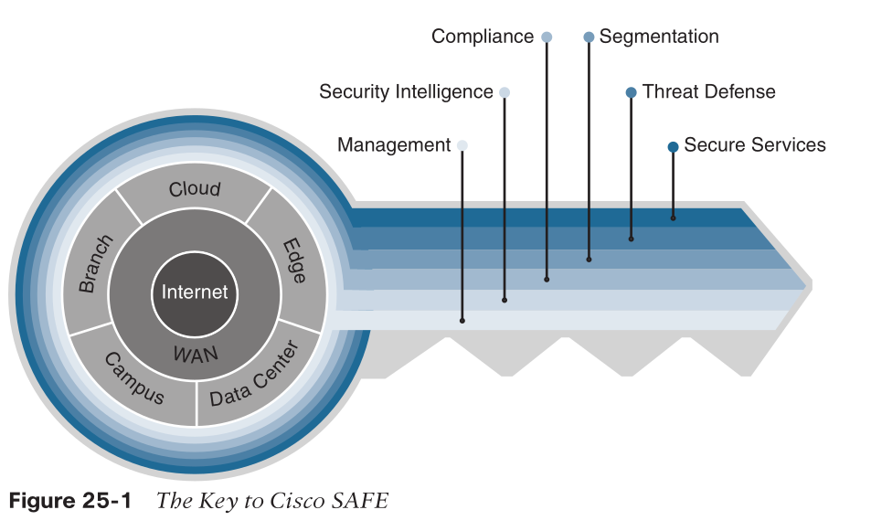
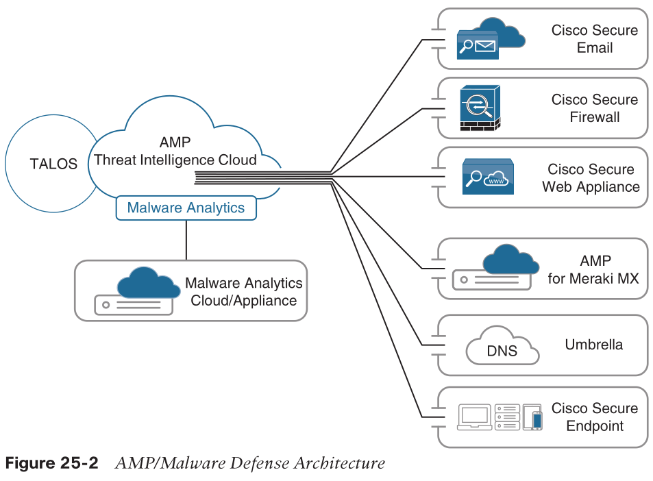

- [Secure Network Access Control](#secure-network-access-control)
  - [Network Security Design for Threat Defense](#network-security-design-for-threat-defense)
  - [Next-Generation Endpoint Security](#next-generation-endpoint-security)
    - [Cisco Talos](#cisco-talos)
    - [Cisco Secure Malware Analytics (Threat Grid)](#cisco-secure-malware-analytics-threat-grid)
    - [Cisco Advanced Malware Protection (AMP)](#cisco-advanced-malware-protection-amp)
    - [Cisco Secure Client (AnyConnect)](#cisco-secure-client-anyconnect)
    - [Cisco Umbrella](#cisco-umbrella)
    - [Cisco Secure Web Appliance (WSA)](#cisco-secure-web-appliance-wsa)
    - [Cisco Secure Email (ESA)](#cisco-secure-email-esa)
    - [Cisco Secure IPS (FirePOWER NGIPS)](#cisco-secure-ips-firepower-ngips)
    - [Cisco Secure Firewall (NGFW)](#cisco-secure-firewall-ngfw)
    - [Cisco Secure Firewall Management Center (FMC)](#cisco-secure-firewall-management-center-fmc)
    - [Cisco Secure Network Analytics (Stealthwatch Enterprise)](#cisco-secure-network-analytics-stealthwatch-enterprise)
    - [Cisco Secure Cloud Analytics (Stealthwatch Cloud)](#cisco-secure-cloud-analytics-stealthwatch-cloud)
    - [Cisco Identity Services Engine (ISE)](#cisco-identity-services-engine-ise)
  - [Network Access Control (NAC)](#network-access-control-nac)

# Secure Network Access Control

## Network Security Design for Threat Defense

* SAFE: Secure Architectural Framework
* PINs: Places In the Network
  * branch
    * less secure PIN
    * endpoint malware (fake POS)
    * rogue APs
  * campus
    * phishing
    * malware propagation
    * botnets
  * data center
    * main target
  * edge
    * highest risk PIN
  * cloud
    * SP SLA
  * WAN
    * connect PINs together
* secure domains
  * central management
  * security intelligence
  * compliance
    * PCI DSS 3.0 (Payment Card Industry Data Security Standard version 3.0)
      * security standards for organizations that handle cardholder data to protect against fraud and breaches.
    * HIPAA
  * segmentation
    * boundaries of data/user
    * IP addressing/VLANs/ACL
    * new TrustSec/SGT, group-based policy
      * leveraging identity-aware infrastructure to enforce policies in an automated and scalable manner.
  * threat defense
    * traffic telemetry
    * file reputation
    * context (device, user, role, location, time, etc.)
  * secure services
    * VPN
    * ACL



* continuum
  * before
    * set policies
      * know me, know enemy
    * firewall
    * network access control
    * identity services
  * during
    * incident response
    * IPS
    * malware protection
    * email/web security
  * after
    * contain / remediate attack
    * lessons learned

## Next-Generation Endpoint Security

* dynamic threats

### Cisco Talos

* cisco threat intelligence team
* per day, receiving
  * 16 billion web requests
  * 600 billion emails
  * 1.5 million unique malware samples
* collaborates with others
  * snort
  * honeypots
  * ...

### Cisco Secure Malware Analytics (Threat Grid)

* file analysis
  * static
  * dynamic
    * sandbox
      * malware detects sandbox as well
      * counter that detection by not having the typical instrumentation
      * run via Glovebox to interact with malware
    * behavior analysis
* upload file to cloud-based Analytics

### Cisco Advanced Malware Protection (AMP)

* Malware Defense
* arch.
  * AMP Cloud (private or public)
    * file reputation
      * malware/clean/unknown/custom
  * AMP connectors
    * upload file to AMP cloud
    * send a hash of file
  * Threat intelligence from Cisco Talos and Cisco Secure Malware Analytics



### Cisco Secure Client (AnyConnect)

* TLS/SSL VPN
  * SSL is deprecated by IETF
* host scan
* compliance

### Cisco Umbrella

* OpenDNS
  * anycast DNS
  * DNS traffic is routed to the closest location
> Security intelligence is gathered from an average of 500 billion daily DNS requests from more than 90 million users.
> All this data is fed in real time into Umbrella’s massive graph database, where statistical and machine learning models are continuously run against it.

### Cisco Secure Web Appliance (WSA)

* hardware
  * but can be a virtual appliance as well
* block malware


* before attack
  * working with Talo which updates the database every 3-5 minutes
  * Web reputation filters
    * Cisco Secure Web Appliance analyzes and categorizes unknown URLs and blocks those that fall below a defined security threshold
    * eval
      * domain owner
      * the server where the site is hosted
      * the time the site was created
      * the type of site
    * score
    * act
      * allow
      * block
      * warning
  * URL filtering
    * check against a database of 50M blocked sites
    * Dynamic Content Analysis (DCA) engine
      * scan text
      * calculates model document proximity
  * Cisco Application Visibility and Control (AVC)
    * most granular control over application and usage behavior
      * AVC can be configured to permit users to access Facebook or YouTube while blocking users from activities such as clicking the “Like” button or viewing certain videos or YouTube channels.
* During
  * Secure Web Appliance identify and blocks 0-day threats
    * via intelligence from cloud access security broker (CASB) providers, Talos, and AMP
  * cloud access security
    * threats in cloud apps
      * monitor their usage in real-time
  * Parallel antivirus (AV) scanning
    * multiple antivirus software running same time
  * Layer 4 traffic monitoring
    * botnet/spyware's phone-home communications
  * File reputation and analysis with Cisco AMP
  * Data loss prevention (DLP)
    * checking outbound traffic
    * Internet Content Adaptation Protocol (ICAP)
    * DPI
      * content markers
        * confidential files
        * credit card numbers
        * personal information
* After
  * Cisco AMP retrospection capabilities
  * data collected for machine learning

### Cisco Secure Email (ESA)

* hardware appliance or as a cloud offering called Cisco Secure Email Threat Defense
* from Talos and others
  * Global threat intelligence
  * Reputation filtering
* Spam protection
  * Cisco Context Adaptive Scanning Engine (CASE)
  * false position rate: < 1/1M
* Forged email detection
  * protects high-value targets such as executives against business email compromise (BEC) attacks
* Cisco Advanced Phishing Protection (CAPP)
  * machine learning to model trusted email behavior on the Internet, within organizations, and between individuals
  * stop identity deception–based attacks such as fraudulent senders, social engineering, and BEC attacks
* Cisco Domain Protection (CDP)
  * prevent phishing emails from being sent using a customer domain
* Malware defense
* Graymail detection and Safe Unsubscribe
  * graymail typically comes with an unsubscribe link, which may be used for phishing
* URL-related protection and control
* Outbreak filters
  * rewrite URLs in email
* traffic delivered to WSA to scan
* Web interaction tracking
  * report who clicked which rewritten URL
* Data security for sensitive content in outgoing emails
  * automatically protected by encryption, footers and disclaimers,

### Cisco Secure IPS (FirePOWER NGIPS)

* IDS + blocking
* Real-time contextual awareness
  * OS
  * applications
  * users
  * ...
* Advanced threat protection
  * AMP for Networks
  * Secure Malware Analytics sandboxing solutions
* Intelligent security automation
  * automating protection policy updates
  * network anomaly detection
  * tagging potentially affected hosts
* Unparalleled performance and scalability
* Application visibility and control (AVC) and URL filtering
* Centralized management
  * Cisco Secure Firewall Management Center (FMC)
* Snort IPS detection engine
* Open API
* Integration with Cisco ISE

### Cisco Secure Firewall (NGFW)

* industry’s first fully integrated, threat-focused NGFW with unified management
  * integrating Cisco integrated ASA software with the Cisco Secure IPS services software
* per Gartner, an NGFW firewall must include
  * Standard firewall capabilities such as stateful inspection
  * An integrated IPS
  * Application-level inspection (to block malicious or risky apps)
  * The ability to leverage external security intelligence to address evolving security threats
* Cisco Secure Firewall is available in the following form factors:
  * Cisco Secure Firewall Appliances
  * Cisco Secure Industrial Security Appliance (ISA)
  * Cisco Secure Firewall Threat Defense Virtual
  * Cisco Secure Firewall Cloud Native
  * Cisco Secure Web Application Firewall (WAF) and bot protection
  * All ASA 5500-X appliances (except 5585-X)
* software
  * ASA software image
    * standard legacy firewall
    * Adaptive Security Appliance
  * ASA software image with Cisco Secure IPS software image (FirePOWER NGIPS)
    * only on 5500-X appliances (except the 5585-X)
  * Firepower Threat Defense (FTD) software image
    * on all Cisco Secure Firewall and ASA 5500-X appliances (except the 5585-X)

> In Cisco’s documentation, FirePOWER (uppercase) refers to the Cisco Secure IPS (NGIPS) services software or the NGIPS services ASA module, while Firepower (lowercase) refers to the Cisco Secure Firewall or the FTD unified image.

### Cisco Secure Firewall Management Center (FMC)

* ggregates and correlates threat events, contextual information, and network device performance data
* monitor information that Cisco Secure Firewall devices are reporting

### Cisco Secure Network Analytics (Stealthwatch Enterprise)

* collector and aggregator of network telemetry data
* against both outsiders and insiders
  * command-and-control (C&C) attacks
  * ransomware
  * DDoS attacks
  * illicit cryptomining
  * unknown malware
  * inside threats
* scaled 
  * into the cloud (when used in combination with Cisco Secure Cloud Analytics)
  * across the network
  * to branch locations
  * in the data center
  * down to the endpoints
* components
  * Cisco Secure Network Analytics Manager, formerly Stealthwatch Management Console (SMC)
    * analytics from up to 25 Flow Collectors, Cisco ISE, and other sources
  * Cisco Secure Network Analytics Flow Collectors
    * Netflow, IPFIX
    * can pinpoint malicious patterns in encrypted traffic using Encrypted Traffic Analytics (ETA), without having to decrypt it
  * Cisco Secure Network Analytics Flow Rate License
  * optionally
    * Cisco Secure Network Analytics Flow Sensors
      * generate netflow
    * Cisco Secure Network Analytics UDP Director
      * central flow collector and replicator
    * Cisco Telemetry Broker
      * central telemetry collector and replicator
    * Cisco Secure Network Analytics Data Store
      * central data store
    * Cisco Secure Network Analytics Endpoint License
    * Cisco Secure Cloud Analytics
      * extend visibility into AWS, GCP, Azure
* also can be used for network performance and capacity planning

### Cisco Secure Cloud Analytics (Stealthwatch Cloud)

* a cloud-based Software-as-a-Service (SaaS) solution
* detect attacks from cloud and Internet
* deployment
  * Cisco Secure Cloud Analytics Public Cloud Monitoring, formerly Stealthwatch Cloud Public Cloud Monitoring
    * agentless
    * virtual private cloud (VPC) flow logs
    * integrated with additional AWS services such as Cloud Trail, Amazon CloudWatch, AWS Config, Inspector, Identity and Access Management (IAM), etc.
  * Cisco Secure Network Analytics SaaS, formerly Stealthwatch Cloud Private Network Monitoring
    * threat detection for the on-premises network, delivered from a cloud-based SaaS solution
    * collected metadata is encrypted and sent to the Cisco Secure Cloud Ana- lytics platform for analysis
      * metadata only

### Cisco Identity Services Engine (ISE)

* network visibility
  * who
  * which applications installed/running
  * which endpoints
* integration with Cisco DNA
* Centralized secure network access control
  * RADIUS
  * 802.1x/EAP, MAB, and local and centralized WebAuth
* Centralized device access control
  * TACACS+
* Cisco TrustSec
  * implements Cisco TrustSec policy
    * SGT tags, SGACLS
* Guest lifecycle management
* Streamlined device onboarding
  * automates 802.1x supplicant provisioning and certificate enrollment
  * integrates with mobile device management (MDM)/ enterprise mobility management (EMM) vendors for mobile device compliance and enrollment
* Internal certificate authority (CA)
* Device profiling
  * endpoint-specific authorization policies based on device type
* Endpoint posture service
  * for compliance/audits
    * is latest OS
    * is firewall enabled
    * is anti-malware app installed
* Active Directory support
  * Microsoft
  * Kerberos based authentication
    * user uses username and password
      * but password was hashed, plaintext never transferred
    * primarily relying on symmetric encryption
* Cisco Platform Exchange Grid (pxGrid)
  * shares contextual information using a single API between different Cisco platforms as well as partners
  * pxGrid is an IETF framework
    * pxGrid Server: central pxGrid controller
    * pxGrid nodes: all Cisco and third-party security platforms
    * pxGrid 1.0: Released with ISE 1.3 and based on Extensible Messaging and Presence Protocol (XMPP)
      * kinda obselete
    * pxGrid 2.0: Uses WebSocket and the REST API over Simple Text Oriented Message Protocol (STOMP) 1.2
        ```
        Session={ip=[192.168.1.2]
        Audit Session Id=0A000001000000120001C0AC
        UserName=dewey.hyde@corelab.com
        ADUserDNSDomain=corelab.com
        ADUserNetBIOSName=corelab,
        ADUserResolvedIdentities=dewey.hyde@corelab.com
        ADUserResolvedDNs=CN=Dewey Hyde
        CN=Users
        DC=corelab
        DC=com
        MacAddresses=[00:0C:C1:31:54:69]
        State=STARTED
        ANCstatus=ANC_Quarantine
        SecurityGroup=Quarantined_Systems
        EndpointProfile=VMWare-Device
        NAS IP=192.168.1.1
        NAS Port=GigabitEthernet0/0/1
        RADIUSAVPairs=[ Acct-Session-Id=0000002F]
        Posture Status=null
        Posture Timestamp=
        LastUpdateTime=Sat Aug 21 11:49:50 CST 2019
        Session attributeName=Authorization_Profiles
        Session attributeValue=Quarantined_Systems
        Providers=[None]
        EndpointCheckResult=none
        IdentitySourceFirstPort=0
        IdentitySourcePortStart=0
        ```

## Network Access Control (NAC)

