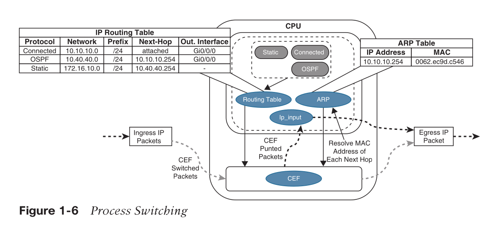
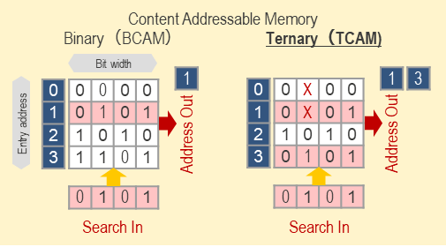
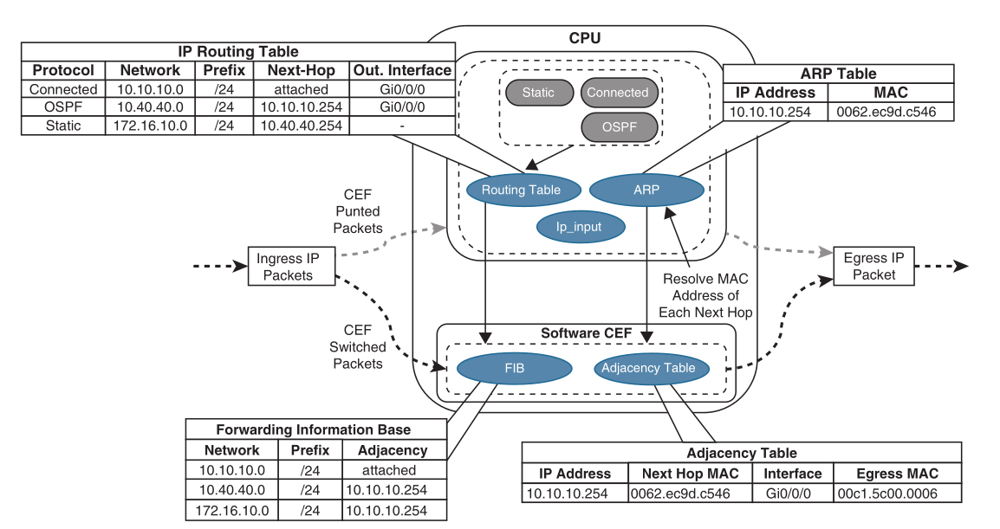

# OSI model

| Layer   | Name         | Description                                       |
|---------|--------------|---------------------------------------------------|
| Layer 7 | Application  | Interface for receiving and sending data          |
| Layer 6 | Presentation | Formatting of data and encryption                 |
| Layer 5 | Session      | **Tracking** of packets                           |
| Layer 4 | Transport    | **End-to-end** communication between devices      |
| Layer 3 | Network      | Logical **addressing** and **routing** of packets |
| Layer 2 | Data Link    | Hardware **addressing**                           |
| Layer 1 | Physical     | Media type and connector                          |

* Nice way to describe data link layer and network layer with a focus on addressing

# layer 2 forwarding

## MAC Table

* switch maintains a MAC table
  * MAC: Media Access Control
  * The MAC address table resides in content addressable memory (CAM).
    * basically a hash table alike thing

| MAC address        | port                       |
|--------------------|----------------------------|
| PC A's mac address | port N where A connects to |

* in case there is an unknown MAC address, switch will do broadcast to every port, called `unknown unicast flooding`

```
show mac address-table [address mac-address | dynamic | vlan vlan-id]
```

* `dynamic` means the entry is learned by switch, not statically configured

### manually change the mac-table

* Some older technologies (such as load balancing) require a static MAC address entry in the MAC address table to prevent unknown unicast flooding. 

```
mac address-table static mac-address vlan vlan-id {drop | interface interface-id}
clear mac address-table dynamic [{address mac-address | interface interface-id | vlan vlan-id}]
```

## VLAN

* 802.1Q
* each vlan is a broadcast domain
  * uniquely identified by VLAN ID
  * may across multiple switches
* insert 16bits after MAC address in ethernet frame


```
SW1# configure term
Enter configuration commands, one per line. End with CNTL/Z.
SW1(config)# vlan 10
SW1(config-vlan)# name PCs
SW1(config-vlan)# vlan 20
SW1(config-vlan)# name Phones

show vlan [{brief | id vlan-id | name vlan-name | summary}]
```

### Access Ports

* An Access ports is assigned to only one VLAN.
  * The 802.1Q tags are not included on packets transmitted or received on access ports.

```
SW1(config-vlan)# interface gi1/0/15
SW1(config-if)# switchport mode access
SW1(config-if)# switchport access vlan 99
```

* Catalyst access switches place switch ports as Layer 2 access ports for VLAN 1 by default.

### Trunk Ports

* Trunk ports can carry multiple VLANs.
* Trunk ports are typically used when multiple VLANs need connectivity between a switch and another switch, router, or firewall and use only one port. 
* Upon receipt of the packet on the remote trunk link, the headers are examined,  traffic is associated to the proper VLAN, then the 802.1Q headers are removed, traffic is forwarded to the next port, based on the MAC address for that VLAN.
* *LZ: trunk ports see untagged coming in, let untagged coming out?*

```
SW1(config)# interface gi1/0/2
SW1(config-if)# switchport mode trunk
```

* load balancing between network links where select VLANs are allowed on one
trunk link, while a different set of VLANs are allowed on a different trunk port.

```
switchport trunk allowed vlan {vlan-ids | all | none | add vlan-ids | remove vlan-ids | except vlan-ids}
! e.g.:
switchport trunk allowed vlan 1,10,20,99
```

* When you are scripting configuration changes, it is best to use the `add` and `remove` keywords because they are more prescriptive.

### Native VLAN

* Any traffic that is transmitted or received on a trunk port without the 802.1Q VLAN tag is associated to the native VLAN. 
* Any traffic associated to the native VLAN will flow across the trunk port untagged. The default native VLAN is VLAN 1.
  * the default can be changed by `switchport trunk native vlan vlan-id`
  * The native VLAN should match on both ports for traffic to be transmitted for that VLAN across the trunk link.
  * All switch control plane traffic is advertised using VLAN 1.
  * The Cisco security hardening guidelines recommend changing the native VLAN to something other than VLAN 1. More specifically, it should be set to a VLAN that is not used at all.
  * so everything has to be tagged properly when entering the network

## Troubleshooting

### check mac table


```
SW1# show mac address-table dynamic
Mac Address Table
VlanMac Address Type    Ports
----------------------------
10081.c4ff.8b01 DYNAMIC Gi1/0/2
1189c.5d11.9981 DYNAMIC Gi1/0/3
1189c.5d11.99c7 DYNAMIC Gi1/0/3
```

* If multiple MAC addresses appear on the same port, you know that a switch, hub, or server with a virtual switch is connected to that switch port.

### check interface/port status

```
show interfaces gi1/0/5 switchport
show interfaces status
```

# Layer-3 forwarding

* ARP: IP addr -> MAC addr
```
show ip arp [mac-address | ip-address | vlan vlan-id | interface-id]
```
* the destination MAC address is needed for the next-hop IP address.

# Forwarding Architecture

## Process switching

* software switching / slow path
  * `ip_input` process
    * packets coming to / going out from router itself
    * complicated packets, e.g., IP packets with Options
    * extra info needed, e.g., unresolved ARP entries


### Data structures

* RIB
  * to find next hop IP address and outgoing interface
* ARP table
  * to find next hop MAC address

## CEF

* Cisco Express Forwarding (CEF) / fast path
* [software CEF](#software-cef)
* [hardware CEF](#hardware-cef)
  * ASIC
  * TCAM (Tenary CAM)
  * NPU

### TCAM

* CAM result is binary (0 or 1)
* TCAM (0 true, 1 false, X don't care)



* The TCAM entries are stored in `Value`, `Mask`, and `Result` (VMR) format.
  * The `value` indicates the fields that should be searched, such as the IP address and protocol fields. 
  * The `mask` indicates the field that is of interest and that should be queried. 
  * The `result` indicates the action that should be taken with a match on the value and mask.
  * Multiple actions can be selected

### Distributed Forwarding

* If the line cards are equipped with forwarding engines so that they can make packet switching decisions without intervention of the RP, this is known as a *distributed forwarding architecture*.
* On the contrary, centralized forwarding will involve *route processor (RP)* to process every packet

### Software CEF

* also known as the software Forwarding Information Base (FIB)
* two tables
  * FIB
  * Adjacency table (next-hop IP address, next-hop MAC, egress if MAC)



* Software CEF in hardware-based platforms is not used to do packet switching as in software-based platforms; instead, it is used to program the hardware CEF.

### Hardware CEF

* NPU: Unlike ASICs, **NPUs are programmable**, and their firmware can be changed with relative ease.

### SDM templates

* `[show] sdm prefer {vlan | advanced}`
  * then restart switch w/ `reload`
* Every switch in a switch stack must be configured with the same SDM template.

# Command reference


