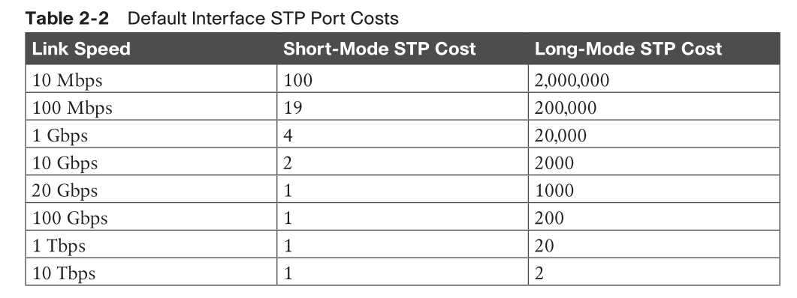
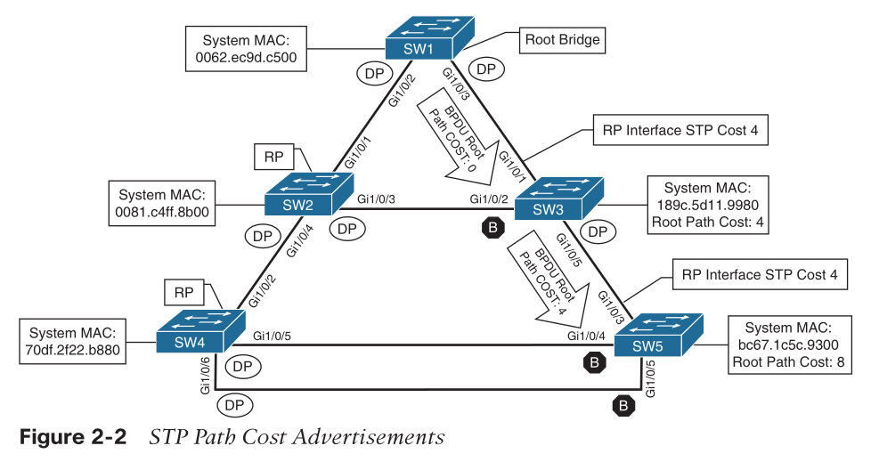
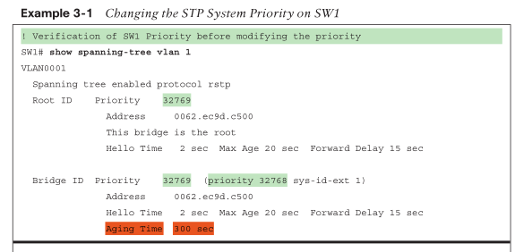
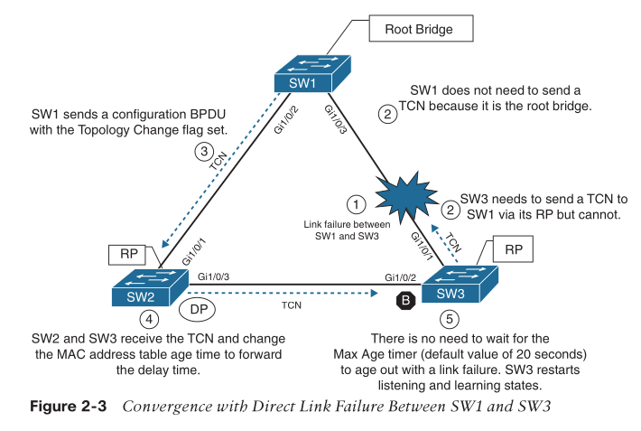

****- [STP](#stp)
- [Ch. 2 STP](#ch-2-stp)
  - [Fundamentals](#fundamentals)
    - [versions](#versions)
  - [802.1D STP](#8021d-stp)
    - [port states](#port-states)
    - [port types](#port-types)
    - [Terminology](#terminology)
    - [Spanning Tree Path Cost](#spanning-tree-path-cost)
    - [Building STP topology](#building-stp-topology)
      - [root bridge election](#root-bridge-election)
      - [identifying root ports](#identifying-root-ports)
      - [identify block ports](#identify-block-ports)
    - [STP toplogy change](#stp-toplogy-change)
      - [case 2](#case-2)
        - [indirect link failure](#indirect-link-failure)
      - [case 3](#case-3)
  - [RSTP / 802.1W](#rstp--8021w)
    - [port states](#port-states-1)
    - [port roles](#port-roles)
    - [port types](#port-types-1)
    - [Building STP topology](#building-stp-topology-1)
    - [RSTP convergence](#rstp-convergence)
- [Ch. 3 Advanced STP Tunning](#ch-3-advanced-stp-tunning)
  - [STP topology tunning](#stp-topology-tunning)
    - [Placing the root bridge](#placing-the-root-bridge)
    - [Modifying port cost](#modifying-port-cost)
    - [Modifying port priority](#modifying-port-priority)
    - [Additional STP protection against loop](#additional-stp-protection-against-loop)
      - [Root guard](#root-guard)
      - [STP Portfast](#stp-portfast)
      - [BPDU guard](#bpdu-guard)
      - [BDPU filter](#bdpu-filter)
    - [Problems with Unidirectional Links](#problems-with-unidirectional-links)
      - [STP loop guard](#stp-loop-guard)
      - [Unidirectional Link Detection](#unidirectional-link-detection)

# Ch. 2 STP

* Problem: redundant links between switches adds reliability, but also causing possible loops
  * broadcasted ARP traffic may well trigger the loop
  * no TTL in layer 2

## Fundamentals

* idea: prevent loop by temporarily blocking traffic on redundant ports
* protocol: BPDU (bridge protocol data units)
  * enable switches to become aware of other switches
* steps: 
  * select a specific switch as the best / root switch

### versions

STP has multiple iterations:

* 802.1D, which is the original specification
* Per-VLAN Spanning Tree (PVST)
* Per-VLAN Spanning Tree Plus (PVST+)
* 802.1W Rapid Spanning Tree Protocol (RSTP)
* 802.1S Multiple Spanning Tree Protocol (MST)

## 802.1D STP

### port states

* disabled
* blocking
  * only receive BPDUs
* listening
  * only send/receive BPDUs
  * 15 sec
* learning
  * alter mac address table by snooping wire
  * 15 sec
* forwarding
  * send/recv any traffic
* broken

### port types

* Root port (RP)
  * only one RP per VLAN
  * upstream connection
* Designated port (DP)
  * recv/sent BPDU
  * only one active DP per link
  * downstream connection
* Blocking port
  * not forwarding traffic
  * no connection

### Terminology

* **Root bridge**
  * top / root of the tree
  * all ports are DP
* **BPDU**
  * dest. MAC addr: 01:80:c2:00:00:00
  * build the tree and notify the changes
  * two types:
    * Config BPDU
    * Topology change notification (TCN) BDPU
* **Root path cost**: combined cost for a specific path toward the root switch
* **System priority**: This 4-bit value indicates the preference for a switch to be root bridge. 
  * default: 32,768.
* **System ID extension**: This 12-bit value indicates the VLAN that the BPDU correlates to.
* **bridge identifier**: This is a combination of **MAC address, system ID extension, and system priority** of the bridge.
  * root bridge id
  * local bridge id
* **Max age**: If a switch loses contact with the BPDU’s source, it assumes that the BPDU information is still valid for the duration of the Max Age timer.
  * default: 20 seconds
  * config: `spanning-tree vlan vlan-id max-age maxage`. 
* **Hello time**: time interval that a BPDU is advertised out of a port. 
  * default: 2 seconds
  * config: `spanning-tree vlan vlan-id hello-time hello-time`.
* **Forward delay**: This is the amount of time that a port stays in a listening and learning state after topology change
  * default: 15 seconds per state
  * config: `spanning-tree vlan vlan-id forward-time forward-time`.
* **note**: STP was defined before modern switches existed. The devices that originally used STP were known as bridges. The terms *bridge* and *switch* are interchangeable in this context.

### Spanning Tree Path Cost

* **short mode**: 16-bit value, with a reference value of 20 Gbps.
* **long mode**: 32-bit value, with a reference speed of 20 Tbps.



> When a switch generates the BPDUs, the root path cost includes only the calculated metric to the root and does not include the cost of the port out which the BPDU is advertised.

### Building STP topology

#### root bridge election

* If the neighbor’s configuration BPDU is preferred to its own BPDU, the switch updates its BPDUs to include the new root bridge identifier along with a new root path cost that correlates to the total path cost to reach the new root bridge. This process continues until all switches in a topology have identified the root bridge switch.
* more preferable if the **priority** in the bridge identifier is **lower**


* The priority in the configuration BPDU packets is actually the priority plus the value of the sys-id-ext (which is the VLAN number).
  * looking at VLAN 10, which has a priority of 32,778, which is 10 higher than 32,768.

#### identifying root ports

1. The interface associated to lowest path cost is more preferred.
2. The interface associated to the lowest system priority of the advertising switch is preferred next.
3. The interface associated to the lowest system MAC address of the advertising switch is preferred next.
4. When multiple links are associated to the same switch, the lowest port priority from the advertising switch is preferred.
5. When multiple links are associated to the same switch, the lower port number from the advertising switch is preferred.




#### identify block ports

1. The interface is a designated port and must not be considered an RP.
2. The switch with the lower path cost to the root bridge forwards packets, and the one with the higher path cost blocks. If they tie, they move on to the next step.
3. The system priority of the local switch is compared to the system priority of the remote switch. The local port is moved to a blocking state if the remote system priority is lower than that of the local switch. If they tie, they move on to the next step.
4. The system MAC address of the local switch is compared to the system MAC address of the remote switch. The local designated port is moved to a blocking state if the remote system MAC address is lower than that of the local switch.

```
show spanning-tree root
show spanning-tree vlan 1 [detail]
show spanning-tree interface interface-id [detail] ! for trunk interfaces

SW3# show spanning-tree interface gi1/0/1 detail
! Output omitted for brevity
Port 1 (GigabitEthernet1/0/1) of VLAN0001 is root forwarding
Port path cost 4, Port priority 128 (?), Port Identifier 128.1.
Designated root has priority 32769, address 0062.ec9d.c500
Designated bridge has priority 32769, address 0062.ec9d.c500
Designated port id is 128.3 (on remote?), designated path cost 0
Timers: message age 16, forward delay 0, hold 0
Number of transitions to forwarding state: 1
Link type is point-to-point by default
BPDU: sent 15, received 45908
```

### STP toplogy change

* In a stable Layer 2 topology, configuration BPDUs always flow from the root bridge toward the edge switches.
* The switch that detects a link status change sends a topology change notification (TCN) BPDU toward the root bridge, out its RP.
  * what if RP down? [case 2](#case-2)
    * no TCN out
    * re-determine DP
      * receiving new Config BPDU (w/ topology change flag set)
      * previous blocking ports now in listening -> learning state
      * The total convergence time for SW3 is 30 seconds: 15 seconds for the listening state and 15 seconds for the learning state before SW3’s Gi1/0/2 can be made the RP.
* Upon receipt of the TCN, the root bridge creates a new configuration BPDU with the Topology Change flag set, and it is then flooded to all the switches.
* When a switch receives a configuration BPDU with the Topology Change flag set, all switches change their MAC address timer to the forwarding delay timer (with a default of 15 seconds). This flushes out MAC addresses for devices that have not communicated in that 15-second window but maintains MAC addresses for devices that are actively communicating.
  * not hearing from you for 15 sec, your mac addr gone.

---

> Flushing the MAC address table prevents a switch from sending traffic to a host that is no longer reachable by that port. However, a side effect of flushing the MAC address table is that it temporarily increases the unknown unicast flooding while it is rebuilt. Remember that this can impact hosts because of their CSMA/CD behavior. The MAC address timer is then reset to normal (300 seconds by default) after the second configuration BPDU is received.

q: what is this MAC address timer?



Q: aging mac address if not seeing it on port for 5 min, remove it and someone has to redo arp?

#### case 2



#####  indirect link failure

* link still UP, but data corrupted
* SW3 has to wait RP's Max Age timer expire, wait 20s more

#### case 3


## RSTP / 802.1W

* coming from PVST/PVST+
  * per-Vlan spanning tree
  * cisco proprietary
* require a handshake process
  * if failed, back to 802.1D

### port states

* discarding
  * not forwarding any traffic
* learning
  * forward only BPDUs
  * updates mac table
* forwarding

### port roles

* root port (RP)
* designated port (DP)
* alternate port
  * alternatives to root
* backup port
  * provides link redundancy to a hub (shared)

### port types

* w.r.t. SPT
* edge port
  * connected to edge devices like PCs
  * STP portfast enabled
* non-edge port
  * has received BPDUs
* p2p port
  * full-duplex to another RSTP switch

### Building STP topology

1. check full-duplex
2. handshake to decide which port is DP via system priority
3. inferior sw marks RP, all others are in discarding state
4. inferior sw ack root bridge (if no ack, fall back to 802.1D)
5. inferior sw moves RP to forwarding, superior sw moves all DP to forwarding
6. repeat for other ports / sw

### RSTP convergence

* RSTP age out port info after 6 sec
  * loss 3x consecutive hello

# Ch. 3 Advanced STP Tunning

## STP topology tunning

### Placing the root bridge

* root bridge = core switch / boundary between layer2 and layer3
* secondary root: minimize changes to STP when primary down
* via change of priority
  * 4 bits
  * range: 0 - 61440
    * in increments of 4096, 1 bit = 4096
  * default: 32768

```
spanning-tree vlan vlan-id priority priority
spanning-tree vlan vlan-id root {primary | secondary} [diameter diameter]
! run a script to change priority to make it root bridge
! default primary priority: 24576, secondary: 28672
! script will automatically lower the default if some sw has a lower priority
```

> The best way to prevent erroneous devices from taking over the STP root role is to set the priority to 0 for the primary root switch and to 4096 for the secondary root switch. In addition, root guard should be used (as discussed later in this chapter).

### Modifying port cost

* to change port role between DP and blocking
```
SW3# conf t
SW3(config)# interface gi1/0/1
SW3(config-if)# spanning-tree cost 1
```

### Modifying port priority

* when multiple links between two switches
* do so on the switch which is closer to root

> Remember that system ID and port cost are the same, so the next check is port priority, followed by the port number. Both the port priority and port number are controlled by the upstream switch, because it is closer to the root bridge.

```
SW4# conf t
SW4(config)# interface gi1/0/6
SW4(config-if)# spanning-tree port-priority 64

SW4# show spanning-tree vlan 1
Interface Role  Sts Cost Prio.Nbr  Type
------------------- ---- --- --------- -------- --------------------------------
Gi1/0/2 Root FWD 4  128.2 P2p
Gi1/0/5 Desg FWD 4  128.5 P2p
Gi1/0/6 Desg FWD 4  64.6  P2p
```

### Additional STP protection against loop

* possible looping: flapped MAC address
* shown in syslog

```
12:40:30.044: %SW_MATM-4-MACFLAP_NOTIF: Host 70df.2f22.b8c7 in vlan 1 is flapping
between port Gi1/0/3 and port Gi1/0/2
```

* check STP if enabled and working properly

#### Root guard

* Root guard is placed on **designated ports** toward other switches that should never become root bridges.
  * Upon receipt of a superior BPDU from DP, the port is placed into a root inconsistent state
* Root guard is enabled with the interface command spanning-tree guard root.

> In the sample topology shown in Figure 3-1, root guard should be placed on SW2’s Gi1/0/4 port toward SW4 and on SW3’s Gi1/0/5 port toward SW5. This placement prevents SW4 and SW5 from ever becoming root bridges but still allows SW2 to maintain connectivity to SW1 via SW3 if the link connecting SW1 to SW2 fails.

#### STP Portfast

* The STP portfast feature disables TCN generation for access ports.
  * host connects to access ports and they should never generate TCN
* also allow the access ports bypass the earlier 802.1D STP states (learning and listening) and forward traffic immediately.

```
SW1(config)# interface gigabitEthernet 1/0/13
SW1(config-if)# switchport mode access
SW1(config-if)# switchport access vlan 10
SW1(config-if)# spanning-tree portfast
! globally on all access ports 
spanning-tree portfast default
```

> enabling portfast changes the RSTP port type to an Edge port.

#### BPDU guard

* If a BPDU is received on a portfast-enabled port, the portfast functionality is removed from that port, and it progresses through the learning and listening states.
* BPDU guard places ports configured with STP portfast into an `ErrDisabled` state upon receipt of a BPDU, and such state prevent forwarding any network traffic
* to prevent any unauthorized switches behind host

```
spanning-tree portfast bpduguard default
```

> BPDU guard is typically configured with all host-facing ports that are enabled with portfast.

* restore from `ErrDisabled` is not automatically, use `errdisable recovery cause bpduguard`

> The Error Recovery service operates every 300 seconds (5 minutes). This can be changed to a value of 30 to 86,400 seconds with the global configuration command `errdisable` recovery interval time.


#### BDPU filter

* blocks BPDUs from being transmitted out a port
* globally, `spanning-tree portfast bpdufilter default`

> Be careful with the deployment of BPDU filter because it could cause problems. Most network designs do not require BPDU filter, which adds an unnecessary level of complexity and also introduces risk.

### Problems with Unidirectional Links

* like fiber
* one direction may down, but the other is still up
* can cause a loop
  * link to root still showing UP
  * BDPU timer expires, new RP selected
  * traffic received on new RP, which should come from root, will be forwarded to root 
    * Q: example?

#### STP loop guard

* prevents any alternative or root ports from becoming designated ports due to loss of BPDUs on the root port
* if loop detected, `show spanning-tree vlan x` will show `*LOOP_Inc`

```
! global
spanning-tree loopguard default
```

> It is important to note that loop guard should not be enabled on portfast-enabled ports (because it directly conflicts with the root/alternate port logic).

#### Unidirectional Link Detection

* very much like BFD
* in `aggressive` mode, if no ack from remote in 1s, port down
* need be configured on both ends

```
! global
udld enable [aggressive]
```

