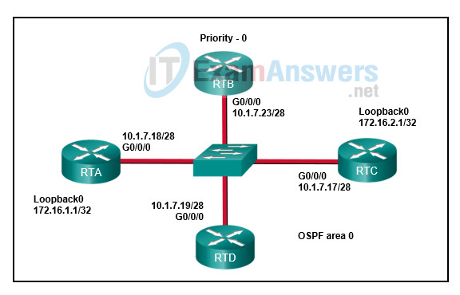
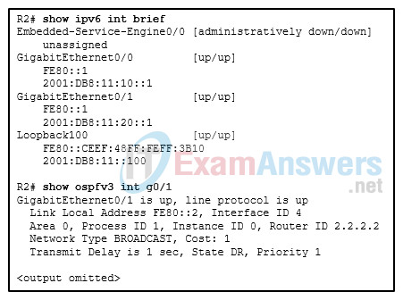

- [ch. 1-5: total 47, wrong: 2, arguable: 1](#ch-1-5-total-47-wrong-2-arguable-1)
- [ch. 6: 26/34](#ch-6-2634)
- [ch. 8-10: 18/34](#ch-8-10-1834)

# ch. 1-5: total 47, wrong: 2, arguable: 1

* https://itexamanswers.net/ccnp-encor-v8-chapters-1-5-l2-redundancy-test-online.html
* ? 16: Why is it important that the network administrator consider the spanning-tree network diameter when choosing the root bridge?
  * > BPDUs may be discarded because of expiring timers.
  * The network diameter limitation is 9.
  * The cabling distance between the switches is 100 meters.
  * Convergence is slower as the BPDU travels away from the root.

> Explanation: The optional diameter keyword in the `spanning-tree vlan <vlan-id> root {primary | secondary} [diameter <diameter>]` command allows for tuning of the STP convergence. The diameter keyword should reference the maximum number of Layer 2 hops that a switch can be from the root bridge and modify the timers accordingly. The timers do not need to be modified on other switches because they are carried throughout the topology through the root bridge BPDUs.

* 30: Given the following configuration, which two statements are true? (Choose two.)
    ```
    switch(vlan)# vtp version 2
    switch(vlan)# vtp mode server
    switch(vlan)# vtp domain Cisco
    switch(vlan)# vtp password mypassword
    ```
  * This switch can advertise its VLAN configuration to other switches in the Cisco domain only, but can receive advertisements from other domains.
  * The password will prevent unauthorized routers from participating in the Cisco domain.
  * > This switch can send and receive advertisements from only the Cisco domain.
  * > This switch can create, modify, and delete all VLANs within the Cisco domain.
  * This switch maintains a full list of all VLANs and can create VLANs, but cannot delete or modify existing VLANs.

> Explanation: A switch in VTP server mode can create, modify, and delete VLANs as well as transmit that information (if the switch has the highest VTP configuration revision number) to other switches in the same VTP domain.

* 46: Which statement describes the term root guard in the operation of STP?
  * It is a feature that prevents any alternative or root ports from becoming designated ports because of a loss of BPDUs on the root port.
  * > It is a feature that prevents a configured port from becoming a root port.
  * It is a value that decides which switch can become the root bridge.
  * It is a safety mechanism that shuts down ports configured with STP portfast upon receipt of a BPDU.

# ch. 6: 26/34

* https://itexamanswers.net/ccnp-encor-v8-chapters-6-7-routing-essentials-and-eigrp-test-online.html

* 2: What are two characteristics of link-state routing protocols? (Choose two.)
  * They can load balance across unequal metric cost paths.
  * They use path attributes to determine the best loop-free path.
  * They periodically send full routing table updates to directly connected neighbors.
    * this is incorrect, during periodical refreshing, only its originated LSAs are re-advertised. ([see here](./06-routing-basics.md#periodical-refreshing))
  * > They provide routers with a synchronized identical map of the network.
  * > They use more CPU and memory resources than distance vector protocols do.

* 15: Refer to a portion of an EIGRP topology table:
```
P 172.18.3.0/24, 1 successors, __ is 2172416
via 172.18.4.3 (2172416/28160), Serial0/0/1
P 172.18.5.0/24, 1 successors, __ is 2495120
via 172.18.6.3 (2495120/227692), Serial0/1/0
P 192.168.24.0/24, 1 successors, __ is 2684416
via 192.168.13.5 (2684416/2072316), Serial0/0/0
via 172.18.4.3 (2854912/2342912), Serial0/0/1
P 10.34.1.0/24, 1 successors, __ is 3072
via 10.13.1.3 (3072/2937), GigabitEthernet0/1
via 10.14.1.4 (5376/2937), GigabitEthernet0/2
```
What is the reported distance of the successor route for 172.18.3.0/24?
  * 2684416
  * 2172416
  * 2072316
  * > 28160

* 20: Which statement describes the autonomous system number used in EIGRP configuration on a Cisco router?
  * It carries the geographical information of the organization.
  * It is a globally unique autonomous system number that is assigned by IANA.
  * > It functions as a process ID in the operation of the router.
  * It identifies the ISP that provides the connection to network of the organization.

* 22: Refer to the exhibit. All the routers that are displayed are part of the EIGRP domain. Assuming EIGRP metric weights are not altered in the configurations, which path will a packet take that originates from a host on the 192.168.1.0/24 network and is going to a host on the 192.168.2.0/24 network?
  * R1, R2, R3
  * R1, R5, R3
  * R1, R4, R3
  * > R1, R2, R5, R3


> EIGRP only uses the slowest bandwidth in its composite metric. The slowest bandwidth in the path R1, R2, R5, R3 is 64 kb/s and thus offers the best path to the 192.168.2.0/24 network.

? didn't get it

* 23: Which two metric weights are set to one by default when costs in EIGRP are being calculated? (Choose two.)
  * k6
  * > k3
  * > k1
  * k4
  * k5
  * k2

* 26: If all router Ethernet interfaces in an EIGRP network are configured with the default EIGRP timers, how long will a router wait by default to receive an EIGRP packet from its neighbor before declaring the neighbor unreachable?
  * 10 seconds
  * > 15 seconds
  * 20 seconds
  * 30 seconds

* 34: What is the administrative distance of an EIGRP summary route?
  * 110
  * > 5
  * 90
  * 20

# ch. 8-10: 18/34

* 3: Which three requirements are necessary for two OSPFv2 routers to form an adjacency? (Choose three.)
  * > The OSPF hello or dead timers on each router must match.
  * > The link interface subnet masks must match.
  * The OSPFv2 process ID must be the same on each router.
  * > The two routers must include the inter-router link network in an OSPFv2 network command.
  * The OSPFv2 process is enabled on the interface by entering the ospf process area-id command.
  * The link interface on each router must be configured with a link-local address.

> Several variables must match for an OSPF neighbor adjacency to be formed between two OSPF routers. These variables include: area ID, hello and dead timers, interface MTU, and interface subnet.

* 6: Refer to the exhibit. What destination address will RTB use to advertise LSAs?
  * 10.1.7.17
  * > 224.0.0.6
  * 224.0.0.5
  * 255.255.255.255
  * 172.16.1.1
  * 172.16.2.1



> A DR and BDR are elected on multiaccess networks to reduce the number of OSPF adjacencies formed. Non-DR routers will form adjacencies with the DR and BDR and send LSU packets to the AllDR-Routers multicast address of 224.0.0.6

* 12: Which two statements describe OSPF route summarization? (Choose two.)
  * OSPF can perform automatic summarization on major classful network boundaries even if no summarization commands are entered from the CLI.
  * Once OSPF route summarization is configured, the summary route will be advertised even if none of the networks in the address range are in the routing table.
  * Automatic OSPF route summarization is performed by the ABR.
  * > The area 51 range 172.0.0.0 255.0.0.0 command identifies area 51 as the area that contains the range of networks to be summarized.
  * > The metric of the summary route is equal to the lowest cost network within the summary address range.

* 13: What feature can be configured to filter routes as they are crossing an OSPF ABR?
  * > distribute list
  * prefix list
  * summarization
  * route map

* 18: Which LSA type is flooded by a designated router to other OSPF routers within the same area?
  * type 1
  * > type 2
  * type 3
  * type 4

> Type 2 LSAs are originated and flooded by the DR to inform other OSPF routers within multiaccess networks

* 21: Which statement is true about the difference between OSPFv2 and OSPFv3?
  * OSPFv3 routers do not need to elect a DR on multiaccess segments.
  * OSPFv3 routers use a 128 bit router ID instead of a 32 bit ID.
  * OSPFv3 routers use a different metric than OSPFv2 routers use.
  * > OSPFv3 routers do not need to have matching subnets to form neighbor adjacencies.

* 22: Which two OSPFv3 LSAs advertise address prefix information? (Choose two.)
  * type 1
  * type 2
  * type 4
  * > type 8
  * > type 9

* 25: Which is a difference between OSPFv2 and OSPFv3?
  * OSPFv3 uses a 128-bit router ID.
  * OSPFv3 and OSPFv2 use different protocol ID numbers.
  * OSPFv3 uses different packet types than OSPFv2.
  * > OSPFv3 does not have built in support for neighbor authentication.

* 26: How are OSPFv3 routes that are learned from type 1 LSAs identified in the IPv6 routing table?
  * > O
  * EX
  * IA
  * OI

> OSPF uses the code `O` to identify intrarea routes learned from type 1 LSAs in the routing table, and `O IA` to identify inter-area routes learned from type 3 LSAs

* 29: Refer to the exhibit. What two addresses will OSPFv3 neighbors connected to the g0/1 interface of R2 use as the destination address for sending OSPFv3 link-state updates to R2?
  * FF02::5
  * > FE80::2
  * 2001:DB8:11::100
  * 2001:DB8:11:20::1
  * > FF02::6



> Router R2 is a DR. Other OSPFv3 routers form an adjacency with the DR and send link-state updates to the ALLDRouters multicast ff02:06 and to the link -local address of the DR, which for g0/1 on R2 is fe80::2.

* 30: Which type of LSA only exists on networks containing a DR?
  * router
  * > network
  * AS external
  * summary

* 31: Which type of LSAs are reduced through interarea summarization?
  * type 1 LSAs from all OSPF routers
  * type 4 LSAs from ASBRs
  * > type 3 LSAs from ABRs
  * type 2 LSAs from DRs

> Interarea summarization reduces the number of type 3 LSAs advertised by an ABR.

* 32: At what level does OSPF maintain a unique LSDB?
  * > area
  * network
  * link
  * router

> Each OSPF router maintains a link state database (LSDB) for each area it participates in.

